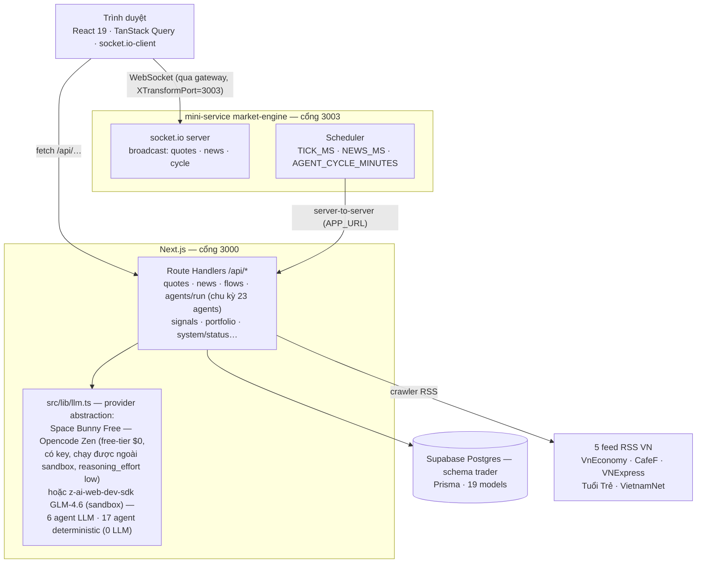

# The Trader

> **Dashboard multi-agent paper-trading cho VNDIRECT** — đội **23 agent AI chia 5 nhóm** (Nghiên cứu · Kiểm soát VETO · Điều hành · Nền tảng dữ liệu · Học máy) phân tích realtime, bảng giá VN30, tin tức RSS thật, tín hiệu giao dịch + lệnh giấy, kèm audit trail đầy đủ.

**Next.js 16** · **TypeScript** · **Prisma + Supabase Postgres** · **shadcn/ui** · **Space Bunny Free** (Opencode Zen, free-tier $0, chạy được cả ngoài sandbox — mặc định cho toàn đội) / fallback **GLM-4.6** (trong sandbox Z.ai) · **socket.io**

> **Miễn trừ trách nhiệm:** đây là dự án minh họa (demo). Dữ liệu giá trên dashboard là **mô phỏng** (random-walk + mean-reversion, gắn nhãn `simulated`); toàn bộ lệnh là **paper trading** — lệnh giấy nội bộ, không gửi ra môi giới; tin tức RSS là dữ liệu thật nhưng chỉ làm ngữ cảnh phân tích. Dự án **không** dùng để giao dịch tiền thật.

---

## Tính năng chính

- **App shell 2 workspace** — tab Tổng quan ⇄ **Đội Agent** (Zustand, không reload trang, realtime không đứt; deep-link `?ws=agents`).
- **Bảng giá VN30 realtime** — 30 mã HOSE, tick mô phỏng mỗi 10 giây qua mini-service `market-engine` (WebSocket), tuân thủ quy tắc sàn: bội 100 VND, dải trần/sàn ±7%; **toggle cột mở rộng** (trần/sàn/tham chiếu/cao/thấp, dấu ⌃⌄ khi chạm trần/sàn).
- **Biểu đồ nến Nhật + RSI14** — nến custom (xanh=đóng≥mở) + volume histogram màu phiên + panel RSI Wilder (guideline 30/70, vùng quá mua/bán); toggle Nến/Đường, khung 30/60/90 phiên.
- **23 AI agent (5 nhóm) — làm việc trực tiếp** — Nghiên cứu (5) · Kiểm soát VETO (3) · Điều hành (4) · Nền tảng dữ liệu (4) · Học máy (7): **6 agent gọi LLM mỗi chu kỳ** (market-analyst · fair-value · news-sentiment · liquidity · risk-manager · portfolio-strategist), **17 agent còn lại chạy deterministic từ DB** (0 chi phí LLM, ~0.2–1.5s); roster UI chia 5 nhóm + badge VETO; **chạy riêng từng agent**, **chat 1-1** (AgentMessage.direction USER/AGENT), hồ sơ chi phí token/$ từng agent + sparkline 7 ngày, rate-limit 60s/agent có đếm ngược.
- **Human-in-the-loop phê duyệt** — chu kỳ sinh tín hiệu **ACTIVE chờ duyệt**; trader **✅ Phê duyệt** (lệnh paper LIMIT 5% NAV) hoặc **⛔ Từ chối** ngay trong feed tin nhắn / tab Tín hiệu; đầy đủ audit `SIGNAL_CREATED`/`SIGNAL_APPROVED`/`SIGNAL_REJECTED`.
- **Tin tức RSS thật** — crawler 5 nguồn Việt Nam (VnEconomy, CafeF, VNExpress, Tuổi Trẻ, VietnamNet), dedupe theo URL, nạp tay hoặc tự động mỗi 15 phút.
- **Dòng khối ngoại (S6)** — mô phỏng deterministic theo thanh khoản thật + cảnh báo `FOREIGN_FLOW_OUTFLOW` khi bán ròng mạnh.
- **Tín hiệu → lệnh giấy** — Signal → APPROVE/convert → lệnh PENDING (phí 0.15%, thuế TNCN 0.1% khi bán), fill engine tự khớp, danh mục vị thế + PnL runtime + **donut phân bổ ngành + cột % tỷ trọng**.
- **Chip CFO** — **Sức mua (ước tính)** công thức minh bạch ở header (cash + equity×0.5 − marginUsed); **chip chi phí AI lũy kế** (tổng $ + tokens) ở footer.
- **Watchlist cá nhân** — thêm/gỡ mã bằng cột sao, chuyển đổi nhanh VN30 ⇄ danh mục theo dõi.
- **Minh bạch nguồn dữ liệu** — mỗi nguồn gắn nhãn `live`/`simulated`/`fallback`/`paper` + stale marking, hiển thị trực tiếp trên footer.
- **Audit trail đầy đủ** — `AgentRun` (token/chi phí/thời lượng), `AgentMessage`, `AuditLog` mọi hành động nhạy cảm (kể cả chat).
- **Dark terminal UI tiếng Việt** — quy ước màu xanh tăng/đỏ giảm (chuẩn thị trường VN), số liệu thẳng cột (tabular-nums), responsive mobile-first.

---

## Kiến trúc



LLM **chỉ** gọi ở server (Route Handlers) — client không bao giờ thấy API key. Mini-service không chạm DB trực tiếp: mọi dữ liệu lấy qua API của app rồi broadcast cho client. Chi tiết: [docs/TECHNICAL_BLUEPRINT.md](docs/TECHNICAL_BLUEPRINT.md).

---

## Yêu cầu môi trường

- **Bun 1.3+** — runtime chính (dev, seed, mini-service)
- **Node 20+** — nếu chạy bằng npm/node thay Bun
- Kết nối mạng ra ngoài (RSS + LLM backend)

---

## Cài đặt

```bash
# 1. Cài dependencies
bun install

# 2. Tạo .env từ mẫu (chỉnh DATABASE_URL nếu cần)
cp .env.example .env

# 3. Đẩy schema Prisma vào Supabase Postgres (schema "trader" — tạo sẵn: CREATE SCHEMA trader)
bun run db:push

# 4. Nạp dữ liệu demo (30 mã VN30 · 90 ngày OHLCV · 23 agent theo roster · danh mục mẫu)
bun prisma/seed.ts

# 4b. (DB đã có dữ liệu 5 agent từ phiên bản cũ?) Đồng bộ lên 23 agents — idempotent,
#     KHÔNG đụng runs/messages/signals/health của agent cũ
bun prisma/expand-agents.ts

# 5. Chạy app
bun run dev
# mở http://localhost:3000
```

**Tuỳ chọn — realtime** (tick bảng giá + nạp tin RSS + chu kỳ agent tự động):

```bash
cd mini-services/market-engine
bun install
bun run dev
```

Mini-service lắng nghe **cổng 3003** và gọi thẳng app Next.js (server-to-server). Trình duyệt kết nối **qua gateway** bằng query `XTransformPort=3003` (`io("/?XTransformPort=3003")`) — nếu deploy sau reverse-proxy thì giữ nguyên pattern này, không cần mở thêm cổng.

### Chạy trên máy local (ngoài sandbox Z.ai)

Sandbox dùng GLM-4.6 qua `z-ai-web-dev-sdk` (gateway nội bộ, không có ở ngoài). Trên máy local, đặt **API key Opencode Zen** để toàn đội 23 agent (6 agent gọi LLM) chạy model **`space-bunny-free`** (free-tier, zero-retention):

1. Lấy key: mở **https://opencode.ai/zen** → đăng nhập → copy **API key** (mục Developers/API keys).
2. Đặt vào `.env`:

   ```bash
   LLM_PROVIDER=auto                      # có key → tự dùng Opencode Zen
   OPENCODE_ZEN_API_KEY=<api-key-cua-ban> # dạng oc_sk_… — đã cấu hình sẵn trong .env của repo này
   ```

   > Repo này đã có sẵn key (dạng `oc_sk_…`) trong `.env` local — không commit key thật lên git; nếu clone về máy khác thì tự điền key của bạn vào placeholder.

3. `bun run dev` — mọi cuộc gọi LLM (chu kỳ đầy đủ, chạy riêng, chat 1-1) tự chuyển qua `https://opencode.ai/zen/v1/chat/completions` với model `space-bunny-free`; chi phí phát sinh **$0** (model free-tier). Model họ space-bunny là model reasoning — `src/lib/llm.ts` mặc định gửi `reasoning_effort: low` (đo thực tế ~3.7s/call thay vì ~19s, nhanh ~5×; tùy chỉnh qua `OPENCODE_ZEN_REASONING_EFFORT`). Model đang chạy hiển thị ngay trên UI (workspace Đội Agent + tooltip chip AI ở footer). KHÔNG cần cài Opencode CLI — app gọi thẳng gateway bằng REST OpenAI-compatible.

---

## Scripts

| Lệnh | Mục đích |
|---|---|
| `bun run dev` | Dev server Next.js (cổng 3000) |
| `bun run lint` | Kiểm tra ESLint |
| `bun run build` / `bun run start` | Build & chạy production |
| `bun run db:push` | Đẩy schema Prisma vào Supabase Postgres (schema `trader`) |
| `bun run db:generate` | Sinh lại Prisma Client |
| `bun run db:studio` | Mở Prisma Studio |
| `bun prisma/seed.ts` | Nạp lại dữ liệu demo (**xóa sạch dữ liệu cũ**) |
| `bun prisma/expand-agents.ts` | Đồng bộ roster 23 agents vào DB (idempotent — upsert theo `code` từ `src/lib/agent-roster.ts`, giữ nguyên lịch sử runs/messages của agent cũ) |

---

## Biến môi trường (`.env`)

| Biến | Mặc định | Ý nghĩa |
|---|---|---|
| `DATABASE_URL` | `postgresql://postgres.<ref>:<pwd>@aws-0-<region>.pooler.supabase.com:5432/postgres?schema=trader` | Kho dữ liệu chính — Supabase Postgres qua Prisma (bền vững qua reset sandbox) |
| `LLM_PROVIDER` | `auto` | Provider LLM cho 6 agent chạy LLM trong chu kỳ (`src/lib/llm.ts`): `auto` = có `OPENCODE_ZEN_API_KEY` → Opencode Zen, ngược lại → z-ai GLM-4.6 (sandbox) |
| `OPENCODE_ZEN_API_KEY` | — | API key từ **opencode.ai/zen** (sign in → copy, dạng `oc_sk_…`). Đặt biến này là toàn đội 23 agent chuyển sang `space-bunny-free` (free-tier, zero-retention) — **chạy được trên máy local ngoài sandbox** |
| `OPENCODE_ZEN_BASE_URL` | `https://opencode.ai/zen/v1` | Gateway OpenAI-compatible của Opencode Zen |
| `OPENCODE_ZEN_MODEL` | `space-bunny-free` | Model id (cùng bảng model của opencode.ai/zen/docs) |
| `OPENCODE_ZEN_REASONING_EFFORT` | `low` | `low` \| `medium` \| `high` \| `none` — reasoning effort cho model họ space-bunny (model reasoning): `low` ≈ ~40 reasoning tokens ≈ 3.7s/call; không set mặc định gửi `low` cho space-bunny, `none` = không gửi (~19s/call) |
| `LLM_PRICE_IN_MTOK` / `LLM_PRICE_OUT_MTOK` | theo model | Ghi đè bảng giá USD/1M token khi đổi model trả phí (model `-free` mặc định $0) |
| `LIVE_TRADING` | `false` | S3 — bật giao dịch thật VNDIRECT; bật mà thiếu cấu hình bên dưới → API từ chối + audit log |
| `VNDIRECT_API_BASE` | — | Endpoint VNDIRECT open API (chỉ cần khi `LIVE_TRADING=true`) |
| `VNDIRECT_API_TOKEN` | — | Token khách hàng VNDIRECT — giữ phía server, không commit |
| `MARKET_STRICT_SESSION` | `false` | `true`: tick engine chỉ sinh giá trong phiên HOSE (T2–T6, 09:15–11:30 & 13:00–14:45, đã trừ nghỉ lễ VN) |

Biến cho mini-service `market-engine` (đặt trong môi trường shell hoặc env riêng của mini-service):

| Biến | Mặc định | Ý nghĩa |
|---|---|---|
| `TICK_MS` | `10000` | Nhịp tick bảng giá (ms) |
| `NEWS_MS` | `900000` | Chu kỳ nạp tin RSS (15 phút) |
| `AGENT_CYCLE_MINUTES` | `0` | Chu kỳ agent tự động (0 = TẮT, tiết kiệm chi phí LLM) |
| `APP_URL` | `http://localhost:3000` | Địa chỉ app Next.js cho các cuộc gọi server-to-server |

---

## Cấu trúc thư mục

```
src/app/                      # App Router: page.tsx (dashboard) + api/ (route handlers)
src/components/dashboard/     # Header, bảng giá, chart, portfolio, agents panel,
                              # signals, risk alerts, news card, footer…
src/lib/                      # db, llm (provider LLM), agent-roster (23 agents —
                              # nguồn duy nhất), agent-service-runs (16 hàm
                              # deterministic), agent-context (role prompts),
                              # news (crawler RSS), flows, sources (stale marking),
                              # market-session, trading-mode, market-quotes,
                              # indicators, health, store (zustand)…
src/hooks/                    # use-realtime (WebSocket), use-run-agents
prisma/                       # schema.prisma (19 models) + seed.ts
                              # + expand-agents.ts (migrate 5 → 23 agents, idempotent)
mini-services/market-engine/  # socket.io server + scheduler (cổng 3003)
docs/                         # Tài liệu chi tiết (xem dưới)
```

---

## Tài liệu chi tiết

- [docs/TECHNICAL_BLUEPRINT.md](docs/TECHNICAL_BLUEPRINT.md) — kiến trúc, API surface (**23 route** — có agents/[id] + run/chat + decision), thiết kế 23 agents · 5 nhóm · chu kỳ 5 đợt (6 LLM + 17 deterministic), realtime & mini-service market-engine
- [docs/DB_SCHEMA.md](docs/DB_SCHEMA.md) — data dictionary 19 model, chính sách kiểu dữ liệu / PII / audit
- [docs/DATA_SOURCES.md](docs/DATA_SOURCES.md) — kho kiểm kê nguồn dữ liệu S1–S6, field mapping, chiến lược fallback

---

## Ghi chú

- **LLM backend-only qua lớp provider duy nhất `src/lib/llm.ts`** — mọi cuộc gọi của 23 agent (6 agent chạy LLM) đi qua một cổng: `.env` đã cấu hình `OPENCODE_ZEN_API_KEY` (lấy tại **opencode.ai/zen**, dạng `oc_sk_…`) nên toàn đội chạy **Space Bunny Free** free-tier $0 và **chạy được trên máy local ngoài sandbox**; không có key thì tự dùng GLM-4.6 của sandbox Z.ai để phát triển. Khóa không nằm trong repo hay client bundle; model đang chạy hiển thị trực tiếp trên UI (chip Đội Agent + tooltip footer) qua `GET /api/agents` → `llm`.
- **Kiến trúc 23 agents — nguồn duy nhất `src/lib/agent-roster.ts`** (thuần dữ liệu, dùng chung bởi seed · `prisma/expand-agents.ts` · API · UI): 5 nhóm — Nghiên cứu (5) · Kiểm soát VETO (3) · Điều hành (4) · Nền tảng dữ liệu (4) · Học máy (7); chu kỳ chạy 5 đợt A→E (xem [docs/TECHNICAL_BLUEPRINT.md §5.2](docs/TECHNICAL_BLUEPRINT.md)); 17 agent dịch vụ chạy deterministic từ DB nên chu kỳ đầy đủ tốn đúng 6 lượt LLM.
- **Scheduler chu kỳ agent mặc định TẮT** (`AGENT_CYCLE_MINUTES=0`) để tiết kiệm chi phí LLM — chạy chu kỳ thủ công bằng nút "Chạy chu kỳ đầy đủ (23 agents)" trên dashboard (đo thực tế: 1 chu kỳ ~42s, 0 lỗi, $0 với Space Bunny Free).
- Giá và dòng tiền trên dashboard là **mô phỏng có khai báo** (mode `simulated` hiển thị trên footer); tin tức RSS là dữ liệu thật.
