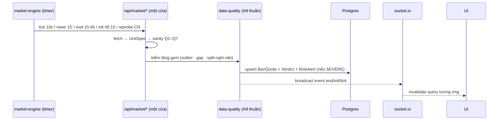

# DATA PLATFORM BLUEPRINT — NHÓM NỀN TẢNG DỮ LIỆU: HỢP ĐỒNG CHUỖI DỮ LIỆU, KIỂM ĐỊNH & PHỤC VỤ ĐẶC TRƯNG

> **Project:** The Trader — Hệ thống giao dịch đa agent (VNDIRECT)
> **Document:** `docs/DATA_PLATFORM_BLUEPRINT.md` · **Version:** 1.0 · **Created:** 2026-10-08 (phiên #54) · **Chốt:** 2026-10-08 (phiên #55)
> **Status:** **ĐÃ CHỐT TRIỂN KHAI (phiên #55)** — 5 câu hỏi §8 đã trả lời: 1b · 2a · **3b TỰ ĐIỀU CHỈNH split kèm AuditLog (user chọn khác đề xuất — P1-1 thiết kế lại kèm lớp an toàn đảo ngược)** · 4a · 5a. Thêm §9 đánh giá độ sẵn sàng dữ liệu cho ANN/nghiên cứu theo 4 câu hỏi mới của user
> **Cross-refs:** [MARKET_EXPANSION_BLUEPRINT.md](./MARKET_EXPANSION_BLUEPRINT.md) (UnitSpec B2 · universe 90 mã) · [CONTROL_RISK_QUANT_BLUEPRINT.md](./CONTROL_RISK_QUANT_BLUEPRINT.md) (σ CRB-1 · rổ ADTV §0.4 — gốc bug F6) · [ML_LEARNING_BLUEPRINT.md](./ML_LEARNING_BLUEPRINT.md) (cổng dữ liệu §6 — người tiêu thụ tương lai lớn nhất) · [DATA_SOURCES.md](./DATA_SOURCES.md) · [Fixbug.md](../Fixbug.md) (4/8 bug #52 gốc tầng này)
> **Người soạn:** Kỹ sư AI / Kiến trúc sư hệ thống (phiên #54)

---

## §0. Chẩn đoán trung thực hiện trạng (đo trực tiếp mã nguồn + DB ngày 2026-10-08)

### 0.1 Bốn agents — "roster nói" vs "code làm"

| Agent | Roster nói (`agent-roster.ts`) | Code thật (`agent-service-runs.ts`) | Khoảng cách |
|---|---|---|---|
| **S0 Thu thập dữ liệu** | "Đồng bộ báo giá realtime, nến lịch sử, tin tức RSS và dòng khối ngoại vào kho trung tâm" · config `{tickIntervalSec:10, barsDays:90, newsFeeds:5}` | `runDataCollector` L179–207: **0 request thu thập** — đếm Instrument/Bar/Quote/NewsItem + đọc DataSourceStatus rồi broadcast 1 câu; duy nhất hành động thật = `ingestFundamentalsWeekly()` Chủ nhật ICT. Config **không ai đọc** — thu thập thật nằm ở market-engine + API routes | 🔴 **Hữu danh vô thực** — khoảng cách roster-vs-reality lớn nhất hệ thống |
| **S1 Thông báo** | "Tổng hợp tín hiệu chờ duyệt, cảnh báo rủi ro chưa xử lý, lỗi agent — bản tin mỗi chu kỳ" | `runNotificationOfficer` L228–258: 3 query đếm (Signal ACTIVE top-5 · RiskAlert chưa ack · AgentRun FAILED 24h) → 1 câu digest. Không có kênh thật nào (chỉ là 1 dòng AgentMessage trong feed) | 🟡 Nông nhưng **trung thực** — đúng như mô tả |
| **S2 Kho đặc trưng** | "Tính toán & phục vụ đặc trưng (SMA20/50, RSI14, VOLRATIO20, MOM5) cho agent nghiên cứu" | `runFeatureStore` L261–284: tính 4 đặc trưng (SMA20/50 · MOM5 · KL/TL20) cho top-10 rồi broadcast — **RSI14 có trong config nhưng KHÔNG tính**; text nói "biến động" nhưng không tính; **không phục vụ ai** — không lưu, không API. Rổ `topLiquid` vẫn xếp hạng theo **quote volume mới nhất** — đúng lớp bug F6 đã vá ở `loadTopSeries` nhưng **chưa vá ở đây** | 🔴 Sai lệch 3 tầng: không tính đủ · không phục vụ · rổ bất ổn |
| **A9 Toàn vẹn dữ liệu** | "Kiểm định độ tươi & độ phủ, cảnh báo stale trước khi agent phân tích" | `runDataIntegrity` L287–317: 3 phép đo — `max(tradedAt)` toàn cục · `min(barCount)` (chỉ mã CÓ bar) · `max(publishedAt)` tin. Xuất câu "TOÀN VẸN / CẢNH BÁO" — **không logic nào tiêu thụ verdict** (grep: 0 consumer) | 🔴 Tư vấn suông — đợt A chạy "trước" nhưng không chặn/kèm cờ gì cho đợt B |

**Kết luận cốt lõi:** cả 4 agents là **hàm báo cáo 1 lần chạy độc lập** — không cái nào điều phối cái nào, không hàng xóm nào đọc output của nhau. Nền tảng dữ liệu THẬT (tick 10s · news 15' · EOD 15:45 ICT · intl 06:15 ICT · reprobe Chủ nhật 04:00 · retry/backoff · paper matching) sống ở `market-engine` + API routes, **ngoài roster**. "Nhóm nền tảng" như hiện tại là lớp trình bày phía trên máy móc đó.

### 0.2 Đo DB + vận hành thật (buổi chiều 2026-10-08, lệnh đo trực tiếp Supabase)

| Số liệu | Giá trị đo | Ghi chẩn đoán |
|---|---|---|
| Instrument active | **90** (HOSE 40 · HNX 22 · UPCOM 14 · US 10 · HK 4) | 14 mã US/HK = **0 bar** (Yahoo 429 sandbox, engine đang backoff lần sai thứ 6, thử lại sau 240') |
| Bar | **215.327** dòng, 2013-01-02 → 2026-10-07 | Độ sâu lịch sử không đồng đều: **min 674 · median ≈3411 · max 3432** phiên/mã — feature cần cửa sổ dài sẽ lệch nhau giữa các mã |
| Quote | **76 dòng** (update-in-place) — US/HK **không có dòng nào** | 76/90 = 84% độ phủ báo giá; không có tick archive (bảng giá chỉ là "ảnh hiện tại") |
| NewsItem | 248 tin (5 feed RSS live) | chỉ dedupe URL — không đo độ tin cậy nguồn |
| FinancialFundamental | **0 dòng** (pending-egress, đúng thiết kế trung thực) | — |
| DataSourceStatus | 7 nguồn: `real` (eod-history · market-quotes) · `live` (news) · `simulated` (foreign-flows) · `fallback` (intl-eod, 14/14 mã lỗi) · `pending` (fundamentals) · `paper` (trading) | Minh bạch nguồn **mạnh** — nhưng A9 không đọc bảng này |
| Báo giá mới nhất | 14:44:59 ICT — trùng **giờ đóng cửa HOSE** | Engine sống (news chảy đều 15'), tick lỗi chỉ thoáng qua lúc dev-server recompile. → **A9 sẽ "crying wolf" mọi buổi tối & cuối tuần** vì check tuổi không phân biệt "đóng cửa" với "dữ liệu hỏng" |

### 0.3 Bản đồ đường nạp dữ liệu thật (ai nạp gì, khi nào, với lớp phòng thủ nào)

| # | Đường | Nguồn → bảng | Lịch (market-engine) | Phòng thủ hiện có |
|---|---|---|---|---|
| 1 | EOD dchart | dchart → `Bar` + neo Quote | 15:45 ICT hằng ngày + boot | UnitSpec · golden-signature · Q1–Q7 sanity · throttle 300ms · retry ×2 · fail-soft markSource |
| 2 | Backfill sâu | dchart 2013→nay → `Bar` | thủ công (`force=deep`) | như #1, chunk 1000 |
| 3 | Yahoo US/HK | v8 chart → `Bar` | 06:15 ICT | null-skip · adjclose-preferred · circuit breaker ≥3 fail · backoff 30'→4h |
| 4 | finfo realtime | finfo → `Quote` (in-place) | trong tick 10s (throttle ≥30s) | fallback random-walk quanh EOD thật, mode `fallback` |
| 5 | Tick mô phỏng | random-walk → `Quote` | tick 10s | mutex chuỗi promise · kẹp dải ±7% |
| 6 | Tin RSS | 5 feed VN → `NewsItem` | 15 phút | parse RSS2/Atom/RDF · dedupe URL · rate-limit 60s |
| 7 | Dòng khối ngoại | **mô phỏng deterministic** → KHÔNG lưu DB | theo yêu cầu | khai báo `simulated` trung thực |
| 8 | finfo cơ bản | finfo → `FinancialFundamental` | Chủ nhật ICT (qua S0) | pending-egress — lỗi mạng → mode pending, không phá chu kỳ |
| 9 | Re-probe watcher | dchart probe → `Instrument` + backfill | Chủ nhật 04:00 ICT | probe-trước-khi-tạo · cooldown 60s |
| 10 | Paper matching | tick → `Order/Trade/Position` | mỗi tick 10s | claim-based atomic fill |

### 0.4 Những gì ĐÃ TỐT — giữ nguyên, không làm lại

1. **Minh bạch nguồn** `DataSourceStatus` + `staleOf` + `escalateStaleSources` + ma trận độ phủ `/api/coverage` — văn hoá "không bịa dữ liệu" đã ăn sâu.
2. **UnitSpec theo (market × type)** — giết chết cả lớp bug đơn vị (index điểm vs cổ phiếu nghìn ₫ vs cents).
3. **Kỷ luật retry đúng ngữ nghĩa** ở Yahoo/EOD: chỉ retry 5xx/429/network, 4xx là lỗi schema không retry mù.
4. **Engine sống sót lỗi** (bài học #42): mọi job try/catch, due-check bọc ngoài, in-flight guard, backoff cấp số nhân, mutex tick.
5. **Idempotency nạp**: upsert theo `@@unique(instrumentId,date)` — chạy lại không nhân đôi.

### 0.5 Khoảng trống lớn (xếp theo mức thiệt hại)

| # | Khoảng trống | Thiệt hại đã thấy |
|---|---|---|
| G1 | **Không có hợp đồng chuỗi theo NGÀY** — mỗi consumer tự cắt chuỗi theo index | F1 tương quan sai 0,69 · F2 return lệch ngày đình quyền — phải vá rải rác trong engine |
| G2 | **4 định nghĩa rổ thanh khoản khác nhau** — `loadTopSeries` (ADTV, đã vá F6) vs `topLiquid` · `buildMarketBlock` · `latestFeatures` (quote volume) | F6: rổ xoay runtime → CUSUM/AUC/Q-table/MLP nhảy số; 3/4 chỗ **vẫn chưa vá** |
| G3 | **Đặc trưng tính 3 lần độc lập** — `indicators.ts` (latest-only) · `ml/features.ts` (rolling) · `agent-context.ts` + `bayes/evidence.ts` (tự tính); nhãn evidence `feature-store.*` là quy gán mỹ từ | Rủi ro cùng 1 chỉ báo ra 2 số khác nhau ở 2 consumer; header `ml/features.ts` tự nhận "O(N²) nếu gọi per-sample" |
| G4 | **A9 mù 4 loại mù**: mù mã 0-bar (14 mã US/HK vô hình) · mù per-symbol freshness (global max che 100 mã cũ) · mù nguồn (không đọc DataSourceStatus 7 dòng) · mù lịch đóng cửa (crying wolf tối & cuối tuần) | Verdict không đáng tin → không ai tiêu thụ là đúng |
| G5 | **Không kiểm outlier/gap/split/PIT**: dải giá 500–5.000.000₫ lỏng; không kiểm đứt ngày giao dịch; dchart pre-adjusted nghĩa là split nằm ẩn trong chuỗi; upsert `Bar` đè lịch sử (restate vô hình); training không tái lập được (không snapshot input) | Gốc của "khoảng tin cậy giả" mọi tầng trên |
| G6 | **Dòng khối ngoại không lưu** — bằng chứng Bayes `flows` đang dùng số mô phỏng re-sinh theo (symbol, ngày) nhưng không có lịch sử persist → không thể backtest/đánh giá bằng chứng này | B8 scorecard thiếu 1 arm dữ liệu |
| G7 | **Engine state in-memory** — restart quên "hôm nay đã sync" (an toàn nhờ idempotent nhưng tốn refetch), quên backoff intl | Vận hành |
| G8 | **S1 không có kênh thật** — "thông báo" = 1 dòng trong feed UI | Trader offline không biết cảnh báo |

---

## §1. Nhiệm vụ chung & nhiệm vụ riêng — xác định lại

### 1.1 Nhiệm vụ chung của nhóm (bản "hợp đồng sứ mệnh" 5 điều)

Nhóm Nền tảng dữ liệu là **bộ môn duy nhất bảo đảm 5 tính chất cho mọi số liệu mà 19 agents còn lại nhìn thấy**:

1. **Đúng** (correctness): đơn vị chuẩn UnitSpec · sanity OHLC · không outlier im lặng · lịch sử không bị đè không dấu vết.
2. **Đủ** (completeness): độ phủ mã/phiên phát hiện được — kể cả mã 0 bar; đứt ngày giao dịch thấy được.
3. **Tươi đúng ngữ cảnh** (freshness): tươi so với **kỳ vọng** (phiên mở/đóng · lịch nguồn), không phải đồng hồ trần.
4. **Tái lập được** (reproducibility): cùng một câu hỏi "tại thời điểm T dữ liệu trông thế nào" → cùng một câu trả lời.
5. **Minh bạch** (honesty): mọi nguồn khai báo mode thật/giả/fallback — số mô phỏng không bao giờ cải trang thành số thật.

**Nguyên tắc phân vai:** engine là *tay đTimer* (điều khiển thời gian), 4 agents là *chủ hợp đồng* (sở hữu chuẩn và verdict). Không agents nào tự giữ scheduler riêng — tránh 2 đồng hồ.

### 1.2 Nhiệm vụ riêng từng agent — hiện tại → đích

| Agent | Hiện tại (tóm §0.1) | **Nhiệm vụ đích** (sau nâng cấp) |
|---|---|---|
| **S0** | Đếm + 1 câu broadcast | **Chủ kho & điều phối nạp** — sở hữu registry adapter (10 đường nạp §0.3), backfill, mở rộng universe, fundamentals tuần; mỗi chu kỳ xuất `IngestSummary` cấu trúc (đã nạp gì mới, nguồn nào hỏng, backlog gì) làm đầu vào lịch sử cho A9 và S1 |
| **A9** | 3 con số → câu text vô consumer | **Kiểm định viên chuỗi dữ liệu** — chạy đủ 6 phép kiểm (freshness per-symbol theo lịch phiên · độ phủ & gap lịch giao dịch · outlier Hampel · nghi ngờ split · trạng thái 7 nguồn · tính sẵn sàng đặc trưng) → xuất **`DataQualityVerdict` JSON có cấu trúc** (mức PASS / DEGRADED / SEVERE + chi tiết từng phép) → (i) lưu DB, (ii) RiskAlert khi SEVERE, (iii) **tiêm khối "TÍNH TRẠNG DỮ LIỆU" vào prompt 5 agent nghiên cứu + Chủ tịch** — biến đợt A từ trang trí thành có nghĩa |
| **S2** | Tính 4 feature cho 10 mã rồi bỏ đó | **Người phục vụ đặc trưng** — sở hữu **đúng 1 thư viện đặc trưng rolling** (`ml/features.ts` chuẩn hoá); mọi consumer (agent-context · evidence · indicators UI · S2) gọi qua giao diện chung; **1 định nghĩa rổ duy nhất `topByAdtv`**; broadcast readiness THẬT (RSI14 có tính, hết chữ "biến động" suông) |
| **S1** | 3 query đếm → 1 câu | **Trạm cảnh báo vận hành** — digest mở rộng: tín hiệu chờ + cảnh báo rủi ro + **chất lượng dữ liệu từ verdict A9** + agent lỗi; luật escalate (mức nào đọng feed, mức nào lên RiskAlert ack-bắt-buộc); đích xa: kênh webhook/email theo pattern pending-egress |

---

## §2. Bản đồ khía cạnh / lĩnh vực nhóm chạm đến

| # | Lĩnh vực | Ai chạm | Hiện trạng |
|---|---|---|---|
| 1 | Thu thập & kết nối đa nguồn | S0 (danh nghĩa) · engine (thật) | 🟡 máy móc tốt, chủ sở hữu sai chỗ |
| 2 | Chuẩn hoá đơn vị & schema | eod-sync UnitSpec | 🟢 mạnh — giữ |
| 3 | Độ tươi dữ liệu | A9 | 🟡 global max, không per-symbol, không theo lịch phiên |
| 4 | Độ phủ & liên tục phiên | A9 | 🔴 đếm bar thô, mù 0-bar, không gap |
| 5 | Chất lượng giá (outlier/OHLC) | toRealBars sanity | 🟡 có sanity khung, không outlier trong dải |
| 6 | Sự kiện doanh nghiệp (split/điều chỉnh) | — | 🔴 không bảng event, dchart pre-adjusted mù tối |
| 7 | Point-in-time & tái lập | — | 🔴 Bar mutable · training không snapshot |
| 8 | Đặc trưng & rổ thanh khoản | S2 (danh nghĩa) · 4 chỗ tự tính | 🔴 nhân ba + 4 rổ lệch nhau |
| 9 | Lưu trữ & vòng đời (tick/retention) | Quote in-place | 🟡 chấp nhận được cho EOD; không có microstructure |
| 10 | Minh bạch nguồn | DataSourceStatus · coverage | 🟢 mạnh — giữ |
| 11 | Cảnh báo & vận hành | S1 · RiskAlert | 🟡 có Khung, không luật escalate/kênh |
| 12 | Điều phối & lập lịch | engine | 🟢 timer chuẩn · 🟡 state in-memory |

Nhận định: nhóm đang **mạnh ở lớp 2/10/12-timer, yếu toàn bộ lớp kiểm định (3–7)** — đúng chỗ mà 4/8 bug #52 đã chui qua.

---

## §3. Kiến trúc phối hợp lại (coordination — ai sở hữu hợp đồng nào)

### 3.1 Nguyên tắc: **hợp đồng thay vì tin tưởng**

Mỗi tầng chỉ trao đổi qua **interface có tên và có kiểm chứng được** — không consumer nào tự cắt chuỗi dữ liệu riêng nữa:

```
┌─────────────────────────────────────────────────────────────────────────┐
│  NGUỒN: dchart EOD · Yahoo US/HK · finfo realtime+fundamentals · RSS · sim │
└──────────────┬──────────────────────────────────────────────────────────┘
               ▼
  ① S0 CHỦ KHO — adapter registry (10 đường) · backfill · universe
               ▼
  ② A9 KIỂM ĐỊNH — DataQualityVerdict { PASS | DEGRADED | SEVERE }
               │   (6 phép: freshness-theo-lịch · gap · outlier · split? · nguồn · sẵn-sàng)
               ▼
  ③ KHO — Bar · Quote · NewsItem · FinancialFundamental · ForeignFlow(mới, P1)
               ▼
  ④ S2 ĐẶC TRƯNG — 1 thư viện rolling · 1 rổ topByAdtv · readiness thật
               ▼
  ⑤ TIÊU THỤ — Nghiên cứu (5) · Kiểm soát (3) · Điều hành (4) · ML (7)
               ▲                                    │
  ⑥ S1 CẢNH BÁO ◄── verdict DEGRADED/SEVERE + RiskAlert ◄──┘
```

### 3.2 Bốn hợp đồng cụ thể (tên gọi sẽ thành code)

| Hợp đồng | Định nghĩa | Thay cho |
|---|---|---|
| **`DatedSeries`** | `{date: Date, o,h,l,c,v}[]` — mọi chuỗi giá/return căn theo NGÀY, hợp nhất bằng giao ngày (bài học F1/F2) | từng consumer tự cắt theo index |
| **`topByAdtv(n, opts)`** | **định nghĩa rổ duy nhất** — ADTV 45 phiên EOD từ `Bar.value` (đã có cột volume×close) | 4 định nghĩa rổ lệch nhau (S2/`buildMarketBlock`/`latestFeatures` còn theo quote volume) |
| **`FeatureContract`** | `rollingFeatures(series: DatedSeries) → {sma20[], rsi14[], macdH[], …}` — chỉ `ml/features.ts` là nơi tính; `indicators.ts` giữ API "latest" làm vỏ bọc | 3 đường tính độc lập + nhãn `feature-store.*` mỹ từ |
| **`DataQualityVerdict`** | JSON chuẩn `{level, checks: [{kind, scope, detail}], asOf}` — lưu DB mỗi chu kỳ | câu text "TOÀN VẸN/CẢNH BÁO" vô consumer |

### 3.3 Đợt A từ trang trí → có nghĩa

Chu kỳ agent: Wave A (4 agents nền tảng) chạy → **verdict A9 + readiness S2 được lưu trước khi Wave B bắt đầu** → `agent-context.ts` thêm khối prompt `TÍNH TRẠNG DỮ LIỆU` (ví dụ: *"báo giá US/HK thiếu 14/90 mã · rổ đặc trưng sẵn 9/10 mã · nguồn intl fallback"*) cho 5 agent nghiên cứu + Chủ tịch → agent nghiên cứu tự khai độ confound trong luận cứ (đúng tinh thần câu chữ A9 hiện tại "agent nghiên cứu nên khai báo độ trễ" — nhưng giờ là dữ liệu có cấu trúc thay vì lời khuyên suông).

**Ranh giới VETO giữ nguyên:** A9 **không** veto quyết định giao dịch (đó là của A6/A7/A8) — A9 chỉ phái sinh cờ chất lượng đầu vào. Theo câu 8-1b đã chốt: DEGRADED → cờ vào prompt Wave B + Chủ tịch; SEVERE → RiskAlert bắt buộc ack — **KHÔNG hard-stop chu kỳ** (đã loại phương án (c)).

---

## §4. Kiến trúc điều phối hành động (orchestration — ai bấm nút gì, khi nào)

### 4.1 Hiện trạng

Engine (port 3003) là orchestrator *de facto*: tick 10s · news 15' · due-check 60s đánh giá eod 15:45 ICT / intl 06:15 ICT (backoff 30'→4h) / reprobe CN 04:00 · boot chạy ngay tick+news+eod. Tốt về timer, yếu về **state** (in-memory, restart quên) và **không có DAG** — vì features tính chỗ đọc nên không cần thứ tự; chính điều đó làm mất invalidation.

### 4.2 Đề xuất — giữ engine làm Timer, thêm 3 cơ chế

1. **Schedule state vào DB**: cờ "hôm nay đã chạy" + bộ đếm backoff chuyển vào `DataSourceStatus.meta` (cột Json đã có) — engine đọc lúc boot, không còn quên sau restart. (P0-5)
2. **Pipeline nạp một cửa**: mọi route nạp (`eod-sync` · `intl-sync` · `reprobe` · tick) đi qua cùng một chuỗi hậu kiểm: `fetch → UnitSpec → sanity → upsert → A9-check-tăng-gem (outlier/gap) → WS broadcast` — thay vì sanity chỉ ở 2/10 đường. A9-check-tăng-gem là hàm **thuần** trong `data-quality.ts` gọi được cả từ route (runtime) lẫn từ `runDataIntegrity` (chu kỳ). (P0-4)
3. **Invalidation theo (mã, ngày)**: khi bar của mã X đổi → hủy cache/mốc readiness của đúng X (hiện chưa có cache nên P0 chỉ cần ghi `featureReadinessAt` per mã để S2 biết tính lại; cache thật là P2 khi đo chậm).



Retry/failover/dead-letter: **kế thừa nguyên hiện trạng đã tốt** (retry đúng ngữ nghĩa · circuit breaker · backoff · fail-soft + markSource); bổ sung duy nhất.dead-letter = `DataSourceStatus.lastError` đã có → chỉ cần A9 đọc nó (hiện không đọc).

---

## §5. Gói nâng cấp — thuật toán / hàm / công cụ

### P0 — "NỀN SẠCH" (sửa gốc 4 bug #52 + hợp đồng hóa; 0 đổi schema) — **chốt câu 8-5a: triển khai trọn P0-1 → P0-5 một đợt 1–2 phiên**

| Gói | Nội dung | Thuật toán / hàm cụ thể | Nghiệm thu |
|---|---|---|---|
| **P0-1 DatedSeries** | `src/lib/dated-series.ts` mới; đổi `risk/engine.ts` · `ml/features.ts` · `agent-context.ts` đọc qua hợp đồng | `loadDatedSeries(symbol)` · `alignByDate(a,b)` · `returnsDated(series)` (giữ logic F2) | Chu kỳ chạy → avgCorr/pBreach **không đổi** (regression PASS như Fixbug #52); script kiểm định giao ngày tái chạy PASS |
| **P0-2 topByAdtv** | 1 hàm rổ duy nhất — ADTV 45 phiên từ `Bar.value`; gỡ 3 chỗ còn xếp theo quote volume (`topLiquid` · `buildMarketBlock` · `latestFeatures`) | ADTV = mean(value, 45 phiên EOD); fallback mean volume khi thiếu value | Gọi 2 lần xen 6s market tick → rổ GIỐNG HỆT (mở rộng script fixbug52-basket-test) |
| **P0-3 FeatureContract** | `ml/features.ts` thành nơi tính duy nhất (rolling); `agent-context.ts` · `bayes/evidence.ts` · S2 gọi qua; S2 broadcast readiness thật (RSI14 tính thật, bỏ chữ "biến động" không tính) | tái dùng `buildRolling` hiện có; `indicators.ts` chỉ còn vỏ "latest" | Cùng 1 mã: RSI14 từ evidence == RSI14 từ S2 (script so bằng chứng); prompt research không phình thêm token |
| **P0-4 A9 kiểm định thật** | `src/lib/data-quality.ts` mới — 6 phép kiểm + `DataQualityVerdict`; `runDataIntegrity` gọi hàm này; verdict lưu DB (bảng có sẵn RiskQuantSnapshot? — không: thêm model `DataQualityReport` additive-lite hoặc JSON vào AgentRun.output + RiskAlert khi SEVERE) | (i) freshness per-symbol **theo lịch phiên HOSE 09:15–14:45 ICT** — ngoài phiên = "đóng cửa", không phải "cũ"; (ii) gap: lịch giao dịch = union ngày Bar của rổ chuẩn → mã thiếu ngày mà rổ có → gap; (iii) **outlier Hampel**: rở về return chuỗi, cửa sổ 20, `|r−med| > 3·1,4826·MAD` → flag; (iv) nghi-vấn-split: `close[t−1]/open[t] ≈ k∈{2,3,5,10}` sai < 2% + volume ≥ 3× ADTV → chỉ cảnh báo; (v) đọc 7 dòng DataSourceStatus; (vi) readiness đặc trưng từ S2 | Kịch bản chủ nhật 15:00 ICT (ngoài phiên): verdict **không** còn "báo giá cũ"; cắm 1 bar giả gap/outlier → verdict bắt được + RiskAlert; prompt Wave B thấy khối TÍNH TRẠNG DỮ LIỆU (kiểm snapshot prompt) |
| **P0-5 Engine state → DB** | cờ đã-sync-ngày + backoff intl vào `DataSourceStatus.meta` | đọc/ghi trong due-check + boot | kill engine → restart → **không** refetch EOD đã xong hôm đó |

### P1 — "CHUẨN HOÁ TRI THỨC DỮ LIỆU" (additive schema, chốt sau P0)

| Gói | Nội dung | Điểm thuật toán |
|---|---|---|
| **P1-1 CorporateEvent + TỰ ĐIỀU CHỈNH** (chốt câu 8-3b — user chọn tự điều chỉnh, **khác đề xuất ban đầu**) | model mới `CorporateEvent {instrumentId, date, kind: SPLIT/DIVIDEND/RESTATE, ratio, status: AUTO_ADJUSTED/SUSPECTED/REVERSED, source, detail Json}`; heuristic P0-4(iv) phát hiện → **tự nhân chuỗi lịch sử trước ngày event theo ratio trong cùng transaction** → AuditLog ghi {mã, range điều chỉnh, ratio, giá trị pre-adjust}. **Lớp an toàn vì là hành vi tự động:** (i) chỉ tự điều chỉnh khi heuristic mức CAO — tỷ số nguyên k∈{2,3,5,10} khớp ±1% ở CẢ HAI phép close[t−1]/open[t] và close[t−1]/close[t] + volume ≥ 3× ADTV; mức thấp → ghi SUSPECTED chờ quan sát; (ii) AuditLog chứa đủ pre-values + ratio + range để **ĐẢO NGƯỢC bằng 1 script**; (iii) kill-switch `AppSetting data-split-autoadjust` = false → chuyển về SUSPECTED-only; (iv) nguồn gửi lại chuỗi đã chỉnh → upsert idempotent tự hội tụ | điều chỉnh là phép nhân một chiều CÓ ghi vết đầy đủ — sai cũng dựng lại được |
| **P1-2 PIT tối thiểu** | `Bar.firstSeenAt/lastSyncedAt` (additive) + `MlModel.meta` lưu window-hash SHA-256 + biên ngày train | tái lập được "hồi đó dữ liệu thế nào"; không làm asOf-engine đầy đủ (quá đắt ở quy mô này) |
| **P1-3 Đối chiếu chéo nguồn** | sau EOD-sync: so close finfo realtime cuối phiên vs dchart EOD cùng ngày; lệch > 1% → RiskAlert INFO | re-validate cột `value = volume×close` |
| **P1-4 ForeignFlow persist** | model `ForeignFlow {instrumentId, date, netValue, mode}` — persist số mô phỏng hiện có với `mode simulated` trung thực | B8 scorecard arm flows có lịch sử thật để đánh giá |
| ~~P1-5 MiniBar 1 phút~~ | **LOẠI (câu 8-4a)** — không lưu tick phút, giữ hiện trạng EOD + ảnh Quote | — |

### P2 — "MỞ RỘNG" (khi có nhu cầu đo được)

| Gói | Nội dung |
|---|---|
| P2-1 | S1 kênh webhook/email — pattern pending-egress như finfo (sandbox chặn) |
| P2-2 | News source reliability — per-feed tỉ lệ parse lỗi/tin trùng |
| P2-3 | FeatureValue cache — **chỉ khi đo P0-3 xong còn > 200ms/chu kỳ** |
| P2-4 | Lịch giao dịch chính thức ngày lễ VN (hiện suy từ union Bar) |

---

## §6. Kỷ luật công nghệ — những gì KHÔNG thêm (nội bộ hoá để không lặp tranh luận)

| Công nghệ | Quyết định | Lý do |
|---|---|---|
| Kafka / Redis Stream / message broker | ❌ | 1 engine + 1 app + Postgres: hàng đợi = bảng DB + socket.io đã có; broker = ops + egress mới |
| Airflow / Prefect / Dagster | ❌ | 5 lịch chạy tĩnh + due-check 60s của engine là đủ; DAG thực tế chỉ 2 cạnh (nạp → kiểm) |
| dbt | ❌ | transform là TS thuần trong `src/lib` — một ngôn ngữ một stack |
| ClickHouse / TimescaleDB hypertable | ❌ | 215k bar + vài trămk dòng — Postgres + index `@@unique(instrumentId,date)` thừa sức |
| DuckDB / Parquet lake | ❌ | chưa có nhu cầu phân tích offline nặng |
| Redis cache | ❌ | tái tính đặc trưng ~ms ở quy mô này; nếu chậm → P2-3 dùng bảng Postgres |

Nguyên tắc chung: **thuật toán viết tay TypeScript thuần** (Hampel, lịch phiên, union-calendar, hash) — đúng văn hoá 3 blueprint trước.

---

## §7. Checklist kiểm định (3 tầng — như RESEARCH_COUNCIL_PLAN §8)

**Tầng lib:**
1. DatedSeries: 2 chuỗi lệch ngày → align đúng (tái dùng script fixbug52-corr-test, sai số < 1e-12)
2. topByAdtv ổn định qua market tick (tái dùng fixbug52-basket-test, 3 caller mới cũng giống hệt)
3. Hampel: cắm outlier ±30% vào chuỗi thật → flag đúng vị trí, chuỗi sạch 0 flag
4. Lịch phiên: 15:30 ICT thứ 7 → freshness "đóng cửa", 10:30 ICT thứ 2 mà quote 90' tuổi → "stale"
5. Split-heuristic: chuỗi thật + cắm tỷ giá 1:5 nhân tạo → SUSPECTED, không tự sửa giá

**Tầng API/chu kỳ:**
6. Chu kỳ đầy đủ 23 agents sau P0: thời lượng ≤ ngân sách 180s (P0-4 thêm ~6 phép nhưng đều là query đã index)
7. Wave B prompt có khối TÍNH TRẠNG DỮ LIỆU khi verdict DEGRADED (bằng chứng snapshot prompt)
8. Verdict lưu DB + truy vấn được theo asOf
9. Regression: avgCorr · pBreach · AUC CRB-6 không đổi ngoài ngưỡng nhiễu (dữ liệu không đổi)

**Tầng UI/browser:**
10. Tab Đội Agent: nhóm nền tảng 4 agents hiển thị verdict mới (không còn câu "TOÀN VẸN" suông)
11. Mobile 390px không tràn; 0 console error

---

## §8. 5 câu hỏi — ĐÃ CHỐT (phiên #55)

1. **A9 chặn đến mức nào?** → **(b) theo đề xuất** — cờ DEGRADED vào prompt Wave B + Chủ tịch; SEVERE → RiskAlert bắt buộc ack. KHÔNG hard-stop chu kỳ.
2. **Feature store bước nào trước?** → **(a) theo đề xuất** — hợp nhất 1 nguồn tính + S2 tính thật, 0 đổi schema; bảng cache `FeatureValue` để P2 khi đo chậm.
3. **Split / sự kiện doanh nghiệp:** → **(b) TỰ ĐIỀU CHỈNH NGAY kèm AuditLog** — *user chọn khác đề xuất (a)*. P1-1 thiết kế lại kèm lớp an toàn: heuristic mức CAO mới tự điều chỉnh (tỷ số nguyên khớp ±1% ở cả 2 phép + volume ≥ 3× ADTV) · AuditLog chứa đủ pre-values/ratio/range để đảo ngược bằng 1 script · kill-switch `AppSetting` · upsert idempotent tự hội tụ khi nguồn gửi lại chuỗi đã chỉnh.
4. **Dữ liệu tick phút:** → **(a) theo đề xuất** — không lưu, giữ EOD + ảnh Quote. P1-5 MiniBar LOẠI.
5. **Phạm vi triển khai P0:** → **(a) theo đề xuất** — trọn P0-1 → P0-5 một đợt 1–2 phiên.

---

## §9. Đánh giá độ sẵn sàng dữ liệu cho ANN & nghiên cứu sau này (phiên #55 — 4 câu hỏi mới của user)

> Câu hỏi gốc: *"Nhóm Nền tảng dữ liệu còn là nơi cung cấp nguồn dữ liệu vào database, tạo nên nền tảng thông tin cho mạng ANN sau này. Cấu trúc Supabase hiện tại đã đầy đủ để lưu trữ — các bảng/row rõ ràng đáp ứng tham chiếu, so sánh, các thuật toán học máy, hồi quy sau này chưa? Nhóm đã có cơ chế cập nhật, lưu trữ dữ liệu chưa? Dữ liệu đã được xây dựng để đáp ứng các nghiên cứu sau này cũng như phục vụ agents chưa? Các luồng, API, Backend, Hook đã đầy đủ chưa?"*

### 9.1 Cấu trúc database cho ANN / học máy / hồi quy

Đếm thực tế từ `prisma/schema.prisma`: **26 model + 12 enum** (docs đang ghi 25 — lệch 1 vì `RiskQuantSnapshot` thêm ở #51 chưa cập nhật số đếm; sẽ đồng bộ khi triển khai P0). Xét theo chuỗi nhu cầu của một ANN:

| Nhu cầu ANN | Bảng hiện có | Thực đo 2026-10-08 | Đánh giá |
|---|---|---|---|
| Chuỗi giá/khối lượng (X) | `Bar` — unique(instrumentId,date) · index date DESC | 215.327 dòng 2013→nay · median 3411 phiên/mã | ✅ Đủ cho MLP hôm nay (58.726 mẫu đã train thật #35) và đủ chiều sâu cho mạng sâu hơn |
| Văn bản (X cho NLP/RAG) | `NewsItem` — url unique · publishedAt | 248 tin, 5 feed live +tin/15' | ✅ đủ cho L1 BM25; L3 embeddings chờ cổng §6 |
| Ký ức lý luận agents | `AgentMessage` (reasoning/sentiment) | tích luỹ mỗi chu kỳ | ✅ corpus RAG L1 |
| Dòng tiền (X) | — **KHÔNG có bảng** | flows re-sinh deterministic, không persist | 🔴 P1-4 lấp — đang mất 1 nhóm feature cho mọi hồi quy tương lai |
| Cơ bản (X) | `FinancialFundamental` | 0 dòng (finfo chặn egress sandbox) | ⚠️ schema + ingest code SẴN SÀNG — chặn ở môi trường, không phải cấu trúc |
| Nhãn (y) | realised direction tính từ `Bar` lúc đọc (deterministic); `BanditEvent` persist phiếu + confidence + reward settle 5 phiên | | ✅ |
| Đối chiếu & đánh giá | `MarketAssessment` (posterior + drivers Δ) · `RiskQuantSnapshot` · `MlModel` versioning serving/archived | | ✅ |
| Tái lập training | `MlModel.meta` | thiếu window-hash + biên ngày train | ⚠️ P1-2 lấp |
| Sự kiện doanh nghiệp | — **KHÔNG có bảng** | split ẩn trong chuỗi dchart pre-adjusted | 🔴 P1-1 lấp (chốt auto-adjust) |

**Verdict 9.1:** cấu trúc **đủ cho ANN đang chạy** (MLP ensemble là cử tri thứ 6 thật) **và đủ cho L1–L2 của ML_LEARNING_BLUEPRINT**. Cho nghiên cứu sâu hơn: 3 lỗ hổng cần lấp (ForeignFlow · PIT · CorporateEvent) — không lỗ hổng nào chặn vận hành ANN hôm nay, nhưng **PIT là rủi ro duy nhất có thể làm nghiên cứu hồi tố SAI mà không phát hiện** (`Bar` upsert đè lịch sử → backtest hôm nay và tháng sau khác nhau không rõ vì sao).

### 9.2 Cơ chế cập nhật & lưu trữ — CÓ, đang chạy thật hằng ngày

10 đường nạp §0.3 với lịch vận hành thực đo hôm 2026-10-08: tin RSS chảy đều (07:33→08:18 UTC) · EOD `real` lastSuccess 07/10 15:04 · quotes `real` 08/10 08:20 · idempotent upsert (chạy lại không nhân đôi) · 7 nguồn khai báo mode minh bạch. Điểm yếu đã có kế hoạch: engine state in-memory (P0-5 vá) · 14 mã US/HK 0 bar chờ Yahoo hồi 429 theo backoff 30'→4h (môi trường sandbox, không phải code) · fundamentals pending-egress (môi trường).

### 9.3 Dữ liệu đã phục vụ agents & nghiên cứu chưa?

**Phục vụ agents: CÓ, mỗi chu kỳ** — `agent-context` build context block từ Bar/Quote/News/BanditEvent; MLP là cử tri thứ 6 trong đồng thuận; bandit settle dùng return thật từ Bar. **Phục vụ nghiên cứu: dữ liệu thô ĐÃ CÓ nhưng chưa qua KIỂM ĐỊNH** (G5: outlier/gap/split/PIT chưa ai kiểm — đúng chẩn đoán §0.5). Sau P0-4: mọi dataset nghiên cứu đi kèm `DataQualityVerdict` → kết quả nghiên cứu trích dẫn được "chất lượng dữ liệu tại thời điểm chạy" — đúng vai trò "nền tảng thông tin cho ANN sau này" của nhóm.

### 9.4 Luồng · API · Backend · Hook — đầy đủ đường ống, thiếu hợp đồng

| Tầng | Thực đo (đếm trực tiếp) | Verdict |
|---|---|---|
| API | **32 file route / 34 endpoint** (một số route đa method) — market 7 (quotes/bars-đi-instruments/tick/flows/watchlist/eod-sync/intl-sync/reprobe) · news · coverage · ml 2 · research/scorecard · assessment 2 · agents 6 · signals 3 · orders 2 · portfolio · risk/alerts · settings 2 · system/status · watchlist/toggle | ✅ P0 không cần route mới — verdict A9 đi qua `agent-messages` + `AgentRun.output` có sẵn |
| Backend lib | eod-sync · intl-eod · fundamentals · vndirect · flows · news · quant/* (OLS · Holt · regime · sentiment) · bayes/* · ml/* · risk/engine | ✅ |
| WebSocket | engine socket.io 6 event (welcome/quotes/news/eod/intl/reprobe/cycle) → `use-realtime` invalidate TanStack Query đúng chuẩn gateway `XTransformPort=3003` | ✅ |
| Hooks | 6 hooks (`use-realtime` · `use-assessment` · `use-ml` · `use-run-agents` · `use-agent-actions` · `use-settings`) + queries inline theo 7 workspace | ✅ |
| **ĐIỂM THIẾU** | không phải đường ống — mà là **hợp đồng**: 4 định nghĩa rổ · 3 đường tính feature · verdict A9 0 consumer | → P0-1→4 lấp, **0 route/hook mới** |

**Kết luận §9:** hạ tầng lưu trữ + đường ống **đã đủ và đang chạy thật**; điều chưa đủ nằm ở **hợp đồng dữ liệu + kiểm định** — chính xác là gói P0 đã chốt ở §8. Sau P0 + P1 (ForeignFlow · PIT · CorporateEvent), nhóm Nền tảng dữ liệu đáp ứng trọn vẹn vai trò *"nơi cung cấp nguồn dữ liệu — nền tảng thông tin của mạng ANN sau này"*.

---

## Changelog

- **v0.1 (2026-10-08, #54):** mở thảo luận — chẩn đoán 4 agents + đo DB + 8 khoảng trống G1–G8 + kiến trúc hợp đồng + gói P0–P2 + 5 câu hỏi mở.
- **v1.0 (2026-10-08, #55):** 5 câu trả lời chốt (1b · 2a · **3b tự điều chỉnh — khác đề xuất, P1-1 thiết kế lại kèm an toàn đảo ngược** · 4a · 5a) · P1-5 loại bỏ · thêm §9 đánh giá độ sẵn sàng dữ liệu cho ANN/nghiên cứu (26 model · 32 route · 6 hooks) · trạng thái **ĐÃ CHỐT TRIỂN KHAI**.

---

*Tài liệu phiên #54–#55. Mọi con số đều đo trực tiếp từ mã nguồn, DB và quy trình vận hành ngày 2026-10-08 — không có số suy đoán.*
