# The Trader — Data Dictionary & Database Schema

> **Project:** The Trader — Hệ thống giao dịch đa agent (Multi-Agent Trading System) cho VNDIRECT
> **Document:** `docs/DB_SCHEMA.md` · **Version:** 0.5.0 · **Updated:** 2026-10-06
> **Source of truth:** [`prisma/schema.prisma`](../prisma/schema.prisma) — tài liệu này mô tả đúng schema đã implement. Mọi thay đổi schema phải được phản ánh lại đây.
> **Cross-refs:** [TECHNICAL_BLUEPRINT.md](./TECHNICAL_BLUEPRINT.md) (API surface) · [DATA_SOURCES.md](./DATA_SOURCES.md) (field mapping theo nguồn dữ liệu)

---

## 1. Overview

The Trader lưu trữ toàn bộ trạng thái của một hệ thống giao dịch chứng khoán giấy (paper trading) điều khiển bởi **23 AI agent chia 5 nhóm** (research · control · executive · platform · ml — xem [TECHNICAL_BLUEPRINT.md §5.1](./TECHNICAL_BLUEPRINT.md)): dữ liệu thị trường (instrument / quote / bar), trạng thái đa agent (run / task / message), luồng tín hiệu → lệnh → khớp lệnh → vị thế, tầng rủi ro – tuân thủ (risk alert / audit log), và từ v0.3 thêm tầng dữ liệu ngoài: tin tức RSS (`NewsItem`) + trạng thái nguồn dữ liệu để stale marking (`DataSourceStatus`). Tổng cộng **19 model**.

Schema được thiết kế theo chuẩn **financial-grade**:

- **Audit fields** `createdAt` / `updatedAt` trên mọi model có trạng thái biến đổi.
- **Soft delete** (`deletedAt`) cho các entity có vòng đời pháp lý (người dùng, tài khoản broker, mã chứng khoán).
- **PII markers** ngay trong comment của `prisma/schema.prisma` (email, phone, passwordHash, accountNumber).
- **Integer money** — toàn bộ giá trị tiền tệ VND là số nguyên (xem §3), tránh sai số dấu chấm động vốn là yêu cầu bắt buộc trong hệ thống tài chính.
- **Unique + composite indexes** phục vụ đúng truy vấn của dashboard và ràng buộc toàn vẹn dữ liệu thị trường (dedup OHLCV theo `(instrumentId, date)`).

**Engine:** **Supabase Postgres** qua Prisma 6.19.3 (`DATABASE_URL=postgresql://...pooler.supabase.com:5432/postgres?schema=trader` trong `.env`) — **kho dữ liệu chính trên đám mây**, bền vững qua reset sandbox. 19 model đặt trong schema riêng `trader` trên cùng project Supabase còn giữ schema `public` Gen-1 (36 bảng + 95.259 bar EOD thật 2013→2026 — nguồn dự phòng cho dữ liệu thật VNDIRECT). Ops SQL trực tiếp qua `tools/db-console.mjs` (Management API, HTTPS).

---

## 2. Naming & Convention

| Quy ước | Giá trị |
|---|---|
| Entity/field naming | `PascalCase` cho model, `camelCase` cho field (chuẩn Prisma) |
| Primary key | `id String @id @default(cuid())` — collision-safe, không phụ thuộc sequence |
| Relations | Tên field quan hệ đặt theo nghĩa nghiệp vụ (`signalId`, `fromAgentId`), back-relation số nhiều (`quotes Quote[]`) |
| Timestamps | `DateTime` lưu **UTC** (Prisma/Postgres `timestamp(3)`); hiển thị theo `Asia/Ho_Chi_Minh` (xem [DATA_SOURCES.md §5](./DATA_SOURCES.md)) |
| Enum | Định nghĩa bằng `enum` Prisma; trên Postgres tạo **native enum type** trong schema `trader` |
| JSON-in-String | `config`, `output`, `result`, `before`, `after`, `sentiment`-style payload dùng `String` chứa JSON — giữ trung lập provider |
| Section comments | Schema chia 8 nhóm có đánh số: Users & Accounts, Market Data, Multi-Agent, Signals & Orders, Positions & Trades, Risk & Compliance, Watchlist, News & Data-Source Status |

---

## 3. Data-Type Policy (Chính sách kiểu dữ liệu)

### 3.1 Money — VND là số nguyên

VND **không có đơn vị phụ** (no minor units, khác USD với cent). Do đó mọi giá trị tiền là integer:

| Nhóm | Kiểu | Lý do |
|---|---|---|
| **Số tiền lớn / tổng giá trị** (số dư, equity, phí, thuế, PnL, giá trị giao dịch, số cổ phiếu lưu hành) | `BigInt` | Vượt an toàn phạm vi `Int` (±2.147e9): equity danh mục hàng tỷ VND (1.28e9), tổng giá trị phiên lên tới hàng nghìn tỷ VND |
| **Giá mỗi cổ phiếu** (giá đặt, giá khớp, giá vốn, trần/sàn/tham chiếu, target/stop) | `Int` | Giá HOSE tối đa ~ vài trăm nghìn VND/cp, nằm trong `Int`; đồng thời ràng buộc logic "bội số 100 VND" dễ validate |
| **Khối lượng** (volume, quantity, filledQuantity) | `Int` | Khối lượng tính bằng cổ phiếu — đơn vị nguyên |
| **Tỷ lệ phần trăm / điểm** (changePct, score, healthScore, costUsd, metricValue, threshold) | `Float` | Đây là giá trị phân tích, không phải số tiền kế toán — sai số float không ảnh hưởng sổ sách |

> **Nguyên tắc:** phép tính tiền luôn thực hiện trên integer (`qty × price` → BigInt); format hiển thị chỉ thêm dấu phân cách hàng nghìn (`vi-VN`) — không bao giờ chia nhỏ đơn vị. Ở API boundary, `BigInt` được serialize về `Number` (an toàn vì mọi giá trị demo < 2^53) — xem [TECHNICAL_BLUEPRINT.md §8](./TECHNICAL_BLUEPRINT.md).

### 3.2 Bảng phân loại kiểu tổng quát

| Kiểu Prisma | Dùng cho | Ví dụ |
|---|---|---|
| `String` (cuid) | PK/FK | `id`, `instrumentId` |
| `String` (enum-like TEXT) | trạng thái nhỏ không cần ràng buộc DB-level | `role`, `priority`, `accountType`, `sentiment` |
| `Int` | giá/cp, khối lượng, duration | `price`, `volume`, `durationMs` |
| `BigInt` | tiền VND quy mô lớn | `cashBalance`, `fee`, `value` |
| `Float` | tỷ lệ, điểm số | `changePct`, `score` |
| `Boolean` | cờ | `isActive`, `broadcast`, `isDefault` |
| `DateTime` | thời điểm UTC | `tradedAt`, `executedAt` |
| `String` (JSON) | payload mở rộng | `config`, `after` |

---

## 4. Policy: PII, Soft Delete, Audit

### 4.1 PII (Personally Identifiable Information)

Các field được đánh dấu `// PII` trực tiếp trong `prisma/schema.prisma`:

| Field | Model | Phân loại | Ghi chú xử lý |
|---|---|---|---|
| `email` | `User` | PII — định danh | Unique; không trả raw qua API công khai |
| `phone` | `User` | PII — liên lạc | Nullable; mask khi hiển thị (`090****567`) |
| `passwordHash` | `User` | PII — credential | **Chỉ lưu hash**, không bao giờ lưu plaintext; giá trị seed là placeholder demo |
| `accountNumber` | `BrokerAccount` | PII — tài chính | Unique theo `(broker, accountNumber)`; chỉ hiển thị 4 số cuối trên UI |

`User.name`, `User.avatarUrl` là quasi-identifier — áp cùng kiểm soát truy cập nhưng không bắt buộc mask. Chi tiết chính sách xem [TECHNICAL_BLUEPRINT.md §7](./TECHNICAL_BLUEPRINT.md).

### 4.2 Soft delete

Chỉ 3 model có `deletedAt DateTime?`: **`User`**, **`BrokerAccount`**, **`Instrument`** — những entity không được xóa cứng vì ràng buộc:

- `Instrument` được tham chiếu bởi Bar/Quote/Signal/Order/Trade/Position (lịch sử giao dịch không được mồ côi);
- `User`/`BrokerAccount` gắn với AuditLog và books & records.

Query mặc định **không** lọc soft-deleted (Prisma không có global filter); các route handler phải thêm điều kiện `deletedAt: null` khi đọc. Các model còn lại (Order, Trade, Signal…) dùng trạng thái nghiệp vụ (`CANCELLED`, `CLOSED`, `expiresAt`) thay vì soft delete.

### 4.3 Audit fields

- `createdAt DateTime @default(now())` — có trên **mọi** model (append-only semantics).
- `updatedAt DateTime @updatedAt` — có trên các model mutable: `User`, `BrokerAccount`, `Instrument`, `Bar`, `Agent`, `AgentTask`, `Signal`, `Order`, `Position`, `Watchlist`, `DataSourceStatus`.
- Models append-only **không** có `updatedAt`: `AgentRun`, `AgentMessage`, `Trade`, `RiskAlert`, `AuditLog`, `WatchlistItem`, `NewsItem` (chỉ có `createdAt`, kèm `executedAt`/`addedAt`/`fetchedAt` theo ngữ cảnh). Riêng `Quote` cũng không có `updatedAt` nhưng **không hoàn toàn append-only**: mỗi mã giữ một row quote hiện hành được **cập nhật tại chỗ** mỗi tick (update-in-place — xem §6.4 và DATA_SOURCES.md Q4); lịch sử giá theo ngày nằm ở `Bar`.
- `AuditLog` (§6.16) là audit trail nghiệp vụ tách bạch: ghi `before`/`after` JSON cho mỗi hành động nhạy cảm. Riêng `DataSourceStatus` là bảng trạng thái ghi đè liên tục (upsert theo `key`) — nó **chính là** audit cho tình trạng nguồn dữ liệu (§6.19).

---

## 5. Entity–Relationship Diagram

```mermaid
erDiagram
    USER ||--o{ BROKER_ACCOUNT : "sở hữu"
    USER ||--o{ WATCHLIST : "tạo"
    USER ||--o{ ORDER : "đặt lệnh"
    USER |o--o{ AUDIT_LOG : "thực hiện action"

    BROKER_ACCOUNT ||--o{ POSITION : "nắm giữ"
    BROKER_ACCOUNT |o--o{ ORDER : "thực thi qua"

    INSTRUMENT ||--o{ QUOTE : "báo giá"
    INSTRUMENT ||--o{ BAR : "chuỗi OHLCV"
    INSTRUMENT ||--o{ SIGNAL : "phát sinh tín hiệu"
    INSTRUMENT ||--o{ POSITION : "vị thế"
    INSTRUMENT ||--o{ ORDER : "lệnh"
    INSTRUMENT ||--o{ TRADE : "bút toán khớp"
    INSTRUMENT ||--o{ WATCHLIST_ITEM : "thuộc watchlist"

    AGENT ||--o{ AGENT_RUN : "chạy chu kỳ"
    AGENT ||--o{ AGENT_TASK : "giao việc"
    AGENT |o--o{ SIGNAL : "bắt nguồn"
    AGENT ||--o{ AGENT_MESSAGE : "gửi (from)"
    AGENT |o--o{ AGENT_MESSAGE : "nhận (to)"

    SIGNAL |o--o{ ORDER : "sinh lệnh"
    ORDER ||--o{ TRADE : "khớp thành bút toán"
    POSITION |o--o{ TRADE : "ghi nhận"

    WATCHLIST ||--o{ WATCHLIST_ITEM : "chứa"

    USER {
        string id PK
        string email UK "PII"
        string passwordHash "PII - credential"
        string phone "PII"
        string role
        datetime deletedAt "soft delete"
    }
    BROKER_ACCOUNT {
        string id PK
        string userId FK
        string broker
        string accountNumber UK "PII"
        bigint cashBalance
        bigint equity
        bigint marginUsed
    }
    INSTRUMENT {
        string id PK
        string symbol UK
        enum market
        enum type
        string sector
        bigint outstandingShares
        boolean isActive
    }
    QUOTE {
        string id PK
        string instrumentId FK
        int last "giá khớp gần nhất"
        int refPrice "giá tham chiếu"
        int ceilingPrice "trần"
        int floorPrice "sàn"
        int volume "khối lượng khớp"
        datetime tradedAt
    }
    BAR {
        string id PK
        string instrumentId FK
        datetime date "ngày giao dịch"
        int open
        int high
        int low
        int close
        int volume
        bigint value
    }
    AGENT {
        string id PK
        string code UK
        enum role
        string group "research|control|executive|platform|ml"
        string model "space-bunny-free"
        enum status
        string config "JSON"
        float healthScore
    }
    AGENT_RUN {
        string id PK
        string agentId FK
        enum taskStatus
        int tokensIn
        int tokensOut
        float costUsd
    }
    AGENT_TASK {
        string id PK
        string agentId FK
        enum status
        string priority
    }
    AGENT_MESSAGE {
        string id PK
        string fromAgentId FK
        string toAgentId FK "nullable - broadcast"
        boolean broadcast
        string sentiment "bullish|bearish|neutral"
    }
    SIGNAL {
        string id PK
        string instrumentId FK
        string agentId FK "nullable"
        enum direction
        enum confidence
        float score
        int targetPrice
        int stopLoss
        int takeProfit
    }
    ORDER {
        string id PK
        string userId FK
        string brokerAccountId FK "nullable"
        string signalId FK "nullable"
        string instrumentId FK
        enum side
        enum type
        int quantity
        int price
        enum status
        bigint fee
    }
    POSITION {
        string id PK
        string brokerAccountId FK
        string instrumentId FK
        int quantity
        int avgPrice
        bigint realizedPnl
        enum status
    }
    TRADE {
        string id PK
        string orderId FK
        string positionId FK "nullable"
        string instrumentId FK
        int price
        bigint fee
        bigint tax "TNCN 0.1% khi bán"
    }
    RISK_ALERT {
        string id PK
        enum severity
        string code
        string metricKey
        float metricValue
        float threshold
    }
    AUDIT_LOG {
        string id PK
        string userId FK "nullable"
        string action
        string entity
        string entityId
        string before "JSON"
        string after "JSON"
    }
    WATCHLIST {
        string id PK
        string userId FK
        string name
        boolean isDefault
    }
    WATCHLIST_ITEM {
        string id PK
        string watchlistId FK
        string instrumentId FK
        datetime addedAt
    }
    NEWS_ITEM {
        string id PK
        string title
        string url UK "khoa dedupe"
        string source "VnEconomy CafeF VNExpress"
        string category "market macro"
        datetime publishedAt
        datetime fetchedAt
    }
    DATA_SOURCE_STATUS {
        string id PK
        string key UK "market-quotes news foreign-flows trading"
        string label
        string mode "live simulated fallback paper"
        datetime lastSuccessAt "nullable"
        string lastError "nullable"
        string meta "JSON"
    }
```

> Bảng đầy đủ của từng model (mọi field) nằm ở §6; ERD trên chỉ nêu field chủ chốt.
>
> **`NewsItem` và `DataSourceStatus` là 2 model standalone** — không có FK tới model khác: tin tức RSS chỉ mang `url` + nguồn (không gắn `instrumentId` vì một bài tin thường chạm nhiều mã); trạng thái nguồn là registry singleton-theo-`key` cho stale marking.

---

## 6. Model Dictionary

Quy ước cột: **Constraints/Default** ghi ràng buộc Prisma; **Mô tả** dùng thuật ngữ thị trường chứng khoán Việt Nam.

### 6.1 `User` — Người dùng trader

| Field | Type | Constraints / Default | Mô tả |
|---|---|---|---|
| `id` | String | PK, `cuid()` | Định danh duy nhất |
| `email` | String | **Unique**, PII | Email đăng nhập — định danh đăng nhập duy nhất |
| `name` | String | — | Tên hiển thị của trader |
| `passwordHash` | String | **PII (credential)** | Chuỗi băm mật khẩu; seed dùng placeholder demo, production dùng bcrypt/argon2 |
| `phone` | String | nullable, PII | Số điện thoại liên lạc |
| `avatarUrl` | String | nullable | URL ảnh đại diện |
| `role` | String | default `"trader"` | Vai trò hệ thống: `trader` \| `admin` |
| `isActive` | Boolean | default `true` | Cờ kích hoạt tài khoản |
| `deletedAt` | DateTime | nullable | **Soft delete** — null nghĩa là còn hiệu lực |
| `createdAt` | DateTime | default `now()` | Thời điểm tạo |
| `updatedAt` | DateTime | `@updatedAt` | Thời điểm cập nhật cuối |

**Relations:** `brokerAccounts` (1-n), `watchlists` (1-n), `auditLogs` (1-n, SetNull), `orders` (1-n, Cascade).

**Indexes/constraints:** unique index ngầm trên `email`.

**Retention:** không xóa cứng; soft delete + giữ nguyên toàn bộ lịch sử giao dịch liên quan (books & records).

### 6.2 `BrokerAccount` — Tài khoản môi giới (VNDIRECT)

| Field | Type | Constraints / Default | Mô tả |
|---|---|---|---|
| `id` | String | PK, `cuid()` | Định danh duy nhất |
| `userId` | String | FK → `User.id`, **Cascade** | Chủ tài khoản |
| `broker` | String | default `"VNDIRECT"` | Mã môi giới đích — thiết kế multi-broker-ready |
| `accountNumber` | String | **PII**, một phần `@@unique([broker, accountNumber])` | Số tài khoản tại môi giới (VD: `VD0029961828`) |
| `accountType` | String | default `"basic"` | `basic` \| `margin` — ảnh hưởng hạn mức vay |
| `cashBalance` | BigInt | default `0` | Số dư tiền khả dụng (VND, integer) |
| `equity` | BigInt | default `0` | Tổng giá trị tài khoản = tiền mặt + giá trị thị trường vị thế mở (VND) — **snapshot**: được chốt lại khi khớp lệnh (fill engine) và khi sang phiên mới (EOD rollover, fix F-105); giá trị live luôn do `/api/portfolio` tính runtime từ giá hiện tại |
| `marginUsed` | BigInt | default `0` | Nợ margin đang sử dụng (VND) |
| `currency` | String | default `"VND"` | Đồng tiền định khoản |
| `status` | String | default `"ACTIVE"` | Trạng thái tài khoản tại broker |
| `deletedAt` | DateTime | nullable | Soft delete |
| `createdAt` / `updatedAt` | DateTime | `now()` / `@updatedAt` | Audit |

**Relations:** `positions` (1-n, Cascade), `orders` (1-n, SetNull).

**Indexes/constraints:**
- `@@unique([broker, accountNumber])` — một số tài khoản chỉ tồn tại một lần tại mỗi broker;
- `@@index([userId])` — tra cứu danh sách tài khoản theo user.

**Retention:** soft delete; số dư là snapshot — lịch sử biến động suy ra từ `Trade` + `AuditLog`.

### 6.3 `Instrument` — Mã chứng khoán

| Field | Type | Constraints / Default | Mô tả |
|---|---|---|---|
| `id` | String | PK, `cuid()` | Định danh duy nhất |
| `symbol` | String | **Unique** | Mã ticker (VCB, FPT, VHM…) |
| `name` | String | — | Tên đầy đủ công ty |
| `market` | Enum `Market` | — | Sàn niêm yết: HOSE / HNX / UPCOM |
| `type` | Enum `InstrumentType` | default `STOCK` | Loại tài sản: cổ phiếu, ETF, quỹ, trái phiếu, chỉ số |
| `sector` | String | nullable | Ngành (Ngân hàng, Bất động sản, Công nghệ…) — dùng cho risk sector-weight |
| `listingDate` | DateTime | nullable | Ngày niêm yết |
| `outstandingShares` | BigInt | nullable | Số cổ phiếu lưu hành — tính vốn hóa |
| `isActive` | Boolean | default `true` | Còn giao dịch (false = bị hủy niêm yết/tạm ngừng) |
| `deletedAt` | DateTime | nullable | Soft delete |
| `createdAt` / `updatedAt` | DateTime | `now()` / `@updatedAt` | Audit |

**Relations:** `quotes`, `bars`, `signals`, `watchlistItems`, `positions`, `orders`, `trades` (đều 1-n, Cascade).

**Indexes/constraints:** unique `symbol`; `@@index([market])` (lọc theo sàn); `@@index([sector])` (phân tích tỷ trọng ngành cho Risk Manager).

**Retention:** soft delete; không bao giờ xóa lịch sử giá.

### 6.4 `Quote` — Báo giá realtime (level-1)

Bản snapshot giá tại một thời điểm — thiết kế cho feed tick/snapshot từ nguồn thị trường. Hiện tại quote mới nhất được cập nhật bởi **tick engine mô phỏng** `POST /api/market/tick` (S4 — random-walk có mean-reversion, tuân thủ Q1–Q5, đánh dấu `mode="simulated"`); lộ trình nối feed VNDIRECT/VPS — xem [DATA_SOURCES.md §4.2](./DATA_SOURCES.md)).

**Vòng đời phiên (EOD rollover — fix F-103):** tick đầu tiên của ngày ICT mới sẽ (1) ghi `Bar` OHLCV của phiên vừa đóng (chỉ ngày giao dịch T2–T6, bỏ lễ — Q7), (2) kéo `refPrice` về close phiên trước và mở dải trần/sàn mới ±7%, (3) reset `volume` về 0 với **ngân sách khối lượng ngày** 0,3–9,2 triệu cp/mã (FNV-1a theo `(mã, ngày)`) — khối lượng chỉ tăng trong phiên (Q3) và không tích luỹ vô hạn qua ngày. Cuối mỗi tick, **bộ khớp lệnh giấy** (fill engine) khớp lệnh `PENDING`/`PARTIALLY_FILLED` khi giá vượt điều kiện — xem §6.11 Order và DATA_SOURCES.md §4.2.

| Field | Type | Constraints / Default | Mô tả |
|---|---|---|---|
| `id` | String | PK, `cuid()` | Định danh duy nhất |
| `instrumentId` | String | FK → `Instrument.id`, **Cascade** | Mã chứng khoán |
| `open` | Int | — | Giá mở cửa phiên (VND, bội số 100) |
| `high` | Int | — | Giá cao nhất phiên |
| `low` | Int | — | Giá thấp nhất phiên |
| `last` | Int | — | **Giá khớp gần nhất** |
| `close` | Int | nullable | Giá đóng cửa (chỉ có sau khi kết phiên) |
| `volume` | Int | default `0` | **Khối lượng khớp lũy kế** (cổ phiếu) |
| `bidPrice` | Int | nullable | Giá mua tốt nhất (best bid) |
| `bidVolume` | Int | nullable | Khối lượng tại best bid |
| `askPrice` | Int | nullable | Giá bán tốt nhất (best ask) |
| `askVolume` | Int | nullable | Khối lượng tại best ask |
| `change` | Int | default `0` | Thay đổi tuyệt đối so với close hôm trước (VND) |
| `changePct` | Float | default `0` | Thay đổi phần trăm (%) |
| `refPrice` | Int | nullable | **Giá tham chiếu** (= close hôm trước) |
| `ceilingPrice` | Int | nullable | **Giá trần** (HOSE: ref × 1.07, làm tròn 100) |
| `floorPrice` | Int | nullable | **Giá sàn** (HOSE: ref × 0.93) |
| `tradedAt` | DateTime | — | Thời điểm báo giá (UTC) |
| `createdAt` | DateTime | default `now()` | Audit |

**Indexes/constraints:** `@@index([instrumentId, tradedAt])` — truy xuất quote mới nhất theo mã và chuỗi tick theo thời gian.

**Retention:** dữ liệu tăng nhanh nhất hệ thống — giữ N bản gần nhất mỗi mã + snapshot EOD; bản cũ nén/lưu lạnh (roadmap).

### 6.5 `Bar` — Nến OHLCV ngày

| Field | Type | Constraints / Default | Mô tả |
|---|---|---|---|
| `id` | String | PK, `cuid()` | Định danh duy nhất |
| `instrumentId` | String | FK → `Instrument.id`, **Cascade** | Mã chứng khoán |
| `date` | DateTime | một phần `@@unique([instrumentId, date])` | Ngày giao dịch (15:00 UTC của ngày, chuẩn hóa EOD) |
| `open` / `high` / `low` / `close` | Int | — | Giá OHLC (VND, bội số 100) |
| `volume` | Int | — | Khối lượng khớp trong ngày (cổ phiếu) |
| `value` | BigInt | nullable | **Giá trị giao dịch** = Σ(price × qty) (VND) |
| `createdAt` / `updatedAt` | DateTime | `now()` / `@updatedAt` | Audit (upsert EOD sẽ cập nhật `updatedAt`) |

**Indexes/constraints:**
- `@@unique([instrumentId, date])` — **dedup**: một mã một ngày đúng một nến (idempotent upsert khi ingest lại);
- `@@index([instrumentId, date(sort: Desc)])` — lấy cửa sổ 90 ngày mới nhất trong một query có index covering.

**Retention:** cửa sổ active 90 ngày cho UI; dữ liệu cũ giữ cho backtest (roadmap tách bảng archive).

### 6.6 `Agent` — Định nghĩa AI agent

| Field | Type | Constraints / Default | Mô tả |
|---|---|---|---|
| `id` | String | PK, `cuid()` | Định danh duy nhất |
| `code` | String | **Unique** | Mã agent (VD: `market-analyst`) — khóa ổn định để tham chiếu trong code |
| `name` | String | — | Tên hiển thị |
| `role` | Enum `AgentRole` | — | Vai trò: xem §7 (23 giá trị) |
| `group` | String | default `"research"`, `@@index([group])` | **Nhóm điều phối chu kỳ & hiển thị UI** (v0.5 — 23 agents): `research` \| `control` \| `executive` \| `platform` \| `ml` — nguồn duy nhất `src/lib/agent-roster.ts` |
| `description` | String | — | Mô tả trách nhiệm (tiếng Việt) |
| `model` | String | default `"space-bunny-free"` | LLM backbone **mặc định khi khởi tạo** (Opencode Zen free-tier — model runtime thực tế resolve từ `src/lib/llm.ts` theo env, hiển thị qua `GET /api/agents` → `llm`) |
| `status` | Enum `AgentStatus` | default `IDLE` | Trạng thái runtime |
| `config` | String | default `"{}"` | **JSON cấu hình**: ngưỡng, trọng số, giới hạn (ví dụ thực tế ở [TECHNICAL_BLUEPRINT.md §5](./TECHNICAL_BLUEPRINT.md)) |
| `lastRunAt` | DateTime | nullable | Lần chạy cuối — dùng tính độ "stale" |
| `healthScore` | Float | default `100` | Điểm sức khỏe 0–100 (success rate, độ trễ, lỗi gần đây) |
| `createdAt` / `updatedAt` | DateTime | `now()` / `@updatedAt` | Audit |

**Relations:** `runs`, `tasks`, `signals`, `messagesFrom` (`AgentMessage` — `FromAgent`), `messagesTo` (`ToAgent`).

**Indexes/constraints:** unique `code`; `@@index([group])` — truy vấn roster theo nhóm (UI + điều phối chu kỳ 5 đợt).

**Retention:** định nghĩa dài hạn; `config` versioning qua `updatedAt` + AuditLog.

### 6.7 `AgentRun` — Audit một lần chạy

| Field | Type | Constraints / Default | Mô tả |
|---|---|---|---|
| `id` | String | PK, `cuid()` | Định danh duy nhất |
| `agentId` | String | FK → `Agent.id`, **Cascade** | Agent thực thi |
| `taskStatus` | Enum `TaskStatus` | default `RUNNING` | Kết quả vòng đời lần chạy |
| `startedAt` | DateTime | default `now()` | Bắt đầu |
| `finishedAt` | DateTime | nullable | Kết thúc (null = đang chạy) |
| `durationMs` | Int | nullable | Thời lượng (ms) |
| `tokensIn` | Int | default `0` | Token đầu vào tiêu thụ |
| `tokensOut` | Int | default `0` | Token đầu ra |
| `costUsd` | Float | default `0` | Chi phí ước tính (USD) — phục vụ cost control |
| `output` | String | nullable | JSON summary kết quả (confidence, tóm tắt) |
| `error` | String | nullable | Thông báo lỗi nếu FAILED |
| `createdAt` | DateTime | default `now()` | Audit |

**Indexes/constraints:** `@@index([agentId, startedAt(sort: Desc)])` — lịch sử chạy mới nhất của agent.

**Retention:** telemetry vận hành — giữ 30–90 ngày rồi roll-up tổng hợp (agent, tháng, tokens, cost).

### 6.8 `AgentTask` — Đầu việc của agent

| Field | Type | Constraints / Default | Mô tả |
|---|---|---|---|
| `id` | String | PK, `cuid()` | Định danh duy nhất |
| `agentId` | String | FK → `Agent.id`, **Cascade** | Agent phụ trách |
| `title` | String | — | Tên đầu việc (tiếng Việt, hiển thị UI) |
| `description` | String | nullable | Diễn giải chi tiết |
| `status` | Enum `TaskStatus` | default `PENDING` | Trạng thái |
| `priority` | String | default `"medium"` | `low` \| `medium` \| `high` |
| `result` | String | nullable | JSON kết quả khi hoàn tất |
| `completedAt` | DateTime | nullable | Thời điểm hoàn tất |
| `createdAt` / `updatedAt` | DateTime | `now()` / `@updatedAt` | Audit |

**Indexes/constraints:** `@@index([agentId, status])` — panel hiển thị đầu việc theo agent + trạng thái.

**Retention:** vòng đời ngắn — dọn các task COMPLETED quá hạn (roadmap).

### 6.9 `AgentMessage` — Tin nhắn liên agent (broadcast bus)

| Field | Type | Constraints / Default | Mô tả |
|---|---|---|---|
| `id` | String | PK, `cuid()` | Định danh duy nhất |
| `fromAgentId` | String | FK → `Agent.id`, **Cascade** (relation `FromAgent`) | Agent gửi (với chat 1-1: agent **sở hữu** thread — kể cả tin của user cũng ghi `fromAgentId` = agent đó) |
| `toAgentId` | String | nullable, FK → `Agent.id`, **SetNull** (relation `ToAgent`) | Agent nhận — null khi broadcast |
| `broadcast` | Boolean | default `true` | `true` = tin broadcast cho cả orchestrator panel (luồng chu kỳ); `false` = tin **chat 1-1** giữa trader và agent |
| `direction` | String | default `"AGENT"` | `AGENT` \| `USER` — hướng của tin trong thread chat (Giai đoạn 3 §4.1); tin broadcast luôn `AGENT` |
| `content` | String | — | Nội dung phân tích (tiếng Việt) — hiển thị trực tiếp trên multi-agent panel |
| `reasoning` | String | nullable | Chuỗi lập luận/lead-up: chỉ báo, con số nền tảng của kết luận |
| `sentiment` | String | nullable | `bullish` \| `bearish` \| `neutral` — chuẩn hóa cho News & Sentiment agent |
| `createdAt` | DateTime | default `now()` | Thời điểm gửi |

**Indexes/constraints:**
- `@@index([fromAgentId, createdAt(sort: Desc)])` — feed "agent này vừa nói gì";
- `@@index([toAgentId, createdAt(sort: Desc)])` — inbox agent nhận;
- `@@index([createdAt])` — feed broadcast toàn cục sort theo thời gian (fix F-116, audit 19-a: query feed cũ SCAN toàn bảng);
- `@@index([fromAgentId, broadcast, createdAt(sort: Desc)])` — truy vấn **thread chat 1-1** của agent (`broadcast=false`, asc) và feed broadcast riêng (Giai đoạn 3 §4.1).

**Retention:** giữ 30–90 ngày cho hoạt động phân tích; là dữ liệu lớn nhất của tầng agent (text LLM).

### 6.10 `Signal` — Tín hiệu giao dịch

| Field | Type | Constraints / Default | Mô tả |
|---|---|---|---|
| `id` | String | PK, `cuid()` | Định danh duy nhất |
| `instrumentId` | String | FK → `Instrument.id`, **Cascade** | Mã đích của tín hiệu |
| `direction` | Enum `SignalDirection` | — | BUY / SELL / HOLD |
| `confidence` | Enum `SignalConfidence` | default `MEDIUM` | Độ tin cậy |
| `score` | Float | default `0` | Điểm composite 0–100 từ các agent (weighted) |
| `rationale` | String | — | Căn cứ (hiển thị cho trader trước khi chấp thuận) |
| `targetPrice` | Int | nullable | Giá mục tiêu (VND) |
| `stopLoss` | Int | nullable | Giá cắt lỗ (VND) |
| `takeProfit` | Int | nullable | Giá chốt lời (VND) |
| `agentId` | String | nullable, FK → `Agent.id`, **SetNull** | Agent gốc — null nếu tổng hợp/hệ thống |
| `status` | String | default `"ACTIVE"` | `ACTIVE` \| `ACTED` \| `REJECTED` \| `EXPIRED` — vòng đời phê duyệt của trader (Giai đoạn 3 §4.1); chu kỳ agent sinh signal → `ACTIVE` chờ duyệt |
| `expiresAt` | DateTime | nullable | Hạn hiệu lực tín hiệu (mặc định +3 ngày) |
| `actedAt` | DateTime | nullable | **Thời điểm được chuyển thành lệnh** — đánh dấu signal đã consumed (`status=ACTED`) |
| `rejectedAt` | DateTime | nullable | Thời điểm trader **từ chối** (`status=REJECTED`) |
| `rejectNote` | String | nullable | Lý do từ chối (tuỳ chọn, tối đa 500 ký tự) |
| `createdAt` / `updatedAt` | DateTime | `now()` / `@updatedAt` | Audit |

**Relations:** `orders` (1-n, SetNull).

**Indexes/constraints:**
- `@@index([instrumentId, createdAt(sort: Desc)])` — lịch sử tín hiệu theo mã;
- `@@index([direction, createdAt(sort: Desc)])` — lọc BUY/SELL cho bảng signals;
- `@@index([status, createdAt(sort: Desc)])` — hàng đợi tín hiệu **ACTIVE chờ phê duyệt** (Giai đoạn 3 §4.1).

**Vòng đời (Giai đoạn 3):** chu kỳ đầy đủ sinh Signal `ACTIVE` (không tự tạo lệnh — quyết định thuộc trader) → `POST /api/signals/[id]/decision` **APPROVE** → lệnh paper (sizing 5% NAV) + `ACTED` + audit `SIGNAL_APPROVED`/`ORDER_CREATED` · **REJECT** → `REJECTED` + `rejectedAt` + audit `SIGNAL_REJECTED`. Migration 2026-10-06: backfill actedAt≠null → `ACTED`, hết hạn → `EXPIRED`.

**Retention:** hết hạn theo `expiresAt`; giữ để đánh giá chất lượng tín hiệu (hit-rate của agent).

### 6.11 `Order` — Lệnh giao dịch

| Field | Type | Constraints / Default | Mô tả |
|---|---|---|---|
| `id` | String | PK, `cuid()` | Định danh duy nhất |
| `userId` | String | FK → `User.id`, **Cascade** | Người đặt (hệ thống đặt thay mặt user) |
| `brokerAccountId` | String | nullable, FK → `BrokerAccount.id`, **SetNull** | Tài khoản thực thi — null nếu chưa gắn |
| `signalId` | String | nullable, FK → `Signal.id`, **SetNull** | Tín hiệu nguồn (null = lệnh thủ công) |
| `instrumentId` | String | FK → `Instrument.id`, **Cascade** | Mã đặt lệnh |
| `side` | Enum `OrderSide` | — | BUY / SELL |
| `type` | Enum `OrderType` | default `LIMIT` | MARKET / LIMIT / STOP / STOP_LIMIT |
| `quantity` | Int | — | Số cổ phiếu đặt |
| `price` | Int | nullable | Giá đặt (VND) — null cho lệnh MARKET |
| `filledQuantity` | Int | default `0` | Khối lượng đã khớp lũy kế |
| `avgFillPrice` | Int | nullable | Giá khớp bình quân |
| `status` | Enum `OrderStatus` | default `PENDING` | Vòng đời lệnh |
| `fee` | BigInt | default `0` | Phí môi giới ước tính (VND) — 0.15% notional |
| `note` | String | nullable | Ghi chú (VD: "Tự động từ tín hiệu agent") |
| `submittedAt` | DateTime | nullable | Thời điểm gửi sàn |
| `filledAt` | DateTime | nullable | Thời điểm khớp (toàn phần) |
| `cancelledAt` | DateTime | nullable | Thời điểm hủy |
| `createdAt` / `updatedAt` | DateTime | `now()` / `@updatedAt` | Audit |

**Relations:** `trades` (1-n, Cascade).

**Indexes/constraints:**
- `@@index([userId, createdAt(sort: Desc)])` — sổ lệnh của user;
- `@@index([instrumentId, createdAt(sort: Desc)])` — lệnh theo mã;
- `@@index([status])` — monitor lệnh đang mở (PENDING/SUBMITTED/PARTIALLY_FILLED).

**Retention:** books & records — **không bao giờ xóa**; trạng thái cuối cùng là trạng thái dữ liệu.

### 6.12 `Position` — Vị thế sở hữu

| Field | Type | Constraints / Default | Mô tả |
|---|---|---|---|
| `id` | String | PK, `cuid()` | Định danh duy nhất |
| `brokerAccountId` | String | FK → `BrokerAccount.id`, **Cascade** | Tài khoản nắm giữ |
| `instrumentId` | String | FK → `Instrument.id`, **Cascade** | Mã sở hữu |
| `quantity` | Int | default `0` | Số cổ phiếu đang nắm giữ |
| `avgPrice` | Int | default `0` | **Giá vốn bình quân** (VND) |
| `realizedPnl` | BigInt | default `0` | Lãi/lỗ **đã thực hiện** (VND) |
| `status` | Enum `PositionStatus` | default `OPEN` | OPEN / CLOSED |
| `openedAt` | DateTime | default `now()` | Thời điểm mở vị thế |
| `closedAt` | DateTime | nullable | Thời điểm đóng (quantity = 0) |
| `createdAt` / `updatedAt` | DateTime | `now()` / `@updatedAt` | Audit |

**Relations:** `trades` (1-n, SetNull).

**Indexes/constraints:**
- `@@unique([brokerAccountId, instrumentId])` — **một tài khoản giữ tối đa một vị thế theo mã** (avg-price rollup);
- `@@index([status])` — lọc vị thế OPEN.

**Retention:** giữ vĩnh viễn kể cả CLOSED (lịch sử đầu tư); unrealized PnL là giá trị tính toán runtime = f(`Quote.last`, `avgPrice`) — không lưu DB.

### 6.13 `Trade` — Bút toán khớp lệnh

| Field | Type | Constraints / Default | Mô tả |
|---|---|---|---|
| `id` | String | PK, `cuid()` | Định danh duy nhất |
| `orderId` | String | FK → `Order.id`, **Cascade** | Lệnh cha (một lệnh có thể tách nhiều bút toán) |
| `positionId` | String | nullable, FK → `Position.id`, **SetNull** | Vị thế bị ảnh hưởng |
| `instrumentId` | String | FK → `Instrument.id`, **Cascade** | Mã khớp |
| `side` | Enum `OrderSide` | — | BUY / SELL |
| `quantity` | Int | — | Khối lượng bút toán |
| `price` | Int | — | **Giá khớp** (VND) |
| `fee` | BigInt | default `0` | Phí môi giới (0.15% × notional) |
| `tax` | BigInt | default `0` | **Thuế TNCN 0.1% trên giá trị bán** (SELL) — đúng quy định giao dịch cổ phiếu Việt Nam |
| `executedAt` | DateTime | default `now()` | Thời điểm khớp |
| `createdAt` | DateTime | default `now()` | Audit (append-only) |

**Indexes/constraints:**
- `@@index([orderId])` — tổng hợp khớp theo lệnh;
- `@@index([instrumentId, executedAt(sort: Desc)])` — lịch sử giao dịch theo mã.

**Retention:** ledger bất biến — không update, không xóa; sửa sai bằng bút toán đảo (storno).

### 6.14 `RiskAlert` — Cảnh báo rủi ro

| Field | Type | Constraints / Default | Mô tả |
|---|---|---|---|
| `id` | String | PK, `cuid()` | Định danh duy nhất |
| `severity` | Enum `RiskSeverity` | — | INFO / WARNING / CRITICAL |
| `code` | String | — | Mã quy tắc (VD: `RISK_MAX_DRAWDOWN`, `RISK_SECTOR_WEIGHT`, `RISK_POSITION_LOSS`) |
| `message` | String | — | Nội dung cảnh báo tiếng Việt |
| `metricKey` | String | nullable | Khóa metric (VD: `portfolio.sector_weight.banking`) |
| `metricValue` | Float | nullable | Giá trị thực tế |
| `threshold` | Float | nullable | Ngưỡng vi phạm — dùng so sánh trực quan trên UI |
| `acknowledgedAt` | DateTime | nullable | Trader đã xác nhận — workflow xử lý |
| `createdAt` | DateTime | default `now()` | Audit |

**Indexes/constraints:** `@@index([severity, createdAt(sort: Desc)])` — bảng cảnh báo ưu tiên CRITICAL mới nhất.

**Retention:** CRITICAL giữ 12 tháng; INFO tổng hợp hàng tuần.

### 6.15 `Watchlist` — Danh mục theo dõi

| Field | Type | Constraints / Default | Mô tả |
|---|---|---|---|
| `id` | String | PK, `cuid()` | Định danh duy nhất |
| `userId` | String | FK → `User.id`, **Cascade** | Chủ sở hữu |
| `name` | String | default `"Danh mục theo dõi"` | Tên watchlist |
| `isDefault` | Boolean | default `false` | Watchlist mặc định hiển thị trên dashboard |
| `createdAt` / `updatedAt` | DateTime | `now()` / `@updatedAt` | Audit |

**Indexes/constraints:** `@@index([userId])`.

### 6.16 `AuditLog` — Nhật ký tuân thủ

| Field | Type | Constraints / Default | Mô tả |
|---|---|---|---|
| `id` | String | PK, `cuid()` | Định danh duy nhất |
| `userId` | String | nullable, FK → `User.id`, **SetNull** | Người thực hiện (null = hệ thống) |
| `action` | String | — | Hành động chuẩn hóa: `ORDER_CREATED`, `ORDER_FILLED`, `ORDER_REJECTED`, `ORDER_CANCELLED`, `SIGNAL_CREATED` (chu kỳ sinh tín hiệu — Giai đoạn 3), `SIGNAL_APPROVED` (trader duyệt qua `/decision`), `SIGNAL_REJECTED` (Giai đoạn 3), `AGENT_RUN_COMPLETED` (kể cả `mode: single`), `AGENT_CHAT` (Giai đoạn 3), `RISK_ALERT_RAISED`, `NEWS_INGESTED`, `WATCHLIST_ADDED`/`WATCHLIST_REMOVED`, `LIVE_TRADING_BLOCKED`, `LIVE_ORDER_GATEWAY_UNAVAILABLE`, `DATA_SOURCE_STALE`… |
| `entity` | String | — | Loại entity (VD: `"Order"`) |
| `entityId` | String | nullable | ID entity bị ảnh hưởng |
| `before` | String | nullable | Trạng thái trước (JSON) |
| `after` | String | nullable | Trạng thái sau (JSON) |
| `ip` | String | nullable | IP nguồn yêu cầu |
| `createdAt` | DateTime | default `now()` | Audit |

**Indexes/constraints:**
- `@@index([entity, entityId])` — truy vết timeline một entity;
- `@@index([userId, createdAt(sort: Desc)])` — lịch sử theo người dùng.

**Retention:** append-only, immutable; giữ dài hạn theo yêu cầu tuân thủ ngành chứng khoán (≥ 5 năm cho giao dịch).

### 6.17 `WatchlistItem` — Mã trong watchlist

| Field | Type | Constraints / Default | Mô tả |
|---|---|---|---|
| `id` | String | PK, `cuid()` | Định danh duy nhất |
| `watchlistId` | String | FK → `Watchlist.id`, **Cascade** | Watchlist cha |
| `instrumentId` | String | FK → `Instrument.id`, **Cascade** | Mã được theo dõi |
| `addedAt` | DateTime | default `now()` | Thời điểm thêm vào |

**Indexes/constraints:** `@@unique([watchlistId, instrumentId])` — không thêm trùng mã trong cùng watchlist.

### 6.18 `NewsItem` — Tin tức tài chính crawl từ RSS (S5)

Tin tức nạp từ 5 feed RSS đã kiểm chứng (VnEconomy, CafeF, VNExpress, Tuổi Trẻ, VietnamNet) qua crawler `src/lib/news.ts` — được UI thẻ "Tin tức thị trường" hiển thị và pack vào prompt của chu kỳ agent (xem [DATA_SOURCES.md §4.3](./DATA_SOURCES.md)).

| Field | Type | Constraints / Default | Mô tả |
|---|---|---|---|
| `id` | String | PK, `cuid()` | Định danh duy nhất |
| `title` | String | — | Tiêu đề bài viết (đã strip HTML, tối đa 200 ký tự) |
| `summary` | String | nullable | Trích dẫn ngắn từ `description` của feed — đã strip HTML, tối đa 320 ký tự |
| `url` | String | **Unique** | URL bài viết — **khóa dedupe** (upsert theo url: crawl lại không nhân bản tin) |
| `source` | String | — | Tên nguồn: `VnEconomy` \| `CafeF` \| `VNExpress` \| `Tuổi Trẻ` \| `VietnamNet` (\| `Seed` nếu nạp mẫu) |
| `sourceUrl` | String | nullable | URL của feed RSS gốc (traceability — feed nào sinh ra tin này) |
| `category` | String | nullable | Phân loại: `market` (thị trường/chứng khoán) \| `macro` (vĩ mô/kinh doanh) \| `company` |
| `publishedAt` | DateTime | — | Thời gian công bố của bài viết (từ `pubDate`/`published`/`updated`/`dc:date`) |
| `fetchedAt` | DateTime | default `now()` | Lần crawl gần nhất (update lại khi `summary` thay đổi) |
| `createdAt` | DateTime | default `now()` | Audit (append-only) |

**Relations:** không có — standalone, không FK tới model khác.

**Indexes/constraints:**
- `@@unique([url])` — **dedupe theo URL** (Q4 DATA_SOURCES mở rộng cho tin tức): crawler dùng upsert nên nạp lại idempotent;
- `@@index([publishedAt(sort: Desc)])` — lấy N tin mới nhất cho UI + prompt agent;
- `@@index([source, publishedAt(sort: Desc)])` — tra cứu theo nguồn.

**Chính sách sentiment:** `NewsItem` **không lưu sentiment** — việc chấm bullish/bearish/neutral là trách nhiệm của agent `news-sentiment` và được lưu ở `AgentMessage.sentiment` (§6.9). Bảng này chỉ lưu dữ liệu thô để có traceability từng bài tin.

**Retention:** cửa sổ tin tức hoạt động vài nghìn bản; dọn tin quá 60–90 ngày theo lịch (roadmap).

### 6.19 `DataSourceStatus` — Trạng thái nguồn dữ liệu (S4 stale marking)

Registry **singleton-theo-`key`**: mỗi nguồn dữ liệu của hệ thống có đúng một dòng, được upsert liên tục qua `src/lib/sources.ts` (`markSource`) để phục vụ stale marking — xem [DATA_SOURCES.md §6](./DATA_SOURCES.md).

| Field | Type | Constraints / Default | Mô tả |
|---|---|---|---|
| `id` | String | PK, `cuid()` | Định danh duy nhất |
| `key` | String | **Unique** | Khóa nguồn: `market-quotes` \| `news` \| `foreign-flows` \| `trading` |
| `label` | String | — | Nhãn hiển thị tiếng Việt trên footer dashboard (VD: "Bảng giá VN30") |
| `mode` | String | — | Chế độ nguồn hiện tại: `live` (nguồn ngoài thật) \| `simulated` (mô phỏng có khai báo) \| `fallback` (đang phục vụ cache) \| `paper` (lệnh giấy) |
| `lastSuccessAt` | DateTime | nullable | Lần thành công cuối — tính tuổi dữ liệu (`ageMinutes`) và cờ `stale` |
| `lastError` | String | nullable | Thông báo lỗi gần nhất của nguồn (hiển thị khi stale) |
| `meta` | String | nullable | JSON mở rộng: `providers`, `counts`, chi tiết engine |
| `createdAt` | DateTime | default `now()` | Audit |
| `updatedAt` | DateTime | `@updatedAt` | Thời điểm upsert trạng thái cuối |

**Relations:** không có — standalone, không FK tới model khác.

**Indexes/constraints:** `@@unique([key])` — một dòng duy nhất cho mỗi nguồn (singleton theo key).

**Quy tắc stale (encode ở `src/lib/sources.ts`, không phải DB):** `mode="fallback"` → luôn stale; `mode="live"` mà `lastSuccessAt` quá 30 phút → stale; `simulated`/`paper` → không stale (đã khai báo mô phỏng). Nguồn stale quá 4 tiếng → `escalateStaleSources()` tạo `RiskAlert` WARNING `DATA_SOURCE_STALE` (dedupe 24h).

**Retention:** ghi đè liên tục — bảng luôn ổn định ở số dòng bằng số nguồn (4 dòng hiện tại).

---

## 7. Enum Dictionary

12 enum, lưu dạng TEXT trên SQLite (validate bởi Prisma Client). `AgentRole` mở rộng đủ **23 giá trị** từ v0.5 (đúng kiến trúc Gen-1 DESIGN.md §4.1 — 4 dịch vụ S + 19 agent A; nhóm hiển thị theo `Agent.group`):

| Enum | Giá trị | Diễn giải (VN) |
|---|---|---|
| `Market` | `HOSE` | Sở GDCK TP.HCM — sàn chính, dải trần/sàn **±7%**, tick 100 VND |
| | `HNX` | Sở GDCK Hà Nội — dải ±10% |
| | `UPCOM` | Thị trường công khai phi tập trung (OTC) — dải ±15% |
| `InstrumentType` | `STOCK` | Cổ phiếu thường |
| | `ETF` | Quỹ hoán đổi danh mục |
| | `FUND` | Quỹ mở/đóng |
| | `BOND` | Trái phiếu |
| | `INDEX` | Chỉ số (VN-Index, VN30) |
| `AgentRole` | `MARKET_ANALYST` | Phân tích kỹ thuật & vi mô (A2 — nhóm research, LLM) |
| | `NEWS_SENTIMENT` | Tin tức & cảm xúc thị trường (A4 — research, LLM) |
| | `RISK_MANAGER` | Quản trị rủi ro (A6 — control, VETO, LLM) |
| | `PORTFOLIO_STRATEGIST` | Chiến lược danh mục (A1 — Chủ tịch Hội đồng, LLM) |
| | `EXECUTION_MANAGER` | Thực thi lệnh qua VNDIRECT (A10 — executive, service) |
| | `DATA_COLLECTOR` | S0 — thu thập dữ liệu thị trường (platform, service) |
| | `NOTIFICATION_OFFICER` | S1 — thông báo & tổng hợp (platform, service) |
| | `FEATURE_STORE` | S2 — kho đặc trưng (platform, service) |
| | `RL_GYM` | S3 — môi trường giả lập RL (ml, service) |
| | `FAIR_VALUE` | A3 — định giá hợp lý (research, LLM) |
| | `LIQUIDITY` | A5 — thanh khoản & dòng tiền (research, LLM) |
| | `EXPOSURE` | A7 — phơi nhiễm danh mục (control, VETO, service) |
| | `COMPLIANCE` | A8 — tuân thủ quy định (control, VETO, service) |
| | `DATA_INTEGRITY` | A9 — toàn vẹn dữ liệu (platform, service) |
| | `SETTLEMENT` | A11 — thanh toán bù trừ (executive, service) |
| | `CASH_MANAGEMENT` | A12 — quản lý dòng tiền (executive, service) |
| | `LEARNING_RAG` | A13 — học tập & RAG (ml, service) |
| | `BACKTEST` | A14 — kiểm định lịch sử (ml, service) |
| | `ML_FORECAST` | A15 — dự báo machine learning (research, service) |
| | `RL_POLICY` | A16 — chính sách RL (ml, service) |
| | `DL_TRAINER` | A17 — huấn luyện deep learning (ml, service) |
| | `RL_TRAINER` | A18 — huấn luyện RL (ml, service) |
| | `MODEL_REGISTRY` | A19 — đăng ký mô hình (ml, service) |
| `AgentStatus` | `IDLE` / `RUNNING` / `ERROR` / `PAUSED` | Trạng thái runtime của agent |
| `SignalDirection` | `BUY` / `SELL` / `HOLD` | Khuyến nghị hành động |
| `SignalConfidence` | `LOW` / `MEDIUM` / `HIGH` | Độ tin cậy |
| `OrderSide` | `BUY` / `SELL` | Bên lệnh |
| `OrderType` | `MARKET` | Lệnh thị trường — khớp ngay tại giá tốt nhất |
| | `LIMIT` | Lệnh giới hạn — chỉ khớp tại giá đặt hoặc tốt hơn (mặc định) |
| | `STOP` / `STOP_LIMIT` | Lệnh kích hoạt điều kiện (roadmap) |
| `OrderStatus` | `PENDING` | Đã tạo, chưa gửi sàn |
| | `SUBMITTED` | Đã gửi sàn/broker |
| | `PARTIALLY_FILLED` | Khớp một phần |
| | `FILLED` | Khớp toàn bộ |
| | `CANCELLED` / `REJECTED` / `EXPIRED` | Đã hủy / sàn từ chối / hết hạn |
| `PositionStatus` | `OPEN` / `CLOSED` | Vị thế đang mở / đã đóng |
| `RiskSeverity` | `INFO` / `WARNING` / `CRITICAL` | Mức độ cảnh báo |
| `TaskStatus` | `PENDING` / `RUNNING` / `COMPLETED` / `FAILED` | Vòng đời đầu việc / lần chạy |

---

## 8. Financial Conventions (Fee / Tax / Price Band)

Được encode trong `prisma/seed.ts` và là chuẩn cho toàn bộ tính toán:

| Quy ước | Giá trị | Áp dụng vào |
|---|---|---|
| Phí môi giới (brokerage) | **0.15%** × notional | `Order.fee`, `Trade.fee` |
| Thuế TNCN bán cổ phiếu | **0.1%** × notional **chỉ lệnh SELL** | `Trade.tax` |
| Dải giá HOSE | trần/sàn = tham chiếu × **(1 ± 7%)** | `Quote.ceilingPrice` / `floorPrice` |
| Tick size HOSE | bội số **100 VND** | mọi field giá `Int` |
| Giá tham chiếu | close phiên trước | `Quote.refPrice` |
| Khớp tính PnL | realized = (giá bán − giá vốn) × qty − fee − tax | `Position.realizedPnl` |

---

## 9. Seeding & Sample Data

`bun prisma/seed.ts` (chạy `db:push` trước) sinh bộ dữ liệu demo **deterministic** (PRNG seed 42):

- **30 mã VN30** (VCB, FPT, VHM…) kèm tên tiếng Việt, ngành, giá tham chiếu thực tế, độ biến động, khối lượng nền — tất cả `HOSE/STOCK`.
- **90 ngày OHLCV mỗi mã** (2,700 bar): random-walk có mean-reversion, bỏ thứ 7/CN, giá làm tròn 100 VND; close cuối ép về giá tham chiếu.
- **Quote mới nhất mỗi mã**: change/changePct so close trước, trần/sàn ±7%, bid/ask ±0.1% kèm khối lượng ngẫu nhiên.
- **Demo user + tài khoản VNDIRECT margin** (số dư 486,5tr; equity seed gốc 1,284tr đã được migration audit 2026-10-06 tính lại thành `cash + GTTH` ≈ 1,572tr và được fill engine/EOD rollover chốt liên tục; margin 92tr).
- **23 agent** theo roster `src/lib/agent-roster.ts` (5 nhóm research/control/executive/platform/ml — config thật ở [TECHNICAL_BLUEPRINT.md §5.1](./TECHNICAL_BLUEPRINT.md)) + 6 AgentRun/agent, 9 AgentTask, 5 AgentMessage broadcast, 8 Signal, 7 Position, 7 Order + Trade (fee/tax đúng quy ước §8), 3 RiskAlert, 6 AuditLog, watchlist mặc định 8 mã. DB đã có dữ liệu 5 agent từ phiên bản cũ → chạy `bun prisma/expand-agents.ts` (idempotent — upsert theo `code`, giữ nguyên runs/messages/signals/health).

Seed **delete toàn bộ dữ liệu cũ trước khi ghi** (clean slate) — chỉ chạy ở môi trường dev/demo. Chi tiết thuật toán sinh dữ liệu: [DATA_SOURCES.md §3](./DATA_SOURCES.md).

---

## 10. Change Log

| Ngày | Thay đổi |
|---|---|
| 2026-10-05 | Tái tạo tài liệu sau reset workspace; đồng bộ 1-1 với `prisma/schema.prisma` (17 model, 12 enum) |
| 2026-10-06 | **v0.2 — Giai đoạn 2:** thêm 2 model `NewsItem` (S5 RSS, dedupe theo `url`) + `DataSourceStatus` (S4 stale marking, singleton-theo-`key`) → tổng **19 model**; cập nhật ERD + dictionary §6.18/§6.19; ghi nhận quote được cập nhật bởi tick engine `POST /api/market/tick`; bổ sung action audit mới |
| 2026-10-06 | **v0.3 — Audit vòng 1+2 (Task 21/22):** `AgentMessage` thêm `@@index([createdAt])` (F-116); §6.4 Quote bổ sung vòng đời phiên EOD rollover + fill engine; §6.2 `equity` ghi rõ chính sách snapshot (chốt khi khớp lệnh/EOD, live do `/api/portfolio` tính); §4.3 làm rõ Quote là update-in-place tại chỗ (không append-only — khớp DATA_SOURCES Q4); §9 cập nhật equity migration; thay lễ 2026-04-10 → 2026-04-27 trong lịch (ở `market-session.ts`) |
| 2026-10-06 | **v0.4 — Giai đoạn 3 (PHASE3_BLUEPRINT B2):** `AgentMessage.direction` (AGENT\|USER) + index `[fromAgentId, broadcast, createdAt desc]` cho thread chat 1-1; `Signal.status` (ACTIVE\|ACTED\|REJECTED\|EXPIRED) + `rejectedAt`/`rejectNote` + index `[status, createdAt desc]` — tín hiệu giờ chờ trader phê duyệt (chu kỳ không tự tạo lệnh); audit action mới `SIGNAL_CREATED`/`SIGNAL_APPROVED`(via decision)/`SIGNAL_REJECTED`/`AGENT_CHAT`; backfill migration `scripts/set-signal-status.ts` (13 ACTED · 3 ACTIVE); API mới: `GET /api/agents/[id]`, `POST /api/agents/[id]/run`, `POST /api/agents/[id]/chat`, `POST /api/signals/[id]/decision` (§4 TECHNICAL_BLUEPRINT) |
| 2026-10-06 | **v0.5 — Mở rộng 23 agents (Gen-1 DESIGN.md §4.1):** `enum AgentRole` **+18 giá trị** (tổng 23: 5 cũ + S0–S3 dịch vụ + A3/A5/A7–A9/A11–A19 chuyên gia); model `Agent` thêm field **`group`** (String, default `"research"` — research\|control\|executive\|platform\|ml) + index **`@@index([group])`**; `Agent.model` default `"glm-4.6"` → **`"space-bunny-free"`** (Opencode Zen free-tier — model runtime vẫn resolve từ `src/lib/llm.ts`); seed dùng roster `src/lib/agent-roster.ts` + script migrate idempotent `prisma/expand-agents.ts` (upsert theo `code`, không đụng lịch sử runs/messages); chu kỳ chạy 5 đợt A→E — chi tiết [TECHNICAL_BLUEPRINT.md §5](./TECHNICAL_BLUEPRINT.md) |
