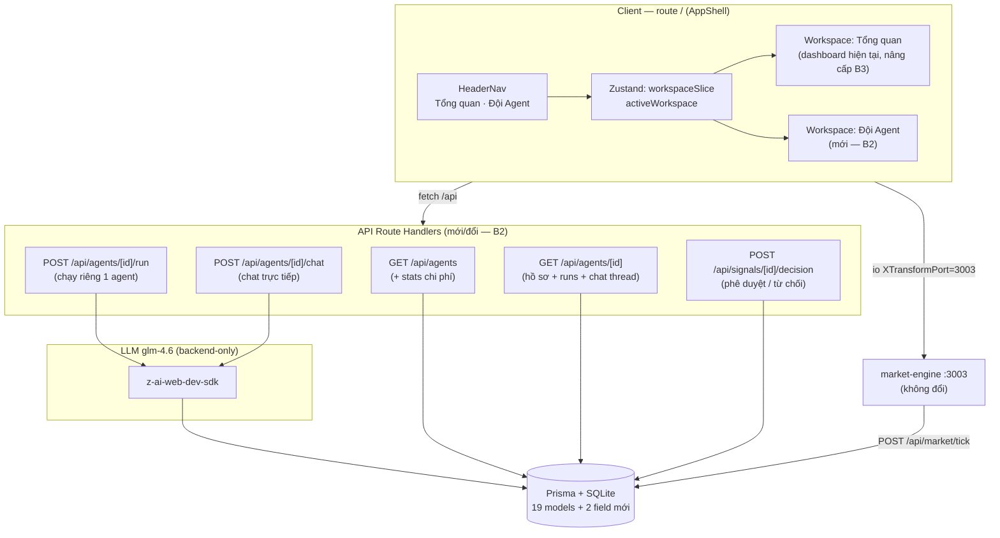

# The Trader — Blueprint Giai đoạn 3: Đội Agent & Trạm chỉ huy

> **Project:** The Trader — Hệ thống giao dịch đa agent (Multi-Agent Trading System) cho VNDIRECT
> **Document:** `docs/PHASE3_BLUEPRINT.md` · **Version:** 0.1.0 (draft — chờ phê duyệt) · **Created:** 2026-10-06
> **Cross-refs:** [TECHNICAL_BLUEPRINT.md](./TECHNICAL_BLUEPRINT.md) (kiến trúc v0.3) · [DB_SCHEMA.md](./DB_SCHEMA.md) (data dictionary 19 models) · [DATA_SOURCES.md](./DATA_SOURCES.md) (nguồn dữ liệu) · [CODE_AUDIT.md](./CODE_AUDIT.md) (rà soát trước khi triển khai)
> **Nguồn gốc:** góp ý người dùng + bản review theo persona CFO VNDIRECT (worklog Task 17): *thiếu module riêng cho đội Agents, không làm việc được với từng agent, dashboard chính sơ sài*

---

## 1. Mục tiêu & phạm vi

### 1.1 Ba bước triển khai

| Bước | Tên | Giải quyết | Phụ thuộc |
|---|---|---|---|
| **B1** | App shell & điều hướng workspace | Mọi khối chức năng cần "cửa vào" riêng; mở rộng cho các workspace sau này (Rủi ro & Tuân thủ…) | — |
| **B2** | Workspace **Đội Agent** — hồ sơ + làm việc trực tiếp | Góp ý (1) xem ai làm gì + (2) chạy riêng / chat / phê duyệt-từ chối | B1 |
| **B3** | Nâng cấp **dashboard Tổng quan** | Góp ý (3): biểu đồ nến + RSI, bảng giá trần/sàn, tỷ trọng danh mục, sức mua, chi phí AI | độc lập B1/B2 (có thể song song) |

### 1.2 Ràng buộc kỹ thuật (bất biến)

- **Single route `/`**: người dùng chỉ nhìn thấy `src/app/page.tsx` — chuyển workspace bằng **client state (Zustand)**, không thêm route trang mới. Route API mới vẫn cho phép (chỉ là endpoint backend).
- **No fabrication**: không bịa dữ liệu DOM/orderbook 5 mức, intraday tick thật, khối ngoại từng mã — các mục này giữ ở roadmap chờ feed thật (nguyên tắc [DATA_SOURCES.md §6](./DATA_SOURCES.md)).
- **LLM backend-only**: `z-ai-web-dev-sdk` chỉ trong Route Handler; client không bao giờ import.
- **Ngân sách chi phí LLM**: mọi call LLM mới (B2) phải ghi `AgentRun` (tokens/cost) và có **rate-limit** — CFO phải thấy được đồng tiền.
- Stack hiện hữu: Next.js 16 App Router, shadcn/ui, TanStack Query, Zustand, recharts, Prisma + SQLite, market-engine (3003).

### 1.3 Non-goals của Giai đoạn 3

- Không làm DOM/orderbook 5 mức, heatmap, khung intraday thật (thiếu nguồn).
- Không đăng nhập/đa người dùng, không backtest.
- Không đổi market-engine (chỉ đọc thêm event `cycle` sẵn có).

---

## 2. Kiến trúc tổng thể sau Giai đoạn 3



**Nguyên tắc luồng:** UI workspace Đội Agent là "phòng họp" — mọi thao tác (chạy riêng, chat, phê duyệt) đi qua API → SDK → DB, có audit; realtime vẫn một nguồn duy nhất từ market-engine.

---

## 3. Bước 1 — App shell & điều hướng workspace

### 3.1 Zustand store (mở rộng `src/lib/store.ts`)

```ts
type Workspace = "overview" | "agents";
// slice mới:
{
  workspace: {
    active: Workspace;            // default "overview"
    set(ws: Workspace): void;
  }
}
```

- Không persist localStorage ở v0.1 (giữ đơn giản); có thể nâng cấp sau.
- `?ws=agents` query param (tuỳ chọn): đọc 1 lần khi mount để deep-link được — vẫn nằm trên route `/`.

### 3.2 UI — `src/components/dashboard/nav.tsx` (mới)

- Vị trí: trong `header.tsx`, hàng dưới thanh logo — dải nút dạng `Tabs`-like (shadcn `Button` variant ghost + trạng thái active nền muted).
- 2 tab: `Tổng quan` (icon `LayoutDashboard`), `Đội Agent` (icon `Bot`, kèm badge chấmlive khi realtime đang nối).
- Mobile (<sm): nav dính lên đầu nội dung, tab chiếm 50%/50%, touch target ≥ 44px.
- `page.tsx`: `{active === "overview" ? <OverviewWorkspace/> : <AgentsWorkspace/>}` — hai workspace tách component root để unmount sạch, tránh rò rỉ socket/listener.

### 3.3 Tái cấu trúc component

| File | Việc |
|---|---|
| `src/components/dashboard/overview-workspace.tsx` **(mới)** | Bọc toàn bộ section hiện tại của page.tsx (market-summary → footer) |
| `src/components/dashboard/agents-workspace.tsx` **(mới — B2)** | Placeholder ở B1, thay bằng roster thật ở B2 |
| `src/app/page.tsx` | Chỉ còn AppShell: header + nav + workspace switch + footer dùng chung |
| `src/lib/store.ts` | Thêm slice `workspace` |

### 3.4 Tiêu chí nghiệm thu B1

- [ ] Chuyển tab không reload trang, không mất trạng thái realtime (socket giữ nguyên).
- [ ] Tab active có chỉ báo thị giác; keyboard focusable (`role="tablist"`, `aria-selected`).
- [ ] Mobile 390px: nav không tràn ngang, footer vẫn sticky bottom.
- [ ] `bun run lint` + `bunx tsc --noEmit` sạch.

---

## 4. Bước 2 — Workspace "Đội Agent"

### 4.1 Thay đổi schema (delta tối thiể)

```prisma
model AgentMessage {
  // ... trường hiện hữu giữ nguyên ...
  direction String @default("AGENT") // AGENT | USER — nhánh chat trực tiếp
  // fromAgentId: agent SỞ HỮU luồng chat (cả tin của user gửi cho agent đó)
  // broadcast=true → message chu kỳ (direction AGENT); broadcast=false → chat 1-1
  @@index([fromAgentId, broadcast, createdAt(sort: Desc)]) // truy vấn thread chat
}

model Signal {
  // ... trường hiện hữu giữ nguyên ...
  status String @default("ACTIVE") // ACTIVE | ACTED | REJECTED | EXPIRED
  rejectedAt DateTime?
  rejectNote String?
  @@index([status, createdAt(sort: Desc)])
}
```

- `bun run db:push` (SQLite additive — không phá dữ liệu seed/hiện hữu; Prisma client regenerate tự động).
- Cập nhật [DB_SCHEMA.md](./DB_SCHEMA.md): §6.8 AgentMessage + §6.10 Signal + Change Log (bump v0.4.0 khi triển khai xong).

### 4.2 Bảng API mới/đổi

| Route | Method | Mục đích | Thay đổi chính |
|---|---|---|---|
| `/api/agents` | GET | Roster + stats | **Đổi:** thêm `stats` mỗi agent: `runCount`, `successRate` (COMPLETED/run), `totalTokensIn/Out`, `totalCostUsd`, `lastError`, `chatCount` |
| `/api/agents/[id]` | GET | Hồ sơ chi tiết | **Mới:** agent + `config` parsed + stats + 20 runs gần nhất + 12 tasks + 30 messages (thread chat lẫn broadcast) + signals mở của agent |
| `/api/agents/[id]/run` | POST | **Chạy riêng 1 agent** | **Mới** — xem hợp đồng §4.3 |
| `/api/agents/[id]/chat` | POST | **Chat trực tiếp** | **Mới** — xem hợp đồng §4.4 |
| `/api/signals/[id]/decision` | POST | Phê duyệt / từ chối đề xuất | **Mới** — xem hợp đồng §4.5 |

Tất cả route: `force-dynamic`, BigInt → Number qua `toPlain`, try/catch toàn cục không crash, trả `{error: "vi-VN message"}` khi 4xx/5xx.

### 4.3 Hợp đồng `POST /api/agents/[id]/run` — chạy riêng

**Request:** `{}` (hoặc `{ note?: string }` — ngữ cảnh tuỳ chọn của trader).

**Luồng:**

1. Load agent theo `[id]` (cuid) — 404 nếu không tồn tại; 400 nếu `status = RUNNING`.
2. **Rate-limit**: từ chối 429 nếu agent có run `RUNNING` chưa kết thúc, hoặc run cuối < **60 giây** trước (guard trong bộ nhớ, như `src/lib/news.ts`); trả `retryAfterSeconds`.
3. Xây **role-prompt đúng chuyên môn** từ bảng ánh xạ §4.6 + context thật:
   - market-analyst → quotes snapshot + indicators + `flowsBlock`
   - news-sentiment → 10 tin RSS mới nhất + `flowsBlock`
   - risk-manager → positions + account + risk alerts mở + `flowsBlock`
   - portfolio-strategist → tất cả khối trên + signals đang mở
   - execution-manager → **từ chối 409** "Execution Manager chỉ chạy trong chu kỳ orchestrator đầy đủ (vì cần Signal đầu vào)" — không chạy lẻ.
4. Gọi SDK (glm-4.6) → parse JSON `{summary, recommendation, confidence}` (chung parser với run route hiện tại).
5. Persist: `AgentRun` (tokens/cost/duration, `taskStatus`) + `AgentMessage` (broadcast **true**, direction `AGENT`) + `updateAgentHealth(agentId, …)`.
6. `AuditLog` action `AGENT_RUN_COMPLETED` (entity agent, meta `{mode: "single"}`).
7. **Response 200:**

```json
{
  "agent":   { "id": "...", "code": "market-analyst", "name": "Market Analyst" },
  "message": { "id": "...", "content": "...", "reasoning": "...", "sentiment": "bullish" },
  "run":     { "id": "...", "tokensIn": 1834, "tokensOut": 421, "costUsd": 0.0087,
               "durationMs": 5210, "taskStatus": "COMPLETED" }
}
```

### 4.4 Hợp đồng `POST /api/agents/[id]/chat` — chat trực tiếp

**Request:** `{ "message": "VCB dạo này thế nào?" }` (trim, 2–500 ký tự; 400 nếu rỗng/quá dài).

**Luồng:**

1. Load agent; rate-limit như §4.3 (429 + `retryAfterSeconds`).
2. Lưu **tin user** ngay: `AgentMessage { fromAgentId: <agent>, direction: "USER", broadcast: false, content }` — hiển thị tức thì kể cả khi LLM lỗi.
3. Context = role-prompt §4.6 (rút gọn) + 10 tin chat gần nhất của thread (đổi vai `user`/`assistant`) + khối dữ liệu theo vai (như single-run nhưng `_compact`).
4. Gọi SDK → lưu **tin trả lời**: `AgentMessage { fromAgentId: <agent>, direction: "AGENT", broadcast: false, content }` + `AgentRun` (đo chi phí, `output` = câu hỏi gốc) + audit `AGENT_CHAT`.
5. Lỗi SDK → trả 200 kèm `{ reply: null, error: "Agent tạm thời không phản hồi — vui lòng thử lại" }` (tin user đã lưu, không mất).

**Response 200:**

```json
{
  "userMessage":   { "id": "...", "direction": "USER", "content": "..." },
  "reply":         { "id": "...", "direction": "AGENT", "content": "..." } ,
  "run":           { "tokensIn": 1210, "tokensOut": 380, "costUsd": 0.0062, "durationMs": 3120 },
  "threadLength":  14
}
```

**GET /api/agents/[id] trả `chat`** = messages `broadcast=false` orderBy createdAt asc (thread hoàn chỉnh) + `broadcastFeed` = 20 tin broadcast gần nhất.

### 4.5 Hợp đồng `POST /api/signals/[id]/decision`

**Request:** `{ "action": "APPROVE" | "REJECT", "note?": "lý do" }`

| Nhánh | Hành vi |
|---|---|
| `APPROVE` | Tái dùng **đúng logic** `POST /api/signals/[id]/convert` (sizing 5% NAV, lot 100, LIMIT paper + `actedAt` + audit `ORDER_CREATED`). Thêm: `status = "ACTED"` + audit `SIGNAL_APPROVED` meta `{via: "decision"}`. Guard 409 nếu `status != ACTIVE`. |
| `REJECT` | `status = "REJECTED"`, `rejectedAt`, `rejectNote` + audit **`SIGNAL_REJECTED`** (action mới) + `AgentMessage` broadcast của risk-manager? — *không*: ghi audit thôi, tránh bịa lời agent. |

**Response 200:** `{ signal: {...}, order?: {...} }` (order chỉ có khi APPROVE).

### 4.6 Bản đồ role-prompt (dùng chung single-run & chat)

| Agent | System prompt cốt lõi (VN) | Khối dữ liệu nhúng |
|---|---|---|
| market-analyst | "Bạn là chuyên viên phân tích kỹ thuật… chỉ nói bằng dữ liệu dưới đây, không bịa số" | quotes board + SMA/RSI/momentum + flowsBlock |
| news-sentiment | "Bạn là chuyên viên tin tức & cảm xúc thị trường… tổng hợp 10 tin, gán sentiment bullish/bearish/neutral" | 10 tin RSS (title+source+time) |
| risk-manager | "Bạn là quản trị rủi ro… kiểm tra hạn mức, tập trung ngành, tổn thất danh mục" | positions + account (đã mask) + risk alerts mở |
| portfolio-strategist | "Bạn là chiến lược gia danh mục… tổng hợp, đề xuất MUA/BÁN/GIỮ kèm điểm số" | tất cả khối rút gọn + signals mở |
| execution-manager | Không chat/chạy lẻ (409) — chỉ hoạt động trong chu kỳ | — |

Mỗi prompt kết thúc bằng: *"Dữ liệu thị trường hiện mang nhãn chế độ nguồn (simulated/live) — hãy khai báo chế độ trong câu trả lời khi liên quan."*

### 4.7 UI — component mới

| File | Nội dung |
|---|---|
| `agents-workspace.tsx` | Layout 2 cột (desktop xl): trái = roster cards; phải = panel chi tiết/chat. Mobile: stack dọc. Header workspace: tổng quan đội (số agent, chi phí AI lũy kế, nút "Chạy chu kỳ đầy đủ" tái dùng `useRunAgents`) |
| `agent-roster-card.tsx` | 5 cards: icon vai, tên + vai VN, mô tả 1 dòng, health score bar, status dot, stats mini (runs, success rate, cost), nút ▶ "Chạy riêng" (loading riêng), click card → mở chi tiết |
| `agent-detail-panel.tsx` | Tabs: `Hồ sơ` (đầy đủ trách nhiệm + input/output + config parsed dạng key-value), `Hoạt động` (bảng AgentRun: thời gian, duration, tokens, cost, trạng thái; sparkline chi phí tuần), `Nhiệm vụ` (tasks), `Phát thanh` (broadcast feed) |
| `agent-chat.tsx` | Thread chat (khác màu tin USER/AGENT), input + gửi (disabled khi rate-limit, đếm ngược hiển thị), cảnh báo chi phí nhỏ ("~$0.006/tin"), auto-scroll `custom-scrollbar` max-h-96 |
| `message-feed.tsx` (đổi `agents-panel` hiện tách ra) | Feed broadcast cũ nâng cấp: tin mới nhất của strategist kèm nút **✅ Phê duyệt / ⛔ Từ chối** khi có signal ACTIVE tương ứng |

### 4.8 Telemetry & audit mới

- `AuditLog.action`: thêm `AGENT_CHAT`, `SIGNAL_REJECTED` (cập nhật [DB_SCHEMA.md §6.16](./DB_SCHEMA.md) danh sách action + [TECHNICAL_BLUEPRINT.md §7](./TECHNICAL_BLUEPRINT.md)).
- Query keys TanStack: `["agent", id]`, `["agent-chat", id]`, `["agents"]` (đổi shape); mutation invalidates đúng tầng.

### 4.9 Tiêu chí nghiệm thu B2

- [ ] Chạy riêng market-analyst → AgentMessage mới xuất hiện trong broadcast feed + AgentRun có tokens/cost + health score cập nhật.
- [ ] Chat: hỏi "VCB dạo này thế nào?" cho market-analyst → trả lời nhắc tới giá VCB thật trong DB; tin user hiển thị đúng bên; rate-limit 429 hiển thị đếm ngược.
- [ ] Phê duyệt signal BUY → order PENDING xuất hiện ở tab Lệnh; Từ chối signal → badge ĐÃ TỪ CHỐI, không tạo lệnh, audit `SIGNAL_REJECTED`.
- [ ] Tổng chi phí AI trên workspace tăng đúng sau mỗi call.
- [ ] execution-manager: chạy riêng/chat → 409/400 với thông báo tiếng Việt rõ ràng.
- [ ] E2E agent-browser qua gateway :81 + VLM audit 6/6 section; console sạch.

---

## 5. Bước 3 — Nâng cấp dashboard Tổng quan

### 5.1 Biểu đồ nến + khối lượng + RSI14

- **Dữ liệu sẵn có:** `Bar` (90 ngày OHLCV) — không thêm nguồn.
- `price-chart.tsx` nâng cấp:
  - **Nến Nhật**: recharts không có sẵn candlestick → render bằng `Customized` component: mỗi ngày vẽ wick (line high→low) + body (rect open→close, màu `--up` xanh khi close ≥ open, `--up/--down` semantic tokens hiện có); tooltip giữ format VND hiện tại + thêm O/H/L.
  - **Volume histogram**: ComposedChart trục dưới, cùng tooltip, opacity 0.5, màu theo ngày tăng/giảm.
  - **RSI14 panel**: chart con cao ~96px phía dưới, đường RSI14 (dùng `src/lib/indicators.ts` `rsi()` sẵn có), 2 guideline 30/70 nét đứt, vùng >70/<30 tô nền amber nhạt.
  - Tab khung thời gian giữ 30/60/90 ngày; toggle chế độ **Nến/Đường** (default Nến; nhớ trong Zustand slice `chart`).
- **Không làm**: intraday 1/5/15p (thiếu nguồn tick lịch sử), indicator MACD/BOLL (để roadmap sau).

### 5.2 Bảng giá — cột mở rộng

- Cột mới: `Trần` · `Sàn` · `Tham chiếu` · `Cao` · `Thấp` (đều có sẵn trên `Quote`).
- **Toggle "Cột mở rộng"** (mặc định tắt): bật mới thêm cột — tránh tràn ngang mobile; khi tắt giữ layout hiện tại (Mã/Giá/±/%/KL/BT).
- Mobile: cột mở rộng chỉ hiện khi ≥ sm; dưới sm dùng collapse hàng (tap mở rộng hiện chi tiết trần/sàn/Cao/Thấp — tái dùng pattern hàng đang có).
- Màu: giá chạm trần → `text-up` đậm + chấm ⌃; chạm sàn → `text-down` + ⌄ (quy ước HOSE).

### 5.3 Danh mục — tỷ trọng & phân bổ

- Thêm cột **% tỷ trọng** mỗi vị thế = marketValue / tổng GTTH (1 chữ số thập phân).
- **Donut phân bổ theo ngành** (recharts `PieChart` innerRadius): từ `Instrument.sector` × marketValue; legend dạng chip %; đặt cạnh tabs, chỉ hiển thị desktop ≥ md (mobile ẩn, thay bằng dòng tổng hợp "Top ngành: Ngân hàng 46% · BĐS 21% · …").
- **Lãi/lỗ đã thực hiện**: tổng `Position.realizedPnl` (BigInt → Number) — hiển thị ở dải 6 chỉ số (thay ô "Biến động ngày" thành dạng ghép: Biến động ngày + Realized P&L dưới).
- Số liệu **không bịa**: không annualize, không giả định dòng tiền vào/ra.

### 5.4 Header — chip Sức mua

- Công thức **minh bạch có nhãn ước tính**: `Sức mua (ước tính) = cashBalance + marginRoom`, với `marginRoom = equity × MARGIN_ROOM_RATIO − marginUsed`, `MARGIN_ROOM_RATIO` = env `MARGIN_ROOM_RATIO` default **0.5** (giả định ký quỹ 50% — ghi rõ tooltip "Giả lập hệ số 0.5 — không phải hạn mức thật của VNDIRECT").
- Tooltip phân tích công thức + cảnh báo nếu `marginRoom < 0` (badge đỏ "Vượt hạn mức ước tính").
- Đây là **ước tính có ghi chú**, không khai báo là hạn mức thật — nhất quán nguyên tắc no-fabrication.

### 5.5 Chip chi phí AI (footer + Đội Agent)

- Nguồn: aggregate `AgentRun.costUsd` (sum) + tokens — query 1 lần trong `/api/agents` stats (đã có ở B2), footer hiển thị chip "AI: $0.42 · 128K tokens" cạnh các chip nguồn dữ liệu hiện có; workspace Đội Agent hiển thị chi tiết theo agent + theo 7 ngày (sparkline).
- Mục đích CFO: kiểm soát chi phí vận hành đội AI theo thời gian thực.

### 5.6 Tiêu chí nghiệm thu B3

- [ ] Nến render đúng 90 phiên: body màu đúng chiều, wck không lệch ngày; tooltip đủ O/H/L/C/Volume.
- [ ] RSI14 khớp giá trị tính tay mẫu 5 mã (so `src/lib/indicators.ts`).
- [ ] Bảng giá: bật cột mở rộng trên desktop không vỡ layout; mobile không tràn ngang (pageScrollW == viewportW).
- [ ] Donut: tổng % = 100 ± 0.5; hover tooltip đúng ngành.
- [ ] Chip Sức mua hiển thị công thức + nhãn "ước tính"; footer chip chi phí AI tăng sau mỗi run (liên động B2).
- [ ] VLM audit desktop + mobile không vỡ layout; console sạch.

---

## 6. Kế hoạch file

**File mới (10):** `nav.tsx`, `overview-workspace.tsx`, `agents-workspace.tsx`, `agent-roster-card.tsx`, `agent-detail-panel.tsx`, `agent-chat.tsx`, `candle-chart.tsx`, `allocation-donut.tsx`, `src/app/api/agents/[id]/route.ts`, `src/app/api/agents/[id]/run/route.ts`, `src/app/api/agents/[id]/chat/route.ts`, `src/app/api/signals/[id]/decision/route.ts` *(12 file — API 4 + UI 8)*

**File đổi (9):** `page.tsx`, `header.tsx`, `footer.tsx`, `price-chart.tsx`, `quotes-table.tsx`, `portfolio-section.tsx`, `agents-panel.tsx` (tách feed), `store.ts` (slice workspace + chart mode), `prisma/schema.prisma` (delta §4.1)

**Docs đồng bộ sau triển khai:** `DB_SCHEMA.md` (v0.4.0 — 2 field + 3 index + 2 audit action), `TECHNICAL_BLUEPRINT.md` (§3 nav, §4 API +5 route, §5.2 luồng single-run/chat, Change Log), `DATA_SOURCES.md` (S2 note chat/single-run), `README.md` (tính năng), `USER_PROMPTS.md` (Giai đoạn 7), `worklog.md` mỗi task.

---

## 7. Kế hoạch kiểm thử & nghiệm thu chung

1. **Trước khi code:** chạy audit theo [CODE_AUDIT.md](./CODE_AUDIT.md) — sửa mọi finding P0/P1 trước khi xây tiếp (không xây nhà trên nền nứt).
2. **Mỗi bước:** lint + tsc + dev.log sạch; agent-browser E2E qua gateway :81 (desktop 1440×900 + mobile 390×844); VLM audit ảnh chụp; checklist nghiệm thu mục §3.4 / §4.9 / §5.6.
3. **Kịch bản E2E chủ chốt (B2):** vào Đội Agent → mở market-analyst → chat "VCB dạo này thế nào?" → nhận câu trả lời có giá → chạy riêng risk-manager → về Tổng quan → phê duyệt 1 signal → kiểm tra tab Lệnh có order mới → footer chip chi phí AI tăng.
4. **Hồi quy:** chu kỳ đầy đủ (nút Header) vẫn hoạt động 5/5 agent; watchlist toggle; realtime tick vẫn đẩy giá.

---

## 8. Thứ tự & khối lượng ước tính

| Thứ tự | Việc | Ước tính | Ghi chú |
|---|---|---|---|
| 0 | Audit CODE_AUDIT.md + fix P0/P1 | riêng biệt | xem §7.1 |
| 1 | B1 App shell | ~0.5 ngày | nền cho B2 |
| 2 | B2 schema delta + 4 API route | ~1 ngày | core |
| 3 | B2 UI roster/detail/chat + decision | ~1 ngày | lượng UI lớn nhất |
| 4 | B3 chart nến/RSI/volume | ~0.5–1 ngày | recharts custom |
| 5 | B3 bảng giá + donut + sức mua + cost chip | ~0.5 ngày | |
| 6 | Docs sync + push GitHub | ~0.25 ngày | dùng PAT đã lưu |

---

## 9. Change Log

| Ngày | Thay đổi |
|---|---|
| 2026-10-06 | Tạo bản draft 0.1.0 theo góp ý người dùng (Task 17 review CFO): 3 bước — App shell, Workspace Đội Agent (roster + chi tiết + chạy riêng + chat + phê duyệt/từ chối), nâng cấp dashboard (nến/RSI/volume, cột trần-sàn, donut tỷ trọng, sức mua ước tính, chip chi phí AI). Chờ phê duyệt trước khi triển khai. |
