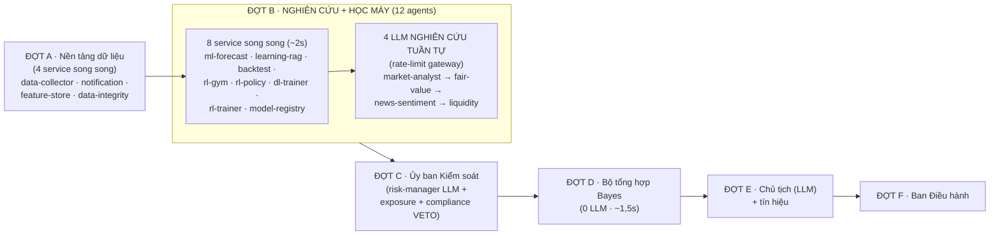
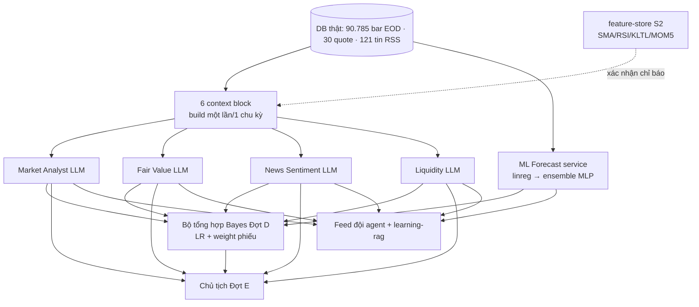

# KẾ HOẠCH THẢO LUẬN — NHÓM 1 · HỘI ĐỒNG NGHIÊN CỨU

> Tài liệu thảo luận + triển khai thuật toán vận hành nhóm đầu tiên trong 5 nhóm của đội 23 agents.
> Phiên bản 0.1 (2026-10-07) — trạng thái: **MỞ THẢO LUẬN**, chưa chốt triển khai.
> Mọi con số trong tài liệu đều trích từ code/DB thực tế (đã xác minh phiên #36), không ước lượng.

---

## §0. Cách dùng tài liệu này

1. §1 trả lời câu hỏi độ phủ thị trường hiện tại của toàn hệ thống.
2. §2–§6 chẩn đoán hiện trạng nhóm Hội đồng Nghiên cứu (ai làm gì, chạy thế nào, thuật toán gì, đánh giá ra sao, còn yếu chỗ nào).
3. §7 đề xuất thuật toán nâng cấp TỪNG THÀNH VIÊN — mỗi đề xuất kèm spec đủ chi tiết để code ngay khi chốt.
4. §8 checklist test chức năng bắt buộc trước khi coi một nâng cấp là "xong".
5. §9 câu hỏi mở — cần user chốt trước khi triển khai đợt 1.

---

## §1. Độ phủ thị trường hiện tại của hệ thống (TRẢ LỜI CÂU HỎI)

### 1.1. Khả năng thiết kế vs thực tế vận hành

| Khía cạnh | Schema hỗ trợ (thiết kế) | DB thực tế (đang chạy) | Tỷ lệ |
|---|---|---|---|
| Sàn giao dịch | 3: HOSE · HNX · UPCOM | **1: HOSE** | 1/3 |
| Loại tài sản | 5: STOCK · ETF · FUND · BOND · INDEX | **1: STOCK** | 1/5 |
| Tổ hợp lý thuyết | 15 | **1 (HOSE cổ phiếu thường)** | **1/15** |

### 1.2. Chi tiết vũ trụ đầu tư thực tế (truy vấn DB 2026-10-07)

- **30 mã cổ phiếu HOSE** đang active — thực chất là **rổ VN30 mở rộng** (SSI, CTG, VCB, PLX, HVN, MSN, VRE, BID, SAB, VNM, VJC, MBB, TPB, VHM, HSG, CMG, VIC, MWG, HPG, DHG…).
- **Phân bố ngành (9 ngành):** Ngân hàng 10 · Chứng khoán 3 · Tiêu dùng 3 · Bất động sản 3 · Công nghệ 2 · Hàng không 2 · Bán lẻ 2 · Năng lượng 2 · Vật liệu 2 · Y tế 1.
- **Dữ liệu lịch sử:** 90.785 bar EOD THẬT VNDIRECT (dchart) — mỗi mã ~2.100–3.429 phiên.
- **Báo giá:** 30 quote hiện tại (mode `real-eod`, có nhánh realtime finfo đã code nhưng chờ egress sandbox).
- **Tin tức:** 121 tin RSS thật từ 5 nguồn (VnEconomy · CafeF · VNExpress · Tuổi Trẻ · VietnamNet).
- **Dòng khối ngoại:** MÔ PHỎNG (mode `simulated` — khai báo rõ trong prompt, trọng số bằng chứng bị hạ 0,5 vì mô phỏng).

### 1.3. Chưa bao hàm (khoảng trống độ phủ)

- HNX (cổ phiếu sàn Hà Nội) và UPCOM — schema sẵn, chỉ cần nạp danh mục + bar.
- ETF (E1VFVN30, FUEVN100…), quỹ mở, trái phiếu, chỉ số tổng hợp (VNINDEX/VN30-Index), phái sinh (VN30 futures).
- Dữ liệu tài chính cơ bản (P/E, EPS, BVPS, ROE) — chưa có bảng tài chính; agent fair-value hiện định giá thuần theo dải giá lịch sử.
- Sàn quốc tế (US, HK…) — ngoài phạm vi hiện tại.

> **Kết luận §1:** Hệ thống đang là chuyên gia của **một tổ hợp duy nhất: cổ phiếu thường HOSE (rổ ~30 mã lớn đủ thanh khoản)**. Với Tài chính chứng khoán nói rộng, mức bao hàm hiện tại ~"1/15 thiết kế". Đây vừa là điểm mạnh (tập trung, dữ liệu thật sâu 3.400 phiên/mã) vừa là ràng buộc cần ghi nhận khi đánh giá mọi dự báo của nhóm Nghiên cứu.

---

## §2. Hiện trạng nhóm Hội đồng Nghiên cứu — từng thành viên

Nhóm gồm **5 thành viên**: 4 agent LLM (phân tích + phiếu bầu định lượng) + 1 agent dịch vụ deterministic.

### 2.1. Bảng tổng quan

| # | Agent (code) | Kiểu | Nhiệm vụ tuyên bố | Đầu vào (context block) | Đầu ra |
|---|---|---|---|---|---|
| 1 | **Market Analyst** (`market-analyst`, A2) | LLM | Phân tích kỹ thuật & vi mô VN30 | `market` + `flows` | JSON: content + reasoning + **assessment {direction, confidence, evidence}** |
| 2 | **Fair Value Analyst** (`fair-value`, A3) | LLM | Định giá hợp lý theo dải giá lịch sử | `market` + `valuation` | Như trên |
| 3 | **News & Sentiment** (`news-sentiment`, A4) | LLM | Chấm cảm xúc dòng tin | `market` + `news` + `flows` | Như trên + trường `sentiment` |
| 4 | **Liquidity Analyst** (`liquidity`, A5) | LLM | Thanh khoản & khả năng hấp thụ lệnh | `market` + `liquidity` | Như trên |
| 5 | **ML Forecast** (`ml-forecast`, A15) | service (0 LLM) | Dự báo động lượng 5 phiên top-5 thanh khoản | DB trực tiếp (Bar) | content + output JSON {forecasts per symbol} |

> Ghi chú: **Risk Manager** tuy mang tâm tư "nghiên cứu rủi ro" nhưng thuộc nhóm 2 (Ủy ban Kiểm soát) — ngoài phạm vi tài liệu này.

### 2.2. Chi tiết từng thành viên

#### 2.2.1. Market Analyst (A2) — LLM

- **Nhiệm vụ:** đánh giá xu hướng tổng thể 5 phiên tới; nêu 2–3 mã nổi bật kèm số liệu; KHÔNG được bịa số ngoài bảng.
- **Dữ liệu nhận (thật):** snapshot VN30 (số mã tăng/giảm, biến động TB, tổng KL, top tăng/giảm 5 mã) + **bảng chỉ báo top-10 thanh khoản** — mỗi dòng: giá, %hg, SMA20, SMA50, RSI14, % 5 phiên, KL/TL20 + danh mục đang nắm + tỷ trọng ngành + tài khoản + cảnh báo rủi ro + dòng khối ngoại (mô phỏng).
- **Thuật toán phía hệ thống tính sẵn:** SMA (P rolling), RSI-14 Wilder, pctChange, latestVsMean (KL/TL20).
- **⚠ Phát hiện mismatch (quan trọng):** prompt tuyên bố *"chỉ báo: SMA20, SMA50, RSI14, MACD, BOLL"* nhưng bảng context **KHÔNG hề có MACD và Bollinger**. Hai hàm này (cùng ATR, OBV, Stochastic) **đã code sẵn trong `src/lib/indicators.ts` mà chưa được nạp vào prompt** — agent nhận ít bằng chứng hơn thiết kế.
- **Phiếu bầu:** trường `assessment` → vào Bộ tổng hợp Bayes như bằng chứng thị trường (xem §5.2).

#### 2.2.2. Fair Value Analyst (A3) — LLM

- **Nhiệm vụ:** xác định mã ĐẮT/RẺ bất thường so lịch sử; z-score cụ thể; ý nghĩa giao dịch.
- **Dữ liệu nhận:** dải giá 90 phiên top-10 thanh khoản — mỗi mã: min/max, mean ± σ, **z-score**, % so đỉnh/đáy, nhãn "ĐẮT bất thường" (z > +1,5) / "RẺ bất thường" (z < −1,5) / "trong dải".
- **Thuật toán:** z-score thống kê (giá hiện tại − mean 90 phiên) / σ. **KHÔNG có P/E/EPS** — prompt bắt buộc khai báo giới hạn này, không được bịa.
- **Hạn chế cấu trúc:** z tuyệt đối — so cổ phiếu ngân hàng (σ nhỏ, giá nén) với cổ phiếu BĐS (σ lớn) chưa chuẩn hoá theo ngành; chưa có mean-reversion half-life.

#### 2.2.3. News & Sentiment (A4) — LLM

- **Nhiệm vụ:** chấm cảm xúc dòng tin (bullish/bearish/neutral); nêu 1–2 tin ảnh hưởng lớn nhất tới VN30; cấm bịa tin — nếu nguồn chưa nạp phải khai báo "no new data".
- **Dữ liệu nhận:** 10 tin RSS mới nhất (5 nguồn thật) kèm tuổi tin + dòng khối ngoại.
- **Thuật toán hệ thống liên quan:** LEXICON SENTIMENT TIẾNG VIỆT (`quant/sentiment.ts`) — từ điển dương/âm + bigram ("tăng trần", "bán ròng") + phủ định ("không tăng" → âm) — **nhưng chỉ dùng cho bằng chứng Bayes (60 tin 24h), điểm lexicon KHÔNG được đưa vào prompt của chính agent này** để LLM đối chiếu.
- **Điểm cần lưu ý:** agent chấm cảm xúc bằng phán đoán LLM; phần quant lexicon chạy song song ở tầng Bayes → hai luồng cảm xúc (LLM vs lexicon) chưa đối chiếu được trong một prompt.

#### 2.2.4. Liquidity Analyst (A5) — LLM

- **Nhiệm vụ:** đánh giá khả năng hấp thụ lệnh; mã khối lượng bùng nổ/khô hạn; cảnh báo mã khó thoát lệnh.
- **Dữ liệu nhận:** top-10 khối lượng — KL phiên, KL/TL20 (×), bid/ask, chênh lệch %, ADTV 20 phiên (tỷ ₫) + dòng khối ngoại.
- **Thuật toán:** mean 20 phiên, ratio khối lượng, spread %, ADTV = mean(vol) × giá.
- **Hạn chế dữ liệu:** bid/ask hiện chỉ có ở Quote (mode `real-eod` → bid/ask suy diễn từ dải trần/sàn); dòng khối ngoại MÔ PHỎNG (khai báo rõ — bằng chứng flows bị weight 0,5).

#### 2.2.5. ML Forecast (A15) — service deterministic

- **Nhiệm vụ:** dự báo xu hướng 5 phiên, top-5 thanh khoản, 0 LLM, ~0,5s.
- **Thuật toán hiện tại:** **hồi quy tuyến tính (linreg slope)** trên 30 phiên đóng cửa → slope × 5 / giá → % dự báo; sentiment theo trung bình.
- **⚠ Phát hiện lạc hậu (quan trọng):** từ phiên #35 hệ thống đã có **MLP deep learning serving v5 (valAcc 40,2% trên 58.726 mẫu thật)** nhưng agent ml-forecast **vẫn chạy linreg** — MLP hiện chỉ được tiêu thụ bởi dl-trainer và bằng chứng Bayes `mlp-forecast`. Agent mang tên "ML Forecast" lại không dùng mô hình ML mới nhất của hệ thống.

---

## §3. Luồng vận hành hiện tại của nhóm

### 3.1. Vị trí trong chu kỳ 6 đợt (A→F)

- **Kích hoạt:** thủ công (nút "Chạy chu kỳ phân tích" trong UI) hoặc **scheduler nền** trong mini-service `market-engine` (tự POST `/api/agents/run` theo chu kỳ, 429 rate-limit được coi là bình thường khi dồn lịch).
- **Thứ tự trong Đợt B:** 8 service agents chạy song song trước (nhanh, 0 LLM) → 4 LLM nghiên cứu chạy **TUẦN TỰ** (tôn trọng rate-limit gateway; `callLlmWithRetry` retry 1 lần khi 429).
- **Thời lượng chu kỳ đo thực tế:** 69–75s (phiên #34–#35), 23 agents, 0 lỗi.

### 3.2. Ngữ cảnh chia sẻ (snapshot một lần/1 chu kỳ)

Đầu chu kỳ, 6 context block được build song song từ DB **một lần duy nhất** rồi tái dùng:
`buildMarketBlock` (chỉ báo top-10) · `buildNewsBlock` (10 tin) · `buildFlowsBlock` (khối ngoại) · `buildOpenSignalsBlock` (tín hiệu đang mở) · `buildValuationBlock` (dải z-score) · `buildLiquidityBlock` (KL/spread/ADTV).

→ Mọi agent LLM trong chu kỳ **cùng nhìn một snapshot** — nhất quán dữ liệu, tránh mỗi agent tự query lệch nhau.

### 3.3. Đầu ra của nhóm chảy đi đâu (3 người tiêu thụ)

1. **Feed đội agent (AgentMessage broadcast):** content 2–4 câu + reasoning + sentiment — hiển thị tab Đội Agent, làm ngữ cảnh học tập của learning-rag (window 500 tin, top-K 8).
2. **Bộ tổng hợp Bayes — Đợt D (quan trọng nhất):** `assessment` của 4 LLM research + risk-manager thành **phiếu bầu** → bằng chứng thị trường:
   - `LR = 1 + 0,8 × confidence` (cap 2,0)
   - `weight = clamp(healthScore/100 × banditPosteriorMean, 0,3 · 1)` — từ #35 nhân thêm posterior Thompson sampling
   - bằng chứng thị trường (Bậc 1) cùng cạnh tranh với breadth, lexicon 60 tin, flows, Holt basket, regime, mlp-forecast, rl-policy.
3. **Prompt Chủ tịch (Đợt E):** toàn bộ báo cáo nhóm nghiên cứu nằm trong prompt tổng hợp — Chủ tịch quyết định tín hiệu + trích con số posterior Bayes.

### 3.4. Luồng dữ liệu đầu vào (ai cung cấp cho nhóm)

- **data-collector (S0):** đồng bộ quote/nến/tin/flows — nền của mọi context block.
- **feature-store (S2):** tính SMA20/50, RSI14, KL/TL20, MOM5 top-10 — output xác nhận cùng họ chỉ báo mà market block build (hiện 2 nơi tính gần trùng lặp — xem §6).
- **data-integrity (A9):** kiểm tuổi báo giá/số phiên nến/độ trễ tin — cảnh báo stale **trước** khi nhóm nghiên cứu chạy (Đợt A).

---

## §4. Danh mục thuật toán đang sử dụng (đối chiếu code)

### 4.1. ĐANG DÙNG trong luồng nghiên cứu

| Thuật toán | Vị trí code | Dùng ở đâu | Ghi chú |
|---|---|---|---|
| SMA (rolling) | `indicators.ts sma()` | market block | SMA20/50 top-10 |
| RSI-14 (Wilder) | `indicators.ts rsi()` | market block | + vào Bayes Bậc 3 (<30 → LR 1,7 UP; >70 → 1,5 DOWN) |
| z-score giá | `agent-context.ts` (inline) | valuation block | ±1,5σ nhãn ĐẮT/RẺ; + Bayes Bậc 3 z90 ±1,5 → LR 1,5 |
| KL/TL20 (latestVsMean) | `indicators.ts` | market + liquidity block | + Bayes: KL ≥ 1,2× TB20 xác nhận hướng → LR 1,3 |
| ADTV 20 phiên | `agent-context.ts` (inline) | liquidity block | mean(vol) × giá |
| Bid-ask spread % | `agent-context.ts` (inline) | liquidity block | phụ thuộc quote quality |
| Hồi quy tuyến tính (slope) | `agent-service-runs.ts linregSlope()` | **ml-forecast agent** | dự báo 5 phiên top-5 |
| Lexicon sentiment tiếng Việt (bigram + phủ định) | `quant/sentiment.ts` | **Bayes Bậc 1** (60 tin 24h) — KHÔNG vào prompt LLM | score −1..1 → LR e^(1,1|s|) cap 2,5 |
| Holt double exponential | `quant/forecast.ts` | Bayes: forecast rổ + từng mã | CI80 |
| Regime BULL/BEAR/NEUTRAL | `quant/regime.ts` | Bayes Bậc 1 | LR 1,5 khi BULL/BEAR |
| MLP 10→16→8→3 (backprop+Adam) | `ml/nn.ts` | Bayes `mlp-forecast` + dl-trainer | #35, valAcc 40,18% |
| Q-learning 48×3 | `ml/rl.ts` | Bayes `rl-policy` + rl-policy agent | #35 |
| Thompson sampling Beta-Bernoulli | `ml/bandit.ts` | weight phiếu LLM | #35 — 0 pulls (chờ 5 phiên) |

### 4.2. CÓ CODE nhưng CHƯA đưa vào luồng nghiên cứu (cơ hội nhanh)

| Thuật toán | Vị trí code | Trạng thái |
|---|---|---|
| **MACD (12,26,9)** | `indicators.ts macd()` | Có code — **không** vào market block dù prompt nhắc tên |
| **Bollinger Bands (20, 2σ)** | `indicators.ts bollinger()` | Có code — **không** vào market block dù prompt nhắc tên |
| **ATR-14** | `indicators.ts atr()` | Có code — chưa dùng ở bất kỳ context |
| **OBV (On-Balance Volume)** | `indicators.ts obv()` | Có code — chưa dùng |
| **Stochastic %K/%D** | `indicators.ts stochastic()` | Có code — chưa dùng |

### 4.3. Chưa có trong hệ thống (phải code mới khi nâng cấp)

- Amihud illiquidity ratio (|return| / giá trị giao dịch) — thước đo thanh khoản học thuật chuẩn.
- z-score theo ngành (sector-relative) — fair-value so cùng ngành.
- Mean-reversion half-life (quá trình OU).
- Hit-rate / Brier score calibration theo từng agent nghiên cứu.
- Cầu bid-ask depth thật (cần finfo realtime khi egress thông).

---

## §5. Cơ chế đánh giá hiệu quả nhóm — CÓ gì, THIẾU gì

### 5.1. Các cơ chế ĐANG có

| # | Cơ chế | Đo cái gì | Công thức | Hạn chế |
|---|---|---|---|---|
| 1 | **healthScore** (`health.ts`) | Vận hành (chạy được không, nhanh không) | fail −12 · success +2 · nhanh hơn P50 (10 run gần nhất) +1 · clamp 0–100 | **KHÔNG đo đúng/sai dự báo** — agent trả lời sai vẫn +2 |
| 2 | **successRate** (AgentRun stats) | Tỷ lệ run hoàn tất | completed/total từng agent | Cùng hạn chế #1 |
| 3 | **Thompson sampling bandit** (#35, `ml/bandit.ts`) | **ĐÚNG/SAI dự báo 5 phiên** — cơ chế đánh giá nội dung duy nhất | vote đúng hướng giá thực tế rổ top-10 sau 5 phiên → reward 1, sai → 0, FLAT khớp → 0,7; Beta(α+1,β+1) → weight phiếu | Mới deploy — **0 pulls** (chưa đủ 5 phiên lịch sử); reward theo rổ chung, chưa theo mã |
| 4 | **disagreement** (MarketAssessment) | Phân hoá quan điểm trong nhóm | công thức entropy trên phân phối phiếu | Chỉ mô tả, chưa dùng để điều phối |
| 5 | **disagreement + confidence** hiển thị UI | Minh bạch cho user | entropy chuẩn hoá 1−H/ln3 | — |
| 6 | **Backtest agent (A14)** | Hiệu quả chiến lược equal-weight rổ top-10, 90 phiên | basket index + vol năm hoá + maxDD | Tham chiếu **chiến lược**, không đo **dự báo của nhóm nghiên cứu** |

### 5.2. Khoảng trống đánh giá (chưa có)

1. **Hit-rate lịch sử từng agent** — "Market Analyst bầu UP thì 5 phiên sau rổ tăng bao nhiêu %?" — cơ sở dữ liệu để trả lời đã có (AgentRun.output lưu assessment từ #34) nhưng **chưa có bảng tổng hợp/endpoint**.
2. **Brier score / calibration curve** — confidence 0,8 của agent có thực sự đúng 80% chưa từng kiểm định.
3. **So sánh MLP vs linreg chính thức** — 2 mô hình cùng chạy nhưng chưa có bảng đối chiếu lỗi trên cùng test-set rolling.
4. **Đánh giá mức đóng góp từng bằng chứng vào posterior** — sensitivity analysis đã có top-12 drivers nhưng chưa dùng để "điểm danh" agent nào hữu ích nhất theo thời gian.
5. **Điểm chính xác theo MÃ** (per-symbol) — hiện reward bandit theo rổ chung.

> **Trả lời câu hỏi user:** ĐÃ CƠ chế đánh giá vận hành (healthScore/successRate — hoạt động thật); CƠ chế đánh giá NỘI DUNG dự báo (bandit Thompson) đã code nhưng chưa đủ dữ liệu tuổi để có con số đầu tiên (cần ~5 phiên giao dịch tiếp theo). Cơ chế đánh giá calibration/hit-rate chưa có — đề xuất ở §7.6.

---

## §6. Đánh giá trung thực hiện trạng nhóm

### 6.1. Điểm mạnh (giữ nguyên khi nâng cấp)

- **Một snapshot nhất quán** cho cả chu kỳ — không lệch dữ liệu giữa các agent.
- **Số liệu context 100% tính từ DB thật** — prompt cấm bịa số, có khai báo chế độ nguồn (simulated/live) bắt buộc.
- **Phiếu bầu định lượng hoá** (assessment JSON) — suy luận LLM quy đổi được thành LR/weight trong Bayes, không chỉ là văn bản.
- **Vòng phản hồi đã kẻ đường** — bandit weight phiếu theo độ đúng lịch sử (chờ dữ liệu tuổi).
- **Kiến trúc 2 lớp LLM + service** — chi phí LLM chỉ tập trung 4 agent có suy luận, phần tính toán deterministic 0 token.

### 6.2. Điểm yếu (nguồn cho §7)

1. **MACD/BOLL có code nhưng không vào prompt** — Market Analyst thiếu 2 chỉ báo thiết kế sẵn (mismatch prompt-thực tế).
2. **ML Forecast chưa dùng MLP** — agent "ML" chạy linreg trong khi MLP v5 đã serving.
3. **Fair-value z tuyệt đối** — chưa chuẩn hoá theo ngành; ngân hàng vs BĐS so trực tiếp không công bằng.
4. **Lexicon sentiment không cho LLM xem** — LLM chấm cảm xúc mù về điểm quant (2 luồng song song không đối chiếu).
5. **Liquidity thiếu thước học thuật** (Amihud) và bid/ask hiện suy từ trần/sàn.
6. **Đánh giá nội dung chưa có số đầu tiên** — bandit 0 pulls; không có hit-rate/Brier table.
7. **Trùng lặp tính toán nhẹ:** feature-store (S2) và market block cùng tính SMA/RSI/KL-TL20 top-10 — 2 chỗ, cùng kết quả (chấp nhận được nhưng cần 1 nguồn khi nâng cấp chỉ báo).
8. **Độ phủ 1/15** — mọi kết luận nhóm chỉ hợp lệ trong cổ phiếu HOSE lớn.

---

## §7. ĐỀ XUẤT THUẬT TOÁN NÂNG CẤP TỪNG THÀNH VIÊN (thảo luận để chốt)

> Nguyên tắc chung: mỗi nâng cấp là **hàm deterministic code thật trong `src/lib`** — LLM chỉ giữ vai diễn giải/kết luận trên số liệu đã tính (đúng triết lý "agents được code vận hành, không chỉ prompt instructions"). Ưu tiên P0 > P1 > P2.

### 7.1. Market Analyst (P0 — có code sẵn, việc nhẹ nhất)

**Nâng cấp bảng chỉ báo top-10:** thêm 4 cột đã có code:
- `MACD hist` = macd().histogram (x1000 để gọn) — tín hiệu đảo chiều động lượng.
- `B%B` = (giá − lower) / (upper − lower) — vị trí trong dải Bollinger.
- `ATR14%` = atr / giá × 100 — độ biến động để so sánh mã.
- `Stoch %K` — quá mua/quá bán ngắn hạn.

Việc code: sửa `buildMarketBlock()` — thêm 4 dòng tính từ `barsByInstrument` (đã load sẵn closes+volumes); KHÔNG đụng prompt (đã nhắc sẵn tên MACD/BOLL). Đồng thời ghi rõ đơn vị từng cột để LLM không nhầm.
Kiểm chứng lợi ích: Bayes Bậc 3 bổ sung quy tắc MACD hist (đã có sẵn từ #34: LR 1,25) sẽ có input đồng bộ với prompt.

### 7.2. ML Forecast (P0 — nâng đúng chất "ML")

**Đổi nguồn dự báo linreg → ensemble MLP + linreg:**
- `pMlp` = MLP serving (từ MlModel) predictProba trên features phiên cuối top-5 → pUp/pFlat/pDown.
- `projLinreg` giữ nguyên slope×5.
- Output agent: cho mỗi mã: hướng MLP (xác suất %), linreg %, ensemble = sign weighted (w_mlp 0,7 · w_lin 0,3) + độ tin cậy = |pUp−pDown|.
- Thêm `modelVersion` vào output để truy vết.
Việc code: sửa `runMlForecast()` — load MlModel serving (đã có hàm MLP.fromJSON), tái dùng `latestFeatures()` (đã có). Fallback linreg khi chưa có model.

### 7.3. Fair Value (P1)

**z-score kép: tuyệt đối + theo ngành:**
- `zAbs` (hiện có) — vị trí trong dải 90 phiên của chính nó.
- `zSector` = (zAbs của mã − mean zAbs cùng ngành) / σ zAbs ngành — mã nào rẻ/đắt **so với peers** (cần ≥ 3 mã/ngành, ngành có 1–2 mã bỏ qua).
- Nhãn 4 ô: ĐẮT vs ngành / ĐẮT tuyệt đối / RẺ vs ngành / RẺ tuyệt đối.
- **Mean-reversion half-life (OU):** ước lượng τ từ hồi quy Δz(t+1) ~ −a·z(t) + ε trên 90 phiên → τ = 1/a phiên — "cần ~X phiên để nửa mức lệch về trung bình". Mã z −2 với τ 5 phiên hấp dẫn hơn τ 40 phiên.
Việc code: mở rộng `buildValuationBlock()` (zSector) + hàm mới `halfLife(closes)` trong `indicators.ts` hoặc `quant/statistics.ts`.

### 7.4. News & Sentiment (P1)

**Đưa điểm lexicon vào từng dòng tin trong prompt:**
- Mỗi tin: `- [Nguồn · 3h trước · lexicon +0,4] tiêu đề — tóm tắt` — LLM thấy điểm quant ngay, đối chiếu phán đoán của mình với lexicon; lệch lớn → tự giải thích.
- Weight tin theo recency (e^(−h/24)) và nguồn (market nguồn 1,0 · macro 0,8) khi tổng hợp điểm ngày.
- (P2) Entity extraction nhẹ: match symbol trong tiêu đề (danh sách 30 mã) → gắn tin với mã cho Bậc 3.
Việc code: `buildNewsBlock()` gọi `scoreNews(title + summary)` cho từng tin — hàm có sẵn.

### 7.5. Liquidity (P1)

**Bộ 3 thước thanh khoản chuẩn hoá:**
- **Amihud illiquidity** (tính trên 60 phiên): mean(|ret ngày| / giá trị GD ngày) × 10^9 — số nhỏ = thanh khoản tốt; rank top-10.
- **Turnover velocity** = KL phiên / outstandingShares (nếu có) — tần suất quay vòng.
- **Spread percentile** = vị trí spread hôm nay trong phân phối spread 90 phiên (không chỉ giá trị tuyệt đối).
- Cảnh báo thoát lệnh: ước tính thời gian thanh khoản giả định để bỏ 1% NAV = 1% NAV / (0,1 × ADTV) — "cần ~N phiên để thoát 1% NAV an toàn".
Việc code: mở rộng `buildLiquidityBlock()` + hàm `amihud()` trong `quant/statistics.ts`.

### 7.6. Đánh giá hiệu quả nhóm — Research Council Scorecard (P0 — là điều kiện để 5 nâng cấp trên có "điểm thi đấu")

**Bảng điểm chuẩn mỗi agent (mở rộng bandit đã có):**
1. **Hit-rate 5 phiên:** mỗi assessment của agent → so realised rổ sau 5 phiên (cơ chế bandit ĐÃ CODE #35 — chỉ cần thêm phần đọc/trình bày): bảng `code · phiếu · đúng · hit-rate % · streak`.
2. **Brier score:** mean((confidence − outcome)²) trên phiếu UP/DOWN (FLAT bỏ) — đo calibration; Brier < 0,25 = tốt hơn mò.
3. **Đóng góp posterior:** trung bình |Δlog-odds| các driver `llm-vote:<code>` trong 30 assessment gần nhất — agent có suy nghĩ thay đổi kết luận bao nhiêu.
4. Endpoint `GET /api/research/scorecard` + khối hiển thị trong tab Đội Agent.
Việc code: phần reward đã có `settlePendingRewards()`; thêm hàm tổng hợp + endpoint + UI (mức ~1 buổi).

### 7.7. (P2 — chờ điều kiện ngoài) Mở rộng độ phủ

- Nạp HNX top thanh khoản (~20 mã) khi xác nhận dchart có nguồn — mở rổ từ 30 → 50 mã; mọi hàm hiện tại tham số hoá theo `isActive` nên không phá code.
- ETF E1VFVN30 làm proxy index khi cần so VN30-Index.

---

## §8. CHECKLIST TEST CHỨC NĂNG (bắt buộc qua trước khi coi "xong")

> Nguyên tắc: mỗi nâng cấp đi kèm test dữ liệu thật trên DB hiện có (90.785 bar) + E2E chu kỳ + browser. Không test = không hoàn thành.

### 8.1. Test dữ liệu/thuật toán (tầng lib)

- [ ] **T7.1 MACD/B%B/ATR/Stoch:** với 10 mã top thanh khoản — đối chiếu 2–3 giá trị với nguồn ngoài (TradingView/chính VNDIRECT) sai lệch < 5%; mã < 26 phiên → cột "—", không NaN.
- [ ] **T7.2 MLP serving trong ml-forecast:** predictProba cho 5 mã — tổng 3 xác suất = 1,000 ± 0,001; fallback linreg khi xoá MlModel (test dev).
- [ ] **T7.3 zSector + half-life:** mã ngành 1–2 thành viên (Y tế…) → bỏ zSector, không crash; half-life luôn ≥ 1 phiên và hữu hạn (a > 0).
- [ ] **T7.4 Lexicon-in-prompt:** 10 tin đều có điểm; tin trung tính điểm 0 ± 0,05; đảo dấu phủ định đúng ít nhất 3 ví dụ ("không tăng").
- [ ] **T7.5 Amihud:** rank top-10 khớp trực giác (SSI/CTG trên, DHG dưới); số dương hữu hạn mọi mã có ≥ 30 phiên.

### 8.2. Test chu kỳ & tích hợp (tầng API)

- [ ] **T8.1 Chu kỳ đầy đủ** sau nâng cấp: 23 agents · 0 lỗi · ≤ 90s · tin mới của 5 agent có số liệu mới (MACD, zSector, Amihud, lexicon điểm, MLP xác suất).
- [ ] **T8.2 Bayes thu nhận:** evidence count tăng tương ứng nguồn mới/không giảm; drivers JSON có source mới; posterior tổng thay đổi hợp lý (|ΔpUp| < 15pp so trước nâng cấp).
- [ ] **T8.3 Scorecard endpoint:** sau ≥ 1 chu kỳ có bảng hit-rate (giai đoạn đầu có thể 0 đủ tuổi — hiển thị "chưa đủ dữ liệu" trung thực).
- [ ] **T8.4 Fallback an toàn:** xoá MlModel / hỏng lexicon / tin trống → chu kỳ vẫn chạy đủ 23 agents (mọi nâng cấp bọc try/catch — mô phỏng từng lỗi một).

### 8.3. Test UI/browser (tầng người dùng)

- [ ] **T9.1** Tab Đội Agent: 5 thẻ nhóm Nghiên cứu hiển thị nội dung mới, không tràn cột desktop 1280 + mobile 390.
- [ ] **T9.2** Workspace Tổng hợp: assessment mới phản ánh nguồn bằng chứng mới; console 0 error.
- [ ] **T9.3** Scorecard UI: bảng điểm render đúng số API, sort giảm dần hit-rate.

---

## §9. Câu hỏi mở cần chốt (trước khi triển khai đợt 1)

1. **Phạm vi đợt 1:** chốt cả 3 nâng cấp P0 (7.1 bảng chỉ báo mở rộng + 7.2 MLP ensemble + 7.6 scorecard) hay từng phần?
2. **Độ ưu tiên MLP trong phiếu bầu:** MLP forecast có nên trở thành phiếu bầu ĐỘC LẬP trong Bayes (hiện là bằng chứng quant weight 0,6) hay giữ hiện trạng? (Ảnh hưởng cân bằng 4 phiếu LLM vs quant.)
3. **Scorecard trưng diện:** để ở tab Đội Agent (chi tiết từng agent) hay workspace Tổng hợp (tổng hợp nhóm)?
4. **Ngưỡng hiệu năng:** có cần giữ ràng buộc "chu kỳ ≤ 90s" hay nới để tính thêm half-life/Amihud 60 phiên mỗi mã?
5. **Độ phủ:** có muốn đợt này kèm nạp thử HNX (~20 mã) để mở rộng rổ, hay để P2 sau khi nhóm nghiên cứu vững?

---

## Phụ lục A. Sơ đồ nguồn dữ liệu → thành viên → người tiêu thụ

## Phụ lục B. Tra cứu nhanh công thức hiện tại

| Đại lượng | Công thức đang chạy |
|---|---|
| RSI-14 | Wilder smoothing trên 14 phiên |
| z-score fair-value | (last − mean₉₀) / σ₉₀ · nhãn ±1,5σ |
| KL/TL20 | KL hôm nay / mean(KL 20 phiên) |
| ADTV | mean(vol 20 phiên) × giá hiện tại |
| Dự báo ml-forecast | linreg slope (30 closes) × 5 / last × 100% |
| LR phiếu LLM (Bayes) | min(2,0 · 1 + 0,8 × confidence) |
| Weight phiếu LLM | clamp(healthScore/100 × Beta(α+1,β+1) posterior, 0,3 · 1) |
| healthScore | −12 fail · +2 ok · +1 nhanh hơn P50(10 run) · clamp 0–100 |
| Bandit reward | vote đúng hướng rổ sau 5 phiên → 1 · sai → 0 · FLAT khớp → 0,7 |

---

*Tài liệu này là bản thảo luận mở đầu — mọi đề xuất §7 chỉ triển khai sau khi user chốt §9. Cập nhật lần cuối: 2026-10-07 (phiên #36).*
