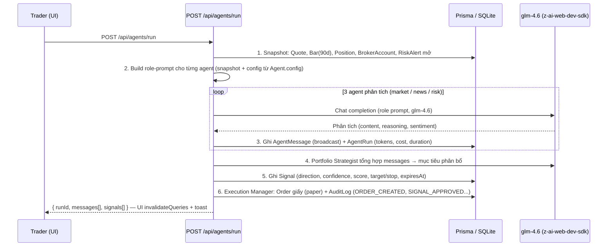

# The Trader — Technical Blueprint

> **Project:** The Trader — Hệ thống giao dịch đa agent (Multi-Agent Trading System) cho VNDIRECT
> **Document:** `docs/TECHNICAL_BLUEPRINT.md` · **Version:** 0.1.0 · **Updated:** 2026-10-05
> **Cross-refs:** [DB_SCHEMA.md](./DB_SCHEMA.md) (data dictionary) · [DATA_SOURCES.md](./DATA_SOURCES.md) (nguồn dữ liệu & mapping)

---

## 1. System Overview

The Trader là một **trading workspace một trang** (single-page dashboard): trader quan sát thị trường VN30, theo dõi danh mục VNDIRECT mô phỏng, và điều phối một **hội đồng 5 AI agent** phân tích — ra tín hiệu — thực thi lệnh giấy (paper trading). Triết lý thiết kế:

1. **Paper-trading first** — toàn bộ luồng lệnh chạy nội bộ, không chạm tiền thật; live trading VNDIRECT chỉ bật sau feature flag (§8).
2. **Mọi phân tích AI đều có audit trail** — mỗi lần chạy agent ghi `AgentRun` (token, chi phí, thời lượng) và mọi kết luận broadcast ghi `AgentMessage` (xem [DB_SCHEMA.md §6.6–6.9](./DB_SCHEMA.md)).
3. **Backend-only LLM** — `z-ai-web-dev-sdk` (model `glm-4.6`) chỉ khởi tạo trong Route Handlers; client không bao giờ thấy API key.
4. **Financial-grade conventions** — tiền VND integer, phí 0.15%, thuế TNCN 0.1% khi bán, dải trần/sàn ±7% HOSE ([DB_SCHEMA.md §8](./DB_SCHEMA.md)).

### Tech Stack (thực tế trong `package.json` / `bun.lock`)

| Layer | Công nghệ | Phiên bản |
|---|---|---|
| Framework | Next.js (App Router, RSC) | 16.3.8 |
| UI runtime | React / React DOM | 19.2.8 |
| Ngôn ngữ | TypeScript | 5.9.3 |
| Styling | Tailwind CSS + `tw-animate-css` | 4.3.3 |
| Components | shadcn/ui (style **new-york**, theme **neutral**, primitives Radix) + `lucide-react` icons | — |
| ORM / DB | Prisma + `@prisma/client` → SQLite (`db/custom.db` qua `DATABASE_URL`) | 6.19.3 |
| Server state | TanStack Query | 5.104.1 |
| Local state | Zustand | 5.0.15 |
| Theming | `next-themes` (dark default) | 0.4.6 |
| Charts | Recharts | 3.10.1 |
| Toasts | Sonner | 2.0.8 |
| Date utils | date-fns | 4.4.0 |
| AI | `z-ai-web-dev-sdk` — model **glm-4.6**, backend-only | 0.0.18 |
| Runtime | Bun | 1.3.14 |

---

## 2. Architecture

```mermaid
flowchart TB
    subgraph Browser["Trình duyệt (Trader)"]
        RSC["Next.js App Router — RSC shell"]
        DASH["Client Dashboard (React 19)\nWatchlist · Charts · Portfolio · Agents · Signals · Risk"]
        TQ["TanStack Query cache\n(server state)"]
        ZU["Zustand store\n(local UI state)"]
    end

    subgraph Server["Next.js Server (Route Handlers — API-only backend)"]
        API["/api/market/* · /api/portfolio · /api/agents/*\n/api/signals · /api/risk/alerts"]
        RUN["POST /api/agents/run\nOrchestrator chu kỳ đa agent"]
        SDK["z-ai-web-dev-sdk\nglm-4.6 (backend-only)"]
        PRISMA["Prisma Client\n(src/lib/db.ts singleton)"]
    end

    DB[("SQLite — db/custom.db\nPrisma 6.19.3 (17 models)")]

    subgraph Future["Lộ trình (planned)"]
        GW["VNDIRECT Gateway mini-service\nOrder placement · Account balance\n(behind LIVE_TRADING flag)"]
        WS["WebSocket mini-service\nRealtime quotes"]
    end

    RSC --> DASH
    DASH --> TQ
    DASH --> ZU
    TQ -- "fetch('/api/...') — relative path" --> API
    API --> PRISMA
    PRISMA --> DB
    RUN --> SDK
    SDK -- "HTTPS" --> LLM["Z.ai — GLM 4.6"]
    RUN --> PRISMA
    GW -. planned .-> API
    WS -. planned .-> TQ
```

**Luồng dữ liệu một chiều:** SQLite → Route Handlers (JSON, `BigInt` → `Number`) → TanStack Query cache → React components. Mutations duy nhất hiện tại là `POST /api/agents/run` (kích hoạt chu kỳ phân tích đa agent, sinh `AgentMessage`/`Signal`/`Order` giấy). Không dùng Server Actions — mọi đọc/ghi server đều qua Route Handler để tập trung validation + audit (§6).

---

## 3. Frontend Architecture

**Một trang duy nhất tại `/`** (App Router: RSC shell render layout, phần tương tác là client components). Cấu trúc section từ trên xuống:

| Section | Nội dung | Nguồn dữ liệu |
|---|---|---|
| **Header** | Brand "The Trader", đồng hồ phiên (ATO 09:00–09:15, liên tục 09:15–11:30 / 13:00–14:45, ATC 14:45–15:00), theme toggle, nút **Run agents** (gọi `POST /api/agents/run`, toast sonner khi xong) | Zustand + `GET /api/agents` |
| **Market summary** | VN-Index proxy (trung bình có trọng số từ quotes VN30), số mã tăng/giảm/đứng giá, top movers | `GET /api/market/summary` |
| **Watchlist** | Bảng mã đang theo dõi: last, change, changePct (màu semantic), volume; click chọn mã cho chart | `GET /api/market/watchlist` |
| **Price chart** | Recharts: nến/area OHLCV **90 ngày** + volume; range selector | `GET /api/market/instruments/[symbol]/bars` |
| **Portfolio tabs** | Tabs: **Vị thế** (Position + giá trị thị trường & unrealized PnL runtime), **Lệnh** (Order + trạng thái), **Giao dịch** (Trade + fee/tax) | `GET /api/portfolio` |
| **Multi-agent panel** | 5 thẻ agent (role, status badge, `healthScore` progress, `lastRunAt`) + feed `AgentMessage` broadcast (content/reasoning/sentiment) + AgentTask list | `GET /api/agents`, `GET /api/agents/messages` |
| **Signals** | Bảng Signal: direction badge, confidence, score, target/stop-loss/take-profit, rationale, expiresAt | `GET /api/signals` |
| **Risk alerts** | Thẻ cảnh báo theo severity (CRITICAL/WARNING/INFO): message + metricValue vs threshold | `GET /api/risk/alerts` |
| **Sticky footer** | Trạng thái nguồn dữ liệu (seed/paper), last-updated, disclaimer "dữ liệu mô phỏng — paper trading" | Zustand + query meta |

### State management

- **TanStack Query — server state:** query keys chuẩn `[resource, params]` (VD `['watchlist']`, `['bars', symbol]`, `['agents']`); `staleTime` ngắn cho quote, dài cho bars; `refetchInterval` cho poll quote; sau `POST /api/agents/run` thành công thì `invalidateQueries` toàn bộ key `['agents']`/`['signals']`/`['portfolio']` để phản ánh kết quả chu kỳ mới.
- **Zustand — local UI state:** `selectedSymbol`, `activePortfolioTab`, chart range, auto-refresh toggle. Không chứa dữ liệu server (tránh dual source of truth).

### Theming & design tokens

- `next-themes` với **dark mặc định** (`class` strategy), bảng màu **neutral oklch** của shadcn/ui new-york.
- **Màu semantic lên/xuống theo quy ước thị trường Việt Nam:** xanh = tăng, đỏ = giảm (ngược với quy ước Mỹ) — token `up`/`down` dùng xuyên suốt watchlist, chart, signals, PnL.
- **`tabular-nums`** cho mọi cột số — chữ số thẳng cột, bắt buộc với bảng tài chính; dấu phân cách hàng nghìn kiểu `vi-VN`, đơn vị VND rút gọn (tr/Tỷ/Tr).
- Skeleton loading (shadcn `Skeleton`) cho mọi section khi fetch lần đầu; empty states cho watchlist/signals trống.

---

## 4. API Surface

Tất cả route là **Route Handlers** trả JSON; lỗi trả `{ "error": string }` + status phù hợp (400/404/500). `BigInt` serialize thành `Number` (an toàn < 2^53). Client gọi bằng **relative path** (`fetch('/api/...')`).

| Method | Route | Mục đích | Response (tóm tắt) |
|---|---|---|---|
| GET | `/api/market/summary` | Tổng quan thị trường từ quotes VN30 | `{ vnIndexProxy, advances, declines, unchanged, topGainers[], topLosers[] }` |
| GET | `/api/market/watchlist` | Watchlist mặc định + quote mới nhất mỗi mã | `WatchlistItem[]` join `Instrument` + `Quote` (last, change, changePct, volume) |
| GET | `/api/market/instruments/[symbol]` | Thông tin mã + quote hiện tại | `Instrument` + `Quote` (đủ refPrice/ceilingPrice/floorPrice) |
| GET | `/api/market/instruments/[symbol]/bars?days=90` | Chuỗi OHLCV cho price chart | `Bar[]` tăng dần theo `date` (mặc định 90 ngày, cap 90) |
| GET | `/api/portfolio` | Sổ tài khoản demo | `{ account: BrokerAccount, positions[] (+marketValue, unrealizedPnl tính runtime), orders[], trades[] }` |
| GET | `/api/agents` | Trạng thái 5 agent | `Agent[]` (status, healthScore, lastRunAt, config, model) |
| POST | `/api/agents/run` | **Kích hoạt chu kỳ phân tích đa agent** (LLM glm-4.6) | `{ runId, messages: AgentMessage[], signals: Signal[] }` — audit `AgentRun` mỗi agent |
| GET | `/api/agents/messages?limit=20` | Feed tin broadcast gần nhất | `AgentMessage[]` join `fromAgent` (name/role), sort `createdAt` desc |
| GET | `/api/signals?limit=` | Tín hiệu còn hiệu lực + gần nhất | `Signal[]` join `Instrument` + `Agent` |
| GET | `/api/risk/alerts` | Cảnh báo rủi ro | `RiskAlert[]` sort severity + `createdAt` desc |

Tham chiếu field: mỗi response khớp định nghĩa model tại [DB_SCHEMA.md §6](./DB_SCHEMA.md); nguồn gốc dữ liệu của từng field tại [DATA_SOURCES.md §3–4](./DATA_SOURCES.md).

---

## 5. Multi-Agent Design

### 5.1 Hội đồng 5 agent (orchestrator pattern)

| # | Agent (`code`) | Role | Trách nhiệm | `config` JSON (thực tế trong DB) |
|---|---|---|---|---|
| 1 | `market-analyst` | `MARKET_ANALYST` | Phân tích kỹ thuật & vi mô trên OHLCV 90 ngày: xu hướng, khối lượng, động lượng, hỗ trợ/kháng cự | `{"lookbackDays":90,"indicators":["SMA20","SMA50","RSI14","MACD","BOLL"],"weight":0.35}` |
| 2 | `news-sentiment` | `NEWS_SENTIMENT` | Đọc tin tài chính VN & quốc tế; chấm điểm cảm xúc bullish/bearish/neutral; cảnh báo sự kiện | `{"sources":["cafef","vneconomy","reuters"],"languages":["vi","en"],"weight":0.2}` |
| 3 | `risk-manager` | `RISK_MANAGER` | Giám sát giới hạn: drawdown, tỷ trọng ngành, kích thước vị thế, stop-loss | `{"maxDrawdownPct":15,"maxSectorWeightPct":40,"maxPositionPct":25,"dailyLossLimitVnd":50000000}` |
| 4 | `portfolio-strategist` | `PORTFOLIO_STRATEGIST` | **Tổng hợp** tín hiệu các agent → phân bổ danh mục, đề xuất tỷ trọng mục tiêu, sinh `Signal` | `{"targetPositions":8,"rebalanceThresholdPct":5,"style":"balanced"}` |
| 5 | `execution-manager` | `EXECUTION_MANAGER` | Thực thi lệnh qua VNDIRECT: chọn loại lệnh, tách lệnh, theo dõi khớp, báo cáo sau giao dịch | `{"sliceCount":3,"maxSlippagePct":0.5,"orderType":"LIMIT"}` |

**Mô hình giao tiếp:** agents **broadcast** `AgentMessage` (`broadcast=true`, `toAgentId=null`) lên "bus"; Risk Manager có quyền **veto** bằng cảnh báo vi phạm ngưỡng (`RiskAlert` + tin broadcast); **Portfolio Strategist là điểm hợp lưu (consolidator)** — đọc toàn bộ broadcast, chấm composite score (weight của analyst 0.35 / news 0.2 / risk-derived penalty) và phát sinh `Signal`; **Execution Manager** là agent duy nhất được tạo `Order` (mặc định LIMIT, tách `sliceCount` lệnh con).

### 5.2 Run cycle — `POST /api/agents/run`

Bước 1–6 là **contract của orchestrator**: mọi lời gọi LLM đều có prompt chứa snapshot dữ liệu thật từ DB; mọi kết quả đều được persist (`AgentMessage`, `Signal`, `Order`) kèm audit (`AgentRun`, `AuditLog`) — không có kết quả AI nào "bay lơ lửng" ngoài persisted state.

### 5.3 Health scoring

`Agent.healthScore` (Float 0–100, seed khởi điểm 88–100):

- **Trừ điểm:** `AgentRun` FAILED (`error` khác null), timeout, `lastRunAt` quá stale so với chu kỳ mong đợi, AgentMessage sentiment trái chiều liên tiếp với kết quả thị trường (đo lường định kỳ).
- **Cộng điểm:** chu kỳ COMPLETED thành công, `durationMs` thấp hơn P50 lịch sử.
- Hiển thị dạng progress bar trên multi-agent panel; agent dưới ngưỡng (VD < 60) được highlight để trader biết cần kiểm tra config hoặc tạm `PAUSED`.

---

## 6. Security

| Lĩnh vực | Chính sách |
|---|---|
| **PII** | Field đánh dấu PII theo [DB_SCHEMA.md §4.1](./DB_SCHEMA.md): `email`, `phone`, `passwordHash`, `accountNumber`. API không trả `passwordHash`; `phone`/`accountNumber` mask khi render. PII không log ra console/LLM prompt. |
| **Credential storage** | Mật khẩu chỉ lưu **hash** (`passwordHash`) — giá trị seed là placeholder demo, production dùng bcrypt/argon2 + salt riêng. Broker credential & khóa dịch vụ đặt trong `.env` phía server (`DATABASE_URL`, khóa `z-ai-web-dev-sdk`), không commit, không đưa vào client bundle. |
| **API-only backend** | **Không dùng Server Actions** — mọi đọc/ghi qua Route Handlers: một cửa duy nhất để validate payload, kiểm soát rate, và ghi `AuditLog`. |
| **Relative-path API calls** | Client chỉ `fetch('/api/...')` — không hard-code origin, tránh leak cross-origin và SSRF-style redirect; deploy được dưới bất kỳ reverse-proxy/domain nào. |
| **LLM backend-only** | `z-ai-web-dev-sdk` chỉ import trong Route Handlers (`/api/agents/run`); SDK không bao giờ nằm trong dependency graph của client components → API key không expose. |
| **Audit logging** | `AuditLog` ghi mọi hành động nhạy cảm: `ORDER_CREATED`, `ORDER_FILLED`, `ORDER_CANCELLED`, `SIGNAL_APPROVED`, `RISK_ALERT_RAISED`, `AGENT_RUN_COMPLETED` (kèm `before`/`after` JSON, `ip`). |
| **Soft delete** | User/BrokerAccount/Instrument chỉ soft delete (`deletedAt`) — bảo toàn tính truy vết (xem [DB_SCHEMA.md §4.2](./DB_SCHEMA.md)). |
| **SQL injection** | Toàn bộ truy vấn qua Prisma Client parameterized — không string-concat SQL. |

---

## 7. Performance

| Khu vực | Chiến lược |
|---|---|
| **Query strategy** | Dùng đúng composite indexes đã định nghĩa trong schema: `Bar @@index([instrumentId, date(sort: Desc)])` phục vụ cửa sổ 90 ngày; `Quote @@index([instrumentId, tradedAt])` cho quote mới nhất; `Signal/Order/AgentRun/AgentMessage` đều có index `(fk, createdAt desc)` cho feed "mới nhất trước" — mỗi truy vấn dashboard là index seek, không scan. Chi tiết: [DB_SCHEMA.md §6](./DB_SCHEMA.md). |
| **90-day bar window** | Route bars mặc định & cap `days=90` — payload giới hạn (~90 dòng/mã), đủ cho SMA20/SMA50/RSI14/MACD/BOLL và chart; dữ liệu cũ hơn chỉ dùng khi có mục đích backtest (roadmap). |
| **JSON serialization** | `BigInt` (VND) chuyển `Number` tại API boundary — mọi giá trị demo < 2^53 nên lossless; client không cần BigInt polyfill. |
| **Client caching** | TanStack Query `staleTime` phân tầng: quote 15–30s, bars 5 phút, portfolio 1 phút; `refetchInterval` chỉ bật khi tab visible; skeleton ngay lập tức từ cache cũ (stale-while-revalidate). |
| **Loading UX** | shadcn `Skeleton` cho mọi section trong lần fetch đầu; sonner toast cho mutation `POST /api/agents/run` (không block UI). |
| **DB footprint** | SQLite single-file đủ cho 1 trader × paper trading (≈ 2,700 bar + vài nghìn row agent telemetry sau seed); Prisma giữ đường migrate PostgreSQL khi đa người dùng. |

---

## 8. Non-Goals & Roadmap

**Non-goals ở v0.1** (chủ động không làm, không phải "chưa làm xong"):

- **Giao dịch tiền thật** — không đặt lệnh qua broker thật; mọi `Order` là paper order nội bộ.
- Đăng nhập/đa người dùng đầy đủ (schema `User.role` đã sẵn nhưng demo single-user).
- Backtesting engine, chiến lược ML tự huấn luyện.
- Mobile app / native notification.

**Roadmap** (thứ tự ưu tiên):

1. **VNDIRECT live trading** — sau feature flag `LIVE_TRADING` + mini-service gateway (xem [DATA_SOURCES.md §4.1](./DATA_SOURCES.md)): xác thực broker, đặt/hủy lệnh thật, đồng bộ số dư; mọi lệnh thật vẫn đi qua Risk Manager veto.
2. **WebSocket mini-service** — realtime quotes thay polling: mini-service nguồn dữ liệu push tick → client qua WebSocket, TanStack Query làm cache layer.
3. Nguồn dữ liệu ngoài: market data feed (HOSE/HNX), news crawler cho News & Sentiment (CafeF/VnEconomy/Tuổi Trẻ/Reuters), alternative data (dòng khối ngoại, margin) — kế hoạch chi tiết ở [DATA_SOURCES.md §4](./DATA_SOURCES.md).
4. Mở rộng HNX/UPCOM (schema `Market` đã có sẵn), lịch nghỉ Tết, ATO/ATC simulation.
5. PostgreSQL migration + tách bảng archive cho `Quote`/`Bar` khi khối lượng tăng.

---

## 9. Change Log

| Ngày | Thay đổi |
|---|---|
| 2026-10-05 | Tái tạo tài liệu sau reset workspace; khớp stack thực tế `package.json`/`bun.lock` và schema `prisma/schema.prisma` |
