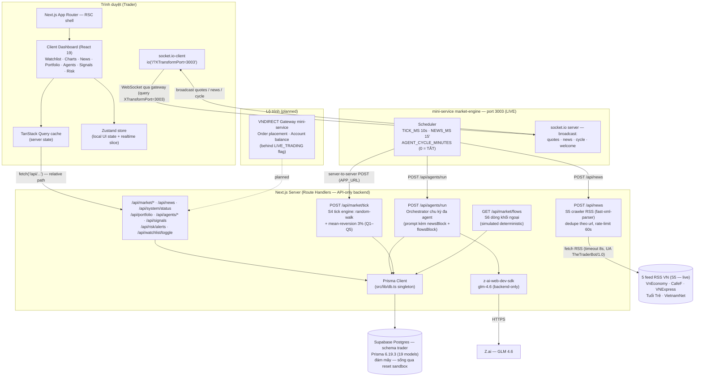
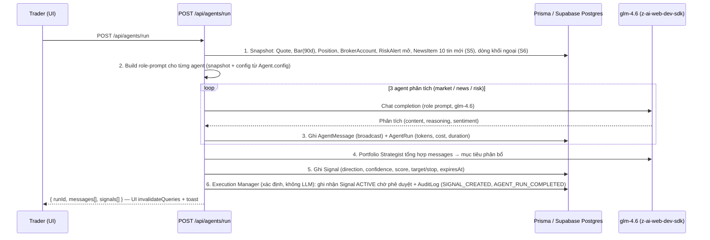

# The Trader — Technical Blueprint

> **Project:** The Trader — Hệ thống giao dịch đa agent (Multi-Agent Trading System) cho VNDIRECT
> **Document:** `docs/TECHNICAL_BLUEPRINT.md` · **Version:** 0.3.0 · **Updated:** 2026-10-06
> **Cross-refs:** [DB_SCHEMA.md](./DB_SCHEMA.md) (data dictionary) · [DATA_SOURCES.md](./DATA_SOURCES.md) (nguồn dữ liệu & mapping)

---

## 1. System Overview

The Trader là một **trading workspace một trang** (single-page dashboard): trader quan sát thị trường VN30 realtime, đọc tin tức RSS thật, theo dõi danh mục VNDIRECT mô phỏng, và điều phối một **hội đồng 5 AI agent** phân tích — ra tín hiệu — thực thi lệnh giấy (paper trading). Triết lý thiết kế:

1. **Paper-trading first** — toàn bộ luồng lệnh chạy nội bộ, không chạm tiền thật; live trading VNDIRECT chỉ bật sau feature flag (§9) — hiện đã có scaffold flag + cổng kiểm tra (S3, gateway thật còn pending).
2. **Mọi phân tích AI đều có audit trail** — mỗi lần chạy agent ghi `AgentRun` (token, chi phí, thời lượng) và mọi kết luận broadcast ghi `AgentMessage` (xem [DB_SCHEMA.md §6.6–6.9](./DB_SCHEMA.md)).
3. **Backend-only LLM** — `z-ai-web-dev-sdk` (model `glm-4.6`) chỉ khởi tạo trong Route Handlers; client không bao giờ thấy API key.
4. **Financial-grade conventions** — tiền VND integer, phí 0.15%, thuế TNCN 0.1% khi bán, dải trần/sàn ±7% HOSE ([DB_SCHEMA.md §8](./DB_SCHEMA.md)).
5. **Minh bạch nguồn dữ liệu** — mọi nguồn được gắn nhãn `live`/`simulated`/`fallback`/`paper` trong `DataSourceStatus` và hiển thị trên footer; dữ liệu mô phỏng không bao giờ giả danh "live" (stale marking — [DATA_SOURCES.md §6](./DATA_SOURCES.md)).
6. **Realtime-first (tuỳ chọn)** — mini-service `market-engine` broadcast tick bảng giá, tin tức mới và kết quả chu kỳ agent qua WebSocket (§6); TanStack Query vẫn là cache layer duy nhất.

### Tech Stack (thực tế trong `package.json` / `bun.lock`)

| Layer | Công nghệ | Phiên bản |
|---|---|---|
| Framework | Next.js (App Router, RSC) | 16.3.8 |
| UI runtime | React / React DOM | 19.2.8 |
| Ngôn ngữ | TypeScript | 5.9.3 |
| Styling | Tailwind CSS + `tw-animate-css` | 4.3.3 |
| Components | shadcn/ui (style **new-york**, theme **neutral**, primitives Radix) + `lucide-react` icons | — |
| ORM / DB | Prisma + `@prisma/client` → **Supabase Postgres** (schema `trader`, Supavisor session pooler `:5432` qua `DATABASE_URL`) — kho dữ liệu chính bền vững qua reset sandbox | 6.19.3 |
| Server state | TanStack Query | 5.104.1 |
| Local state | Zustand | 5.0.15 |
| Theming | `next-themes` (dark default) | 0.4.6 |
| Charts | Recharts | 3.10.1 |
| Toasts | Sonner | 2.0.8 |
| Date utils | date-fns | 4.4.0 |
| AI | `z-ai-web-dev-sdk` — model **glm-4.6**, backend-only | 0.0.18 |
| Realtime client | `socket.io-client` (nối mini-service market-engine, §6) | 4.8.4 |
| RSS parser | `fast-xml-parser` (crawler tin tức S5) | 5.11.2 |
| Runtime | Bun | 1.3.14 |

---

## 2. Architecture



**Luồng dữ liệu:** Supabase Postgres (schema `trader`) → Route Handlers (JSON, `BigInt` → `Number`) → TanStack Query cache → React components; ngoài luồng pull này còn **luồng push** từ mini-service `market-engine` qua WebSocket ghi thẳng vào cache (§6). Mutations hiện tại: `POST /api/agents/run` (kích hoạt chu kỳ phân tích đa agent, sinh `AgentMessage`/`Signal`/`Order` giấy), `POST /api/market/tick` (tick giá S4 + khớp lệnh giấy + EOD rollover), `POST /api/news` (crawler RSS S5), `POST /api/signals/[id]/convert`, `POST /api/watchlist/toggle`, `POST /api/orders/[id]/cancel` (hủy lệnh chờ khớp). Không dùng Server Actions — mọi đọc/ghi server đều qua Route Handler để tập trung validation + audit (§7).

---

## 3. Frontend Architecture

**Một trang duy nhất tại `/`** (App Router: RSC shell render layout, phần tương tác là client components). Từ Giai đoạn 3 trang này là **App Shell với 2 workspace** chuyển bằng Zustand (`activeWorkspace: "overview" | "agents"`, deep-link `?ws=agents`) — KHÔNG thêm route; realtime socket sống ở cấp trang nên đổi workspace không đứt kết nối. Nav dạng `role="tablist"` nằm dưới thanh logo trong Header (2 tab: Tổng quan · Đội Agent, badge chấm live khi engine nối).

**Workspace "Tổng quan"** — cấu trúc section từ trên xuống:

| Section | Nội dung | Nguồn dữ liệu |
|---|---|---|
| **Header** | Brand "The Trader", đồng hồ phiên (ATO 09:00–09:15, liên tục 09:15–11:30 / 13:00–14:45, ATC 14:45–15:00), badge mở/đóng cửa, **badge Live** (trạng thái kết nối realtime market-engine, pulse khi đang nối), chip tài khoản (số tài khoản **đã mask**), **chip Sức mua (ước tính)** (G3 §5.4: `cash + equity×0.5 − marginUsed`, tooltip công thức + cảnh báo âm), nút **Chạy agent** (gọi `POST /api/agents/run`, toast sonner khi xong), theme toggle, nút làm mới | Zustand + `GET /api/portfolio` |
| **Market summary** | VN-Index proxy (trung bình biến động VN30), số mã tăng/giảm/đứng giá, thanh khoản, top movers + **Market pulse bar**: dòng khối ngoại ròng (S6) · tin tức mới nhất (S5) · tuổi tick realtime | `GET /api/market/quotes` (trường `summary` nhúng), `GET /api/market/flows`, `GET /api/news`, Zustand `lastTickAt` |
| **Watchlist** | Bảng giá với **chế độ chuyển đổi**: Toàn bộ VN30 ⇄ Danh mục theo dõi; tìm kiếm; **cột sao** toggle watchlist; **toggle Cột mở rộng (G3 §5.2)**: thêm Trần · Sàn · TC · Cao · Thấp (≥ sm; mobile hiện gọn dưới ô Mã); dấu ⌃/⌄ khi giá chạm trần/sàn | `GET /api/market/quotes` hoặc `GET /api/market/watchlist` |
| **Price chart** | Recharts **G3 §5.1**: **Nến Nhật** (custom Bar shape: wick + thân, xanh=đóng≥mở) + **volume histogram** màu theo phiên + **panel RSI14 Wilder** (~96px, guideline 30/70, vùng quá mua/bán amber) + toggle **Nến/Đường** (Zustand `chartMode`); SMA20 overlay; range 30/60/90; symbol picker; tooltip O/H/L/C/Volume | `GET /api/instruments/bars?symbol=&days=` |
| **Portfolio tabs** | Tabs: **Vị thế** (P&L runtime + **cột % tỷ trọng** G3 §5.3 + dòng tổng), **Lệnh** (nút Hủy), **Giao dịch**; **donut phân bổ ngành** cạnh tabs (desktop ≥ md; mobile dòng "Top ngành") + ô ghép Biến động ngày / **Lãi/lỗ đã thực hiện** | `GET /api/portfolio`, `GET /api/orders` |
| **Multi-agent panel** | 5 thẻ agent (health bar + **stats mini runs/thành công/chi phí** G3) + feed broadcast (tin strategist kèm nút **✅ Phê duyệt / ⛔ Từ chối** khi có signal ACTIVE — G3 §4.7) + AgentTask list + nút **Chạy chu kỳ** | `GET /api/agents`, `GET /api/agents/messages`, `GET /api/signals` |
| **Signals** | Bảng Signal: direction badge, confidence, score, target/stop-loss/take-profit, rationale, expiresAt, **trạng thái ACTIVE/ACTED/REJECTED/EXPIRED** + nút **Chuyển lệnh** (POST convert) | `GET /api/signals` |
| **Risk alerts** | Thẻ cảnh báo theo severity | `GET /api/risk/alerts` |
| **Tin tức (News card)** | 12 tin RSS mới nhất + badge chế độ nguồn + nút Nạp tin | `GET /api/news?limit=12`, `POST /api/news` |
| **Sticky footer** | Chips trạng thái nguồn + **chip chi phí AI (G3 §5.5)**: `AI: $X · YK tokens` từ totals `/api/agents` + badge Realtime + last-updated + disclaimer | `GET /api/system/status`, `GET /api/agents` |

**Workspace "Đội Agent" (G3 §4.7):** header tổng quan đội (số agent · chi phí AI lũy kế · nút **Chạy chu kỳ đầy đủ**) + layout 2 cột xl: trái = 5 **roster card** (icon vai, health bar, status dot, stats mini, nút ▶ **Chạy riêng** — disabled kèm đếm ngược 429) · phải = **panel chi tiết** 5 tab (Hồ sơ / Hoạt động — bảng AgentRun + sparkline chi phí 7 ngày / Nhiệm vụ / Phát thanh + tín hiệu đang mở kèm nút duyệt-từ chối / **Chat** — thread USER↔AGENT, cảnh báo "~$0.006/tin", rate-limit 60s/agent hiển thị đếm ngược). Execution Manager không chat/chạy lẻ (409/400 + Card giải thích).

### State management

- **TanStack Query — server state:** query keys chuẩn `[resource, params]` (VD `['quotes']`, `['watchlist']`, `['bars', symbol, days]`, `['agents']`, `['news']`, `['system-status']`); `staleTime` phân tầng: quote/watchlist 30s, agent messages/news 30s, portfolio/orders/signals/risk/system-status 30–60s, bars 5 phút; sau `POST /api/agents/run` thành công thì `invalidateQueries` toàn bộ key `['agents']`/`['agent-messages']`/`['signals']`/`['orders']`/`['portfolio']`/`['quotes']`/`['risk-alerts']` để phản ánh kết quả chu kỳ mới (gộp trong hook dùng chung `useRunAgents`).
- **Zustand — local UI state** (`src/lib/store.ts`): `selectedSymbol`, `chartDays`, `portfolioTab`, `watchlistOnly`, **`activeWorkspace` (G3 B1)**, **`chartMode` (G3 B3)**, **`quotesExpanded` (G3 B3)** + **slice realtime**: `realtimeConnected` (đèn Live/badge Realtime) và `lastTickAt` (tuổi tick cho Market pulse bar) — cập nhật từ hook `useRealtimeMarket` (§6). Không chứa dữ liệu server (tránh dual source of truth).

### Theming & design tokens

- `next-themes` với **dark mặc định** (`class` strategy), bảng màu **neutral oklch** của shadcn/ui new-york.
- **Màu semantic lên/xuống theo quy ước thị trường Việt Nam:** xanh = tăng, đỏ = giảm (ngược với quy ước Mỹ) — token `up`/`down` dùng xuyên suốt watchlist, chart, signals, PnL.
- **`tabular-nums`** cho mọi cột số — chữ số thẳng cột, bắt buộc với bảng tài chính; dấu phân cách hàng nghìn kiểu `vi-VN`, đơn vị VND rút gọn (tr/Tỷ/Tr).
- Skeleton loading (shadcn `Skeleton`) cho mọi section khi fetch lần đầu; empty states cho watchlist/signals trống.

---

## 4. API Surface

Tất cả route là **Route Handlers** trả JSON; lỗi trả `{ "error": string }` + status phù hợp (400/404/500). `BigInt` serialize thành `Number` (an toàn < 2^53). Client gọi bằng **relative path** (`fetch('/api/...')`).

| Method | Route | Mục đích | Response (tóm tắt) |
|---|---|---|---|
| GET | `/api/market/quotes` | Toàn bộ VN30 + quote mới nhất (volume desc) **+ summary** (VN-Index proxy, bề rộng, thanh khoản, top gainer/loser) **+ meta nguồn** (`mode`/`asOf` — S4 stale marking) | `{ quotes: QuoteRow[], summary, meta }` |
| POST | `/api/market/tick` | **Tick bảng giá S4** (engine mô phỏng): random-walk + mean-reversion 3% trên quote mới nhất từng mã, tuân thủ Q1 (bội 100) · Q2 (dải ±7%) · Q3 · Q5; **EOD rollover** khi sang ngày ICT mới (ghi Bar phiên cũ, refPrice/dải/volume mới — ngân sách ngày 0,3–9,2tr cp); **khớp lệnh giấy** PENDING/PARTIALLY_FILLED khi giá vượt điều kiện (BUY `last ≤ giá đặt` · SELL `last ≥ giá đặt`) — cập nhật Trade/Position/tiền mặt/equity + audit `ORDER_FILLED`; lệnh SELL vượt điều kiện nhưng không đủ vị thế → **tự REJECTED 1 lần** + audit `ORDER_REJECTED` (không retry); `MARKET_STRICT_SESSION=true` thì chỉ chạy trong phiên (ngoài phiên trả `skipped: true`) | payload cùng shape `GET /api/market/quotes` + `ticked`/`rolled`/`fills` |
| GET | `/api/market/flows` | **Dòng khối ngoại ròng S6**: mode `simulated` — deterministic (FNV-1a hash theo mã+ngày), scale theo thanh khoản thật (2–80 tỷ VND); tổng bán ròng < −300 tỷ → RiskAlert WARNING `FOREIGN_FLOW_OUTFLOW` (dedupe 24h) | `{ mode, asOf, totalNet, totalBuy, totalSell, topNet[], topSell[], note }` |
| GET | `/api/news?limit=12` | 12 tin RSS mới nhất (S5) + meta nguồn cho stale marking | `{ items[], meta: { total, mode, lastSuccessAt, stale, ageMinutes, providers } }` |
| POST | `/api/news` | **Chạy crawler RSS 5 nguồn ngay** (rate-limit 60s giữa 2 lần nạp, audit `NEWS_INGESTED`) — nạp được thì `mode=live`, nguồn chết → `fallback` | `{ added, updated, total, mode, feeds[] }` · 429 nếu dồn lịch |
| GET | `/api/system/status` | Trạng thái toàn hệ thống cho footer/monitoring: gọi `escalateStaleSources()` (DATA_SOURCE_STALE WARNING khi stale >4h, dedupe 24h) trước khi đọc | `{ sources[], trading, market, counts, escalatedAlerts, serverTime }` |
| POST | `/api/watchlist/toggle` | Thêm/gỡ mã khỏi watchlist mặc định (body `{ symbol }`) + audit `WATCHLIST_ADDED`/`WATCHLIST_REMOVED` | `{ symbol, inWatchlist, count }` · 404 nếu mã/watchlist không có |
| GET | `/api/market/watchlist` | Watchlist mặc định + quote mới nhất mỗi mã (cùng dạng QuoteRow) | `{ watchlist: { name, count, quotes[] } }` |
| GET | `/api/instruments/bars?symbol=VCB&days=90` | Chuỗi OHLCV + SMA20 cho price chart (cap 90 ngày) | `{ symbol, name, last, change, changePct, bars[] }` |
| GET | `/api/portfolio` | Sổ tài khoản demo (**accountNumber đã mask**) + positions P&L runtime + totals | `{ account, positions[], totals }` |
| GET | `/api/orders` | 20 lệnh + 20 bút toán gần nhất (fee/tax dạng Number) | `{ orders[], trades[] }` |
| POST | `/api/orders/[id]/cancel` | **Hủy lệnh đang chờ khớp** (chỉ PENDING/PARTIALLY_FILLED — phần chưa khớp; lệnh đã kết thúc → 409; không có → 404) + audit `ORDER_CANCELLED`; chạy đua an toàn với fill engine trong tick (claim có điều kiện) | `{ order }` · 404/409 |
| GET | `/api/agents` | Trạng thái 5 agent (config parse, pendingTaskCount, lastRun) + **stats mỗi agent (G3 §4.2**: runCount, successRate, totalTokensIn/Out, totalCostUsd, lastError, chatCount)** + **totals chi phí AI toàn đội** + 12 nhiệm vụ | `{ agents[] (kèm stats), tasks[], totals }` |
| POST | `/api/agents/run` | **Chu kỳ phân tích đa agent đầy đủ** (4 LLM call: 3 agent phân tích → strategist tổng hợp → execution ghi nhận; xem §5.2; prompt kèm `newsBlock` + `flowsBlock`; **G3: tín hiệu BUY/SELL sinh ra ACTIVE chờ trader phê duyệt — không tự tạo lệnh**, audit `SIGNAL_CREATED`) | `{ runId, messages[], signals[], order: null, failures[], durationMs }` |
| GET | `/api/agents/[id]` | **G3 §4.2 — hồ sơ chi tiết agent**: config parsed + stats + 20 runs + 12 tasks + **thread chat 1-1 (asc)** + 20 tin broadcast + signals ACTIVE của agent | `{ agent, runs[], tasks[], chat[], broadcastFeed[], signals[] }` · 404 nếu id rác |
| POST | `/api/agents/[id]/run` | **G3 §4.3 — chạy riêng 1 agent** (role-prompt đúng chuyên môn + context thật; rate-limit 60s/agent dựa trên AgentRun cuối — 429 kèm `retryAfterSeconds` + header Retry-After; execution-manager → 409; agent RUNNING → 400) | `{ agent, message, run }` · 404/400/409/429 |
| POST | `/api/agents/[id]/chat` | **G3 §4.4 — chat trực tiếp** (body `{message}` 2–500 ký tự; lưu tin USER ngay kể cả LLM lỗi; 10 tin history + bối cảnh dữ liệu compact; audit `AGENT_CHAT`; LLM lỗi → 200 reply null + error VN) | `{ userMessage, reply, run, threadLength, error? }` · 400/404/429 |
| GET | `/api/agents/messages?limit=30` | Feed tin broadcast gần nhất (kèm `direction`) | `{ messages[] }` join `fromAgent` |
| GET | `/api/signals?limit=` | Tín hiệu còn hiệu lực + gần nhất (kèm `status`/`rejectedAt`/`rejectNote` G3) | `{ signals[] }` join `Instrument` + `Agent` |
| POST | `/api/signals/[id]/convert` | Chuyển tín hiệu BUY/SELL thành lệnh PENDING (sizing budget 50tr/nửa vị thế — qua `src/lib/signal-execution.ts` chung với decision; giữ 409 nếu đã act); qua cổng S3 — `LIVE_TRADING` bật nhưng thiếu cấu hình → 503 + audit `LIVE_TRADING_BLOCKED`; đủ cấu hình mà chưa có gateway → 501 + audit `LIVE_ORDER_GATEWAY_UNAVAILABLE` | `{ order }` |
| POST | `/api/signals/[id]/decision` | **G3 §4.5 — phê duyệt / từ chối tín hiệu** (body `{action: APPROVE\|REJECT, note?}`): APPROVE → lệnh paper **sizing 5% NAV** + `status=ACTED` + audit `SIGNAL_APPROVED` (via decision) + `ORDER_CREATED`; REJECT → `status=REJECTED` + `rejectedAt`/`rejectNote` + audit `SIGNAL_REJECTED` (không tạo AgentMessage); guard 409 khi `status != ACTIVE`; SELL không vị thế → 400 | `{ signal, order? }` · 400/404/409 |
| GET | `/api/risk/alerts` | Cảnh báo rủi ro | `{ alerts[] }` sort severity + `createdAt` desc |

Tham chiếu field: mỗi response khớp định nghĩa model tại [DB_SCHEMA.md §6](./DB_SCHEMA.md); nguồn gốc dữ liệu của từng field tại [DATA_SOURCES.md §3–4](./DATA_SOURCES.md).

---

## 5. Multi-Agent Design

### 5.1 Hội đồng 5 agent (orchestrator pattern)

| # | Agent (`code`) | Role | Trách nhiệm | `config` JSON (thực tế trong DB) |
|---|---|---|---|---|
| 1 | `market-analyst` | `MARKET_ANALYST` | Phân tích kỹ thuật & vi mô trên OHLCV 90 ngày: xu hướng, khối lượng, động lượng, hỗ trợ/kháng cự | `{"lookbackDays":90,"indicators":["SMA20","SMA50","RSI14","MACD","BOLL"],"weight":0.35}` |
| 2 | `news-sentiment` | `NEWS_SENTIMENT` | Đọc tin tài chính VN & quốc tế; chấm điểm cảm xúc bullish/bearish/neutral; cảnh báo sự kiện | `{"sources":["cafef","vneconomy","reuters"],"languages":["vi","en"],"weight":0.2}` |
| 3 | `risk-manager` | `RISK_MANAGER` | Giám sát giới hạn: drawdown, tỷ trọng ngành, kích thước vị thế, stop-loss | `{"maxDrawdownPct":15,"maxSectorWeightPct":40,"maxPositionPct":25,"dailyLossLimitVnd":50000000}` |
| 4 | `portfolio-strategist` | `PORTFOLIO_STRATEGIST` | **Tổng hợp** tín hiệu các agent → phân bổ danh mục, đề xuất tỷ trọng mục tiêu, sinh `Signal` | `{"targetPositions":8,"rebalanceThresholdPct":5,"style":"balanced"}` |
| 5 | `execution-manager` | `EXECUTION_MANAGER` | Thực thi lệnh qua VNDIRECT: chọn loại lệnh, tách lệnh, theo dõi khớp, báo cáo sau giao dịch | `{"sliceCount":3,"maxSlippagePct":0.5,"orderType":"LIMIT"}` |

**Mô hình giao tiếp:** agents **broadcast** `AgentMessage` (`broadcast=true`, `toAgentId=null`) lên "bus"; Risk Manager có quyền **veto** bằng cảnh báo vi phạm ngưỡng (`RiskAlert` + tin broadcast); **Portfolio Strategist là điểm hợp lưu (consolidator)** — đọc toàn bộ broadcast, chấm composite score (weight của analyst 0.35 / news 0.2 / risk-derived penalty) và phát sinh `Signal`; **Execution Manager** là agent duy nhất được tạo `Order` (mặc định LIMIT, tách `sliceCount` lệnh con).

### 5.2 Run cycle — `POST /api/agents/run`



Bước 1–6 là **contract của orchestrator** (đã implement đầy đủ trong `src/app/api/agents/run/route.ts`): mọi lời gọi LLM đều có prompt chứa snapshot dữ liệu thật từ DB (kèm chỉ báo SMA20/50, RSI14, động lượng 5 phiên, KL/TL20 tính từ `Bar`) — các khối build trùng nguồn với **single-run/chat** qua `src/lib/agent-context.ts` (G3). Phân bổ theo agent: news-sentiment nhận `marketBlock + newsBlock + flowsBlock`; market-analyst và risk-manager nhận `marketBlock + flowsBlock`; portfolio-strategist nhận đủ + khối tín hiệu đang mở. 3 agent phân tích chạy **tuần tự** (SDK giới hạn concurrency — retry backoff 2.5s khi 429; một agent lỗi không kéo sập chu kỳ); mọi kết quả đều persist (`AgentMessage`, `Signal`) kèm audit (`AgentRun` mỗi agent, `AuditLog`: SIGNAL_CREATED · AGENT_RUN_COMPLETED) — không có kết quả AI nào "bay lơ lửng" ngoài persisted state. **Execution Manager chạy xác định (không LLM): ghi nhận tín hiệu và thông báo chờ phê duyệt của trader** — từ Giai đoạn 3 chu kỳ **không tự tạo Order**; lệnh chỉ xuất hiện khi trader **APPROVE** qua `/api/signals/[id]/decision` (sizing 5% NAV, lô 100, LIMIT — `src/lib/signal-execution.ts`) hoặc `convert` (budget 50tr).

### 5.3 Health scoring

`Agent.healthScore` (Float 0–100, seed khởi điểm 88–100) — **cập nhật động sau mỗi AgentRun** (implement trong `src/lib/health.ts`):

- **Trừ điểm:** `AgentRun` FAILED → −12.
- **Cộng điểm:** chu kỳ COMPLETED thành công → +2; `durationMs` thấp hơn P50 của ≤ 10 run COMPLETED gần nhất → thêm +1.
- Clamp [0, 100]; hiển thị dạng progress bar trên multi-agent panel; agent dưới ngưỡng (< 60) được **highlight viền amber** để trader biết cần kiểm tra config hoặc tạm `PAUSED`.

---

## 6. Realtime & mini-service market-engine

Mini-service **`mini-services/market-engine`** (Bun + `socket.io`, chạy riêng ở **port 3003**) là realtime engine + scheduler của Giai đoạn 2. Nó **không chạm DB trực tiếp** — mọi dữ liệu đều lấy qua API của app Next.js (server-to-server `http://localhost:3000`, mặc định `APP_URL`) rồi broadcast kết quả cho client.

### 6.1 Scheduler (env vars)

| Biến env | Mặc định | Ý nghĩa |
|---|---|---|
| `TICK_MS` | `10000` (10s) | Nhịp gọi `POST /api/market/tick` — tick bảng giá S4 rồi broadcast `quotes` |
| `NEWS_MS` | `900000` (15 phút) | Chu kỳ gọi `POST /api/news` — crawler RSS S5 rồi broadcast `news` |
| `AGENT_CYCLE_MINUTES` | `0` (TẮT) | Chu kỳ tự động gọi `POST /api/agents/run` rồi broadcast `cycle` — **mặc định tắt để tiết kiệm chi phí LLM**, trader bấm nút chạy thủ công |
| `APP_URL` | `http://localhost:3000` | Địa chỉ app Next.js cho các cuộc gọi server-to-server |

Khởi động: chạy ngay một vòng tick + news để client có dữ liệu sớm, sau đó `setInterval` theo các nhịp trên.

### 6.2 Sự kiện broadcast (socket.io)

| Event | Payload | Client xử lý (hook `useRealtimeMarket`) |
|---|---|---|
| `quotes` | payload `POST /api/market/tick` (cùng shape `GET /api/market/quotes` + `meta`, `ticked`) | `setQueryData(['quotes'])` + patch `['watchlist']` — **defer `setTimeout(0)`** để tránh warning concurrent React; cập nhật `lastTickAt` |
| `news` | kết quả crawler `{ added, updated, mode, feeds… }` | `invalidateQueries(['news'], ['system-status'])` |
| `cycle` | kết quả `POST /api/agents/run` | invalidate toàn bộ dữ liệu agent (`agents`, `agent-messages`, `signals`, `orders`, `portfolio`, `risk-alerts`) + toast |
| `welcome` | `{ ok, service, ts }` khi client kết nối | xác nhận kết nối (đèn Live) |

### 6.3 Pattern kết nối client — qua gateway

Client **không nối thẳng cổng 3003** mà đi qua gateway (Caddy, cổng 81) bằng query định tuyến:

```ts
io("/?XTransformPort=3003", {
  transports: ["polling", "websocket"],
  reconnection: true, // reconnectionDelay 3s → 15s, timeout 8s
});
```

Query `XTransformPort` được socket.io gắn vào mọi request engine.io (path mặc định `/socket.io`); gateway đọc query đó và định tuyến sang cổng 3003 — nên app vẫn deploy được dưới reverse-proxy mà không cần mở thêm cổng.

### 6.4 Health endpoint

`GET /` (hoặc `/health`) trên cổng 3003 trả JSON thống kê vận hành: `{ ok, service, port, startedAt, lastTickAt, lastTickError, ticks, lastNewsAt, newsRuns, cycles, clients }` — dùng để giám sát scheduler mà không cần vào log.

---

## 7. Security

| Lĩnh vực | Chính sách |
|---|---|
| **PII** | Field đánh dấu PII theo [DB_SCHEMA.md §4.1](./DB_SCHEMA.md): `email`, `phone`, `passwordHash`, `accountNumber`. API không trả `passwordHash`; **`accountNumber` được mask tại API boundary** (`VD00••••1828`) trước khi xuống client; `phone` không nằm trong response nào. PII không log ra console/LLM prompt. |
| **Credential storage** | Mật khẩu chỉ lưu **hash** (`passwordHash`) — giá trị seed là placeholder demo, production dùng bcrypt/argon2 + salt riêng. Broker credential & khóa dịch vụ đặt trong `.env` phía server (`DATABASE_URL`, khóa `z-ai-web-dev-sdk`), không commit, không đưa vào client bundle. |
| **API-only backend** | **Không dùng Server Actions** — mọi đọc/ghi qua Route Handlers: một cửa duy nhất để validate payload, kiểm soát rate, và ghi `AuditLog`. |
| **Relative-path API calls** | Client chỉ `fetch('/api/...')` — không hard-code origin, tránh leak cross-origin và SSRF-style redirect; deploy được dưới bất kỳ reverse-proxy/domain nào. |
| **LLM backend-only** | `z-ai-web-dev-sdk` chỉ import trong Route Handlers (`/api/agents/run`); SDK không bao giờ nằm trong dependency graph của client components → API key không expose. |
| **Audit logging** | `AuditLog` ghi mọi hành động nhạy cảm: `ORDER_CREATED`, **`ORDER_FILLED`** (fill engine trong tick — khớp lệnh giấy, kèm phí/thuế), **`ORDER_CANCELLED`** (POST /api/orders/[id]/cancel), **`ORDER_REJECTED`** (fill engine từ chối lệnh SELL không đủ vị thế — F-303, audit 22-a), `SIGNAL_APPROVED`, `AGENT_RUN_COMPLETED`, `NEWS_INGESTED`, `WATCHLIST_ADDED`/`WATCHLIST_REMOVED`, `LIVE_TRADING_BLOCKED`, `LIVE_ORDER_GATEWAY_UNAVAILABLE`, `RISK_ALERT_RAISED` (runtime: flows khối ngoại + stale escalate) — đủ 12/12 action runtime (fix F-206 + F-303); `SIGNAL_REJECTED` sẽ thêm ở Giai đoạn 3 (kèm `before`/`after` JSON, `ip`). |
| **Soft delete** | User/BrokerAccount/Instrument chỉ soft delete (`deletedAt`) — bảo toàn tính truy vết (xem [DB_SCHEMA.md §4.2](./DB_SCHEMA.md)). |
| **SQL injection** | Toàn bộ truy vấn qua Prisma Client parameterized — không string-concat SQL. |

---

## 8. Performance

| Khu vực | Chiến lược |
|---|---|
| **Query strategy** | Dùng đúng composite indexes đã định nghĩa trong schema: `Bar @@index([instrumentId, date(sort: Desc)])` phục vụ cửa sổ 90 ngày; `Quote @@index([instrumentId, tradedAt])` cho quote mới nhất; `NewsItem @@index([publishedAt(sort: Desc)])` cho 10 tin mới nhất; `Signal/Order/AgentRun/AgentMessage` đều có index `(fk, createdAt desc)` cho feed "mới nhất trước" — mỗi truy vấn dashboard là index seek, không scan. Chi tiết: [DB_SCHEMA.md §6](./DB_SCHEMA.md). |
| **90-day bar window** | Route bars mặc định & cap `days=90` — payload giới hạn (~90 dòng/mã), đủ cho SMA20/SMA50/RSI14/MACD/BOLL và chart; dữ liệu cũ hơn chỉ dùng khi có mục đích backtest (roadmap). |
| **Realtime push** | Event WebSocket `quotes` ghi **thẳng vào cache TanStack Query** (`setQueryData`) — bảng giá cập nhật tức thì mà không tốn thêm request HTTP; patch watchlist từ cùng payload; `news`/`cycle` chỉ `invalidateQueries` (để route tự refetch đúng query). |
| **JSON serialization** | `BigInt` (VND) chuyển `Number` tại API boundary — mọi giá trị demo < 2^53 nên lossless; client không cần BigInt polyfill. |
| **Client caching** | TanStack Query `staleTime` phân tầng: quote/watchlist 30s, portfolio/orders/signals/risk/agents 30–60s, bars 5 phút; skeleton ngay lập tức từ cache cũ (stale-while-revalidate). |
| **Loading UX** | shadcn `Skeleton` cho mọi section trong lần fetch đầu; sonner toast cho mutation `POST /api/agents/run` (không block UI). |
| **DB footprint** | Supabase Postgres (schema `trader`) — kho chính bền vững qua reset sandbox (dữ liệu phân tích/telemetry không mất khi môi trường local bị reset); song song cùng project còn schema `public` Gen-1 với **95.259 bar EOD thật 2013→2026** (nguồn dự phòng cho tích hợp dữ liệu thật VNDIRECT). Ops SQL qua `tools/db-console.mjs` (Management API). |

---

## 9. Non-Goals & Roadmap

**Non-goals ở v0.3** (chủ động không làm, không phải "chưa làm xong"):

- **Giao dịch tiền thật** — không đặt lệnh qua broker thật; mọi `Order` là paper order nội bộ.
- Đăng nhập/đa người dùng đầy đủ (schema `User.role` đã sẵn nhưng demo single-user).
- Backtesting engine, chiến lược ML tự huấn luyện.
- Mobile app / native notification.

**Roadmap** (thứ tự ưu tiên — cập nhật trạng thái sau Giai đoạn 2):

1. **VNDIRECT live trading** — ✅ scaffold xong feature flag `LIVE_TRADING` + cổng kiểm tra `src/lib/trading-mode.ts` (503 + audit `LIVE_TRADING_BLOCKED` khi thiếu cấu hình; 501 + audit `LIVE_ORDER_GATEWAY_UNAVAILABLE` khi gateway chưa có); **pending mini-service gateway thật**: xác thực broker, đặt/hủy lệnh thật, đồng bộ số dư; mọi lệnh thật vẫn đi qua Risk Manager veto (xem [DATA_SOURCES.md §4.1](./DATA_SOURCES.md)).
2. **WebSocket mini-service realtime** — ✅ done: `mini-services/market-engine` (port 3003) broadcast `quotes`/`news`/`cycle`/`welcome` + scheduler, client nối qua gateway với query `XTransformPort=3003` (§6).
3. **Scheduler chu kỳ agent tự động** — ✅ done: có sẵn trong market-engine (`AGENT_CYCLE_MINUTES`), mặc định 0 (TẮT) để tiết kiệm chi phí LLM.
4. **Nguồn dữ liệu ngoài** — market data S4 ✅ (tick engine mô phỏng Q1–Q5 + stale marking `DataSourceStatus` + `/api/system/status`); news S5 ✅ (crawler RSS live 5 nguồn VN: VnEconomy/CafeF/VNExpress/Tuổi Trẻ/VietnamNet, model `NewsItem` dedupe theo url); alternative data S6 ✅ (dòng khối ngoại simulated deterministic + RiskAlert `FOREIGN_FLOW_OUTFLOW`). Còn lại: thay dữ liệu mô phỏng bằng feed thật HOSE/HNX/VPS — kế hoạch chi tiết ở [DATA_SOURCES.md §4](./DATA_SOURCES.md).
5. Mở rộng HNX/UPCOM (schema `Market` đã có sẵn), lịch nghỉ Tết chính thức (hiện là bảng ước lượng 2026 trong `src/lib/market-session.ts`), ATO/ATC simulation.
6. PostgreSQL migration + tách bảng archive cho `Quote`/`Bar`/`NewsItem` khi khối lượng tăng.

---

## 10. Change Log

| Ngày | Thay đổi |
|---|---|
| 2026-10-05 | Tái tạo tài liệu sau reset workspace; khớp stack thực tế `package.json`/`bun.lock` và schema `prisma/schema.prisma` |
| 2026-10-05 | **v0.2 — hoàn thiện blueprint:** (1) chu kỳ đa agent đầy đủ §5.2 (4 LLM call, Signal + Order giấy + AuditLog); (2) đồng bộ bảng API §4 với routes thực tế (thêm `/api/orders`, `/api/signals/[id]/convert`, `/api/market/watchlist`); (3) health scoring động §5.3 (`src/lib/health.ts`) + highlight agent < 60; (4) mask `accountNumber` tại API; (5) Zustand store `src/lib/store.ts` + staleTime phân tầng; (6) Watchlist API + Switch chế độ bảng giá; (7) footer trạng thái nguồn dữ liệu + last-updated; (8) nút Chạy agent ở Header (hook dùng chung `useRunAgents`) |
| 2026-10-06 | **v0.3 — Giai đoạn 2 (S3–S6 + realtime):** (1) mini-service `market-engine` LIVE (port 3003): WebSocket broadcast + scheduler, section mới §6; (2) 6 API route mới (`/api/news` GET/POST, `/api/market/tick`, `/api/market/flows`, `/api/system/status`, `/api/watchlist/toggle`) + `meta` nguồn cho `/api/market/quotes`; (3) schema 19 model: `NewsItem` (S5, dedupe url) + `DataSourceStatus` (S4 stale marking); (4) crawler RSS 5 nguồn VN kiểm chứng + newsBlock/flowsBlock trong prompt chu kỳ agent; (5) S3 flag `LIVE_TRADING` + cổng kiểm tra + audit; (6) frontend: News card, Market pulse bar, cột sao watchlist, badge Live/Realtime, chips trạng thái nguồn động; roadmap cập nhật trạng thái |
| 2026-10-06 | **v0.4 — Giai đoạn 3 (PHASE3_BLUEPRINT B1–B3, 23 route):** (1) **App shell**: nav tab workspace (Zustand `activeWorkspace`, `?ws=` deep-link) — tổng quan ⇄ đội agent không reload, realtime giữ nguyên; (2) **4 API mới** (`GET /api/agents/[id]`, `POST /api/agents/[id]/run`, `POST /api/agents/[id]/chat`, `POST /api/signals/[id]/decision`) + `/api/agents` thêm stats/totals chi phí; rate-limit 60s/agent (DB-backed) + header Retry-After; (3) **Workspace Đội Agent**: roster 5 card (stats chi phí), panel chi tiết 5 tab (Hồ sơ/Hoạt động+sparkline/Nhiệm vụ/Phát thanh/Chat), chat 1-1 với AgentMessage.direction, phê duyệt/từ chối tín hiệu trong feed + panel; (4) **Dashboard**: nến Nhật + volume + RSI14 Wilder panel (custom Bar shape), toggle Nến/Đường, cột mở rộng bảng giá (trần/sàn/TC/cao/thấp + dấu ⌃⌄), donut phân bổ ngành + cột % tỷ trọng, ô Realized P&L, chip Sức mua ước tính (tooltip công thức), chip chi phí AI footer; (5) **hành vi mới**: chu kỳ sinh signal ACTIVE chờ duyệt (không auto-order — human-in-the-loop), audit `SIGNAL_CREATED`/`SIGNAL_APPROVED`/`SIGNAL_REJECTED`/`AGENT_CHAT`; `signal-execution.ts` một nguồn duy nhất cho toán tạo lệnh; SELL nav5pct guard vị thế |
